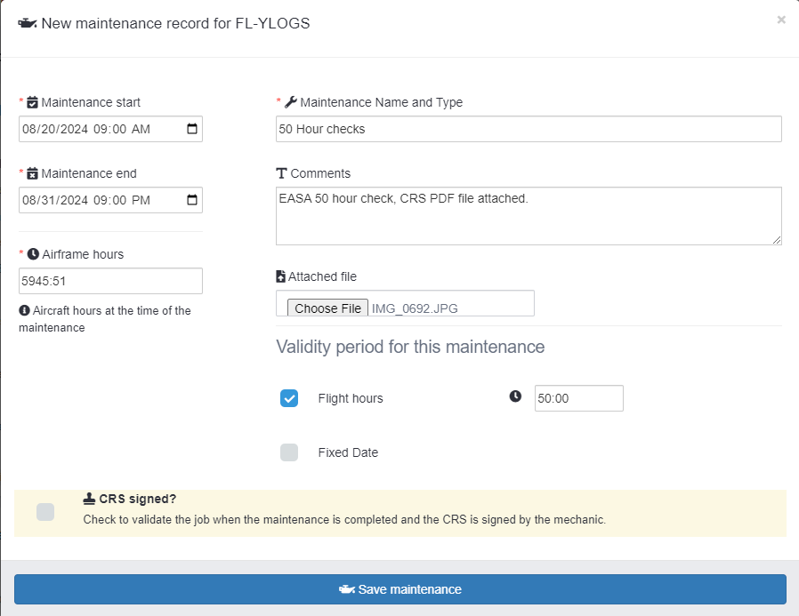

# Aircraft maintenance

[Flylogs](https://www.flylogs.com/) provides you with a straightforward tool to store information on any past or future maintenance jobs that affect your aircraft. This tool enables better communication throughout your company and improves situational awareness for your crew, flight scheduling, and aircraft mechanics.&#x20;

Future maintenance windows will automatically block the scheduling agenda of the plane, and after the maintenance is performed and the **CRS** maintenance record is signed, the information will remain stored in the aircraft maintenance logs for ever.

Each maintenance job, can have as many work orders as neccesary. You can link files, comments and Inventory items to each of the work orders. The list below, shows all maintenance jobs along with location information, CRS status, pending Work Orders, timeframes and job expiration dates.

<figure><figcaption>
List of all company maintenance jobs.
</figcaption></figure>

### Maintenance edit form

If we had this maintenance previously planned, we will not need to create a new one.

Open the maintenance, or create a new one, and enter the data of the job.

**Make sure you specify correctly this 4 key elements:**

* Start and Finish date time of the job (past or future)
* Maintenance descriptive job name
* Airframe hours at the time of the job is done
* Validity flight hours
* If you have a CRS file or any inportant file to attach to the maintenance, you can upload it!\

<figure><figcaption>
Form to create new maintenance jobs or windows
</figcaption></figure>

#### **For already performed maintenance jobs:**

Do not forget to check the **CRS** **signed** checkbox.  Checking this box activates the remaining flight time counter and the associated warnings to pilots.

#### **Future maintenance windows:**

You can schedule future maintenance jobs. Select a future date for start/finish and Flylogs will automatically block this aircraft schedule for the selected date range.

In this case, there is no need to specify a validity period, you can do this once the maintenance has been performed and the **CRS** has been signed.

Read more about [scheduled maintenance windows](schedule-maintenance-windows.md).

<figure><figcaption>
Future maintenance windows block the aircraft schedule.
</figcaption></figure>

### Maintenance validity tracker

Once a maintenance is performed and you or your mechanic check the **CRS signed** checkbox, Flylogs will keep track of the aircraft flight time available for the next maintenance window.

As example taken from the first screenshot on this page, the aircraft airframe was at **84:39** and the validity of the maintenance is **50 hours**.\
**Flylogs will SUM the airframe hours of the last CRS with the entered validity flight hours.**

So the aircraft will have potential to fly until **134:39 hours**. **Remember to check the CRS signed checkbox and save the maintenance.**\

Flylogs displays this information in your aircraft page and also in your manager home page:

### Flight time maintenance due warning

Every time a new flight is created, Flylogs will check the aircraft maintenance period. If the remaining hours are less than the entered flight hours, an error will be triggered alerting the flight crew of the aircraft´s upcomming maintenance.

This message is an advisory, and the crew has the option to by-pass it.

<figure><figcaption></figcaption></figure>

### Maintenance prediction

Flylogs will now predict based on previous maintenance records and aircraft utilization, when the next maintenance action will be required.

<figure><figcaption></figcaption></figure>

The prediction will appear as a date below the NEW MAINTENANCE button. It is a logarithmic prediction based on the aircraft's trends and historical data. The prediction will be shown only if there is previous maintenance and the aircraft has logged more than 50 flight hours. Predictions more than 180 days away will not be displayed.
