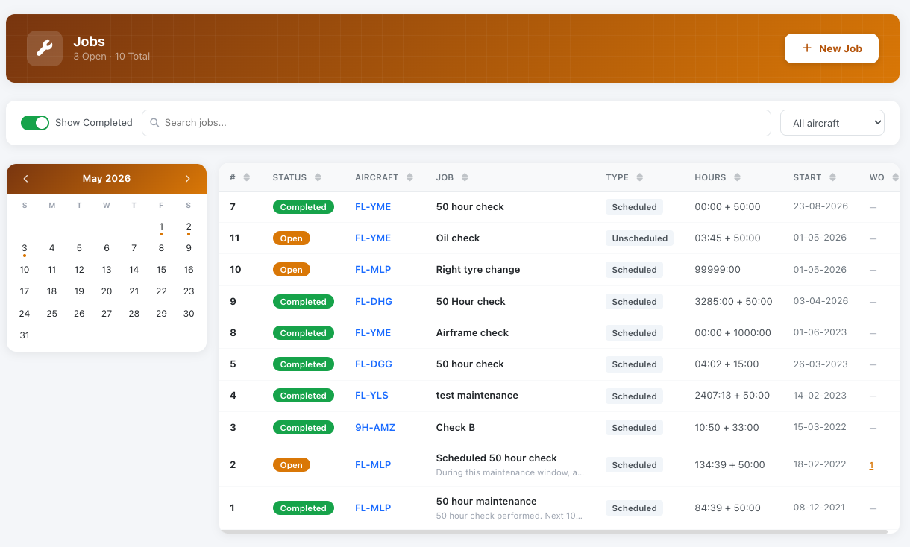
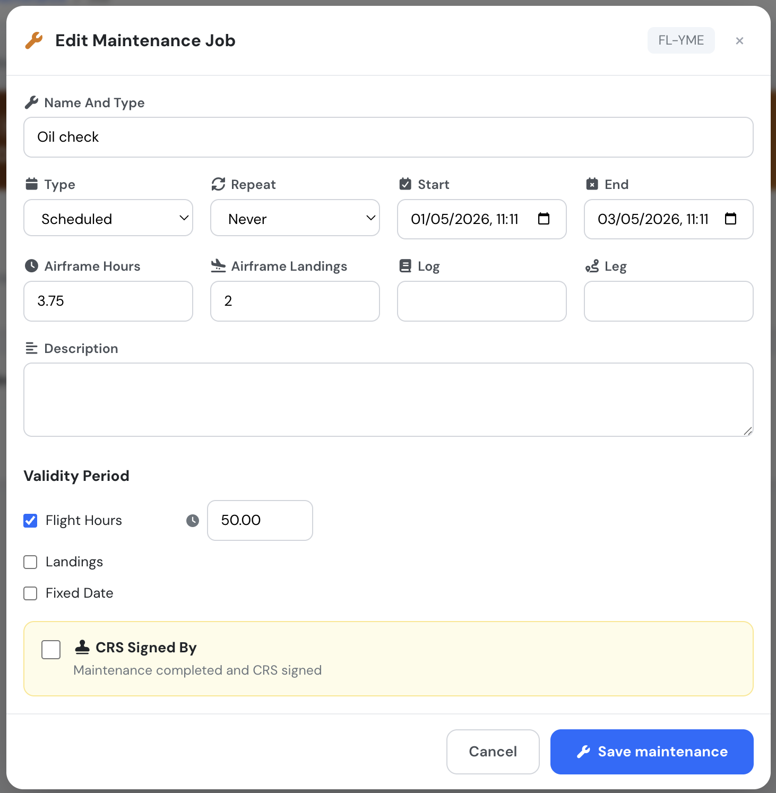
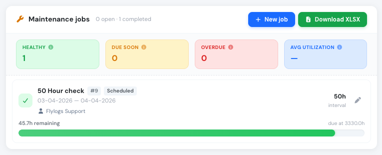
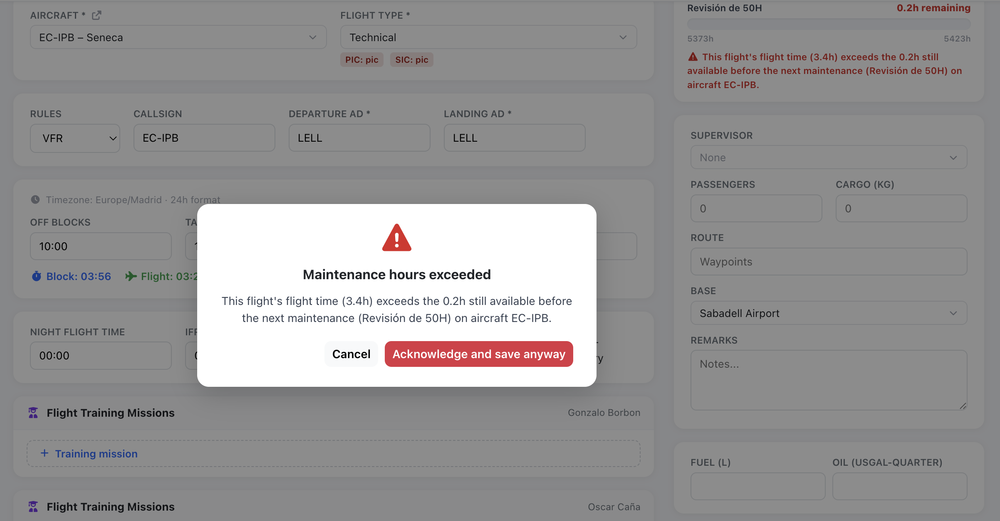
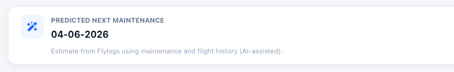

# Aircraft maintenance

[Flylogs](https://www.flylogs.com/) provides you with a straightforward tool to store information on any past or future maintenance jobs that affect your aircraft. This tool enables better communication throughout your company and improves situational awareness for your crew, flight scheduling, and aircraft mechanics.&#x20;

Future maintenance windows will automatically block the scheduling agenda of the plane, and after the maintenance is performed and the **CRS** maintenance record is signed, the information will remain stored in the aircraft maintenance logs for ever.

Each maintenance job, can have as many work orders as neccesary. You can link files, comments and Inventory items to each of the work orders. The list below, shows all maintenance jobs along with location information, CRS status, pending Work Orders, timeframes and job expiration dates.

<figure><figcaption>
List of all company maintenance jobs.
</figcaption></figure>

### Maintenance edit form

If we had this maintenance previously planned, we will not need to create a new one.

Open the maintenance, or create a new one, and enter the data of the job.

**Make sure you specify correctly this 4 key elements:**

* Start and Finish date time of the job (past or future)
* Maintenance descriptive job name
* Airframe hours at the time of the job is done
* Validity flight hours
* If you have a CRS file or any inportant file to attach to the maintenance, you can upload it! 

<figure><figcaption>
Form to create new maintenance jobs or windows
</figcaption></figure>

#### **For already performed maintenance jobs:**

Once the work is done, sign the **CRS** (Certificate of Release to Service). Signing the CRS activates the remaining flight time counter and the associated warnings to pilots. See [Signing the CRS](#signing-the-crs) below for the full process.

#### **Future maintenance windows:**

You can schedule future maintenance jobs. Select a future date for start/finish and Flylogs will automatically block this aircraft schedule for the selected date range.

In this case, there is no need to specify a validity period, you can do this once the maintenance has been performed and the **CRS** has been signed.

Read more about [scheduled maintenance windows](schedule-maintenance-windows.md).

<figure><figcaption>
Future maintenance windows block the aircraft schedule.
</figcaption></figure>

### Signing the CRS

The **CRS** (Certificate of Release to Service) records that the maintenance work has been completed and that the aircraft is released back to service. Signing the CRS is now a deliberate, password-protected action that captures **who** signed and **when**, replacing the old "CRS signed" checkbox.


**Who can sign:** only users with the maintenance management role (typically your TMA / maintenance staff) can sign the CRS, edit it, or sign an inspection. Pilots and other staff can view the CRS status but cannot sign.


To sign the CRS:

1. Open the maintenance job and choose **Sign CRS** from the actions menu. The job must have a **start date set, and that start date must be in the past** — you cannot release a job to service before its work has started.
2. Record the **airframe hours** and **landings** at the time the job was completed.
3. Set the **validity period** for the next maintenance window. You can combine any of:
   * **Flight hours** — hours of flight after which the next check is due.
   * **Landings** — number of landings after which the next check is due.
   * **Fixed date** — a calendar date/time on which the CRS expires. After this date the aircraft cannot be scheduled until a new CRS is signed.
4. Attach any supporting **documents** (the CRS file itself, work reports, etc.).
5. Confirm with your **password** and tick the certification statement:\
   _"I confirm the information above is accurate and certify that the work described has been completed in accordance with the applicable regulations."_

Once signed, the job displays the **CRS Signed By** name and date, the remaining flight-time counter becomes active, and the maintenance record is stored permanently in the aircraft logs.

To correct a signed CRS, use **Edit CRS** from the same menu and re-confirm with your password. Note that re-signing the CRS invalidates any previous inspection signature (see below).

### Signing an inspection

After the CRS is signed, a separate **Sign Inspection** signature can be recorded as an independent verification that the maintenance job has been inspected. This is optional and distinct from the CRS signature.

To sign an inspection:

1. Open a job whose **CRS is already signed** and choose **Sign Inspection** from the actions menu.
2. Confirm with your **password** and tick the certification statement.

The job then displays **Inspected by** with the inspector's name and date. Both the CRS signer and the inspector appear on the printable job card.


Re-signing or editing the CRS clears any existing inspection signature, because the inspection refers to the state of the job at the moment it was signed. Sign the inspection again after editing the CRS if it is still required.


### Maintenance validity tracker

Once a maintenance is performed and you or your mechanic [signs the **CRS**](#signing-the-crs), Flylogs will keep track of the aircraft flight time available for the next maintenance window.

As example taken from the first screenshot on this page, the aircraft airframe was at **84:39** and the validity of the maintenance is **50 hours**.\
**Flylogs will SUM the airframe hours of the last CRS with the entered validity flight hours.**

So the aircraft will have potential to fly until **134:39 hours**. **Remember to sign the CRS so the validity period takes effect.** 

Flylogs displays this information in your aircraft page and also in your manager home page:

### Flight time maintenance due warning

Every time a new flight is created, Flylogs will check the aircraft maintenance period. If the remaining hours are less than the entered flight hours, an error will be triggered alerting the flight crew of the aircraft´s upcomming maintenance.

This message is an advisory, and the crew has the option to by-pass it.

<figure><figcaption></figcaption></figure>

### Maintenance prediction

Flylogs will now predict based on previous maintenance records and aircraft utilization, when the next maintenance action will be required.

<figure><figcaption></figcaption></figure>

The prediction will appear as a date below the NEW MAINTENANCE button. It is a logarithmic prediction based on the aircraft's trends and historical data. The prediction will be shown only if there is previous maintenance and the aircraft has logged more than 50 flight hours. Predictions more than 180 days away will not be displayed.
