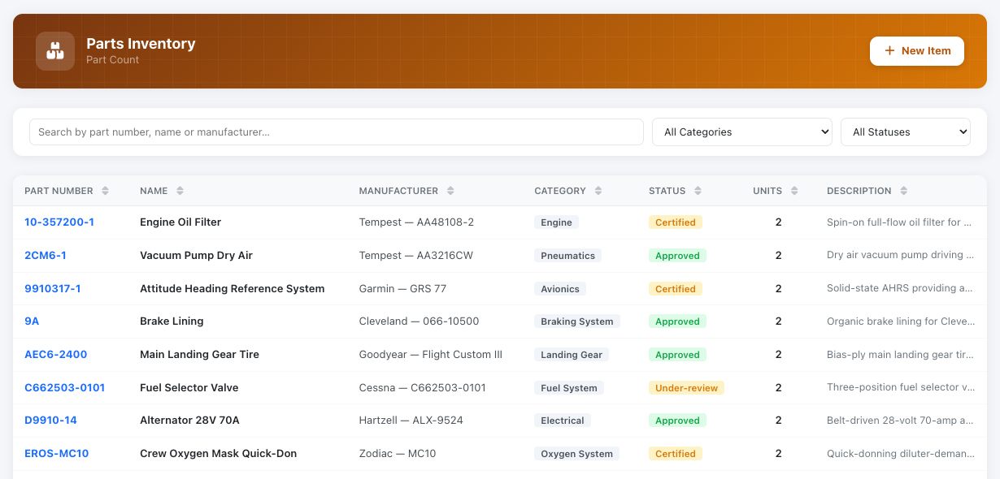
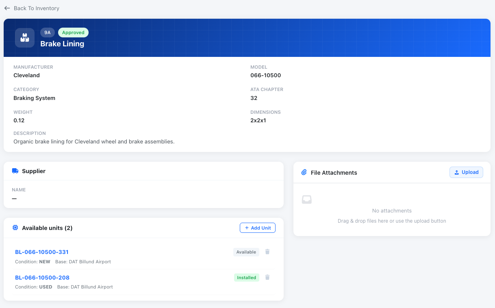

# Inventory

The inventory tracking system is designed to help you manage and monitor the status, lifecycle, and requirements of your maintenance warehouse items. It enables efficient tracking of stock levels, predicts future needs, and facilitates seamless communication and work organization with your engineering team.

<figure><figcaption></figcaption></figure>

The system displays all part numbers in your catalog, and you can add the numbers available in your stock. These serial numbers can be linked to a specific company base, work order, or aircraft. This functionality allows you to track the location and status of each serial number, ensuring complete visibility and control over your inventory.

For each inventory item, you can see all details, as well as provider information and available serials in your warehouse.

&#x20;

<figure><figcaption>
Inventory Part details
</figcaption></figure>

