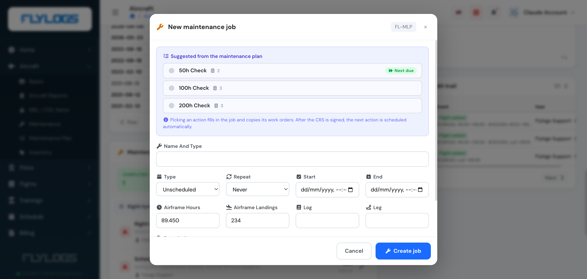
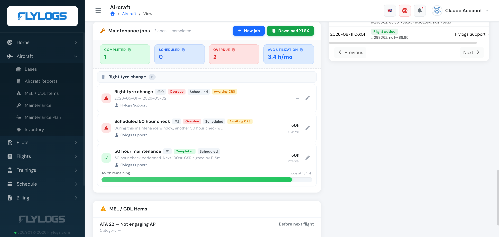

# Scheduled maintenance windows

### **Basic aircraft maintenance job tracking**

With Flylogs, you can can keep record of past maintenance jobs, and schedule upcoming checks.

All your pilots, company staff and mechanics can see this information and plan accordingly.

Your TMAs can even add details to each maintenance window, upload documents, [sign the CRS and sign an inspection](README.md#signing-the-crs).

### Create a future maintenance

To create any maintenance windows, past or future, go into the aircraft details page and click **New job** on top of the Maintenance jobs list.

The new maintenance job window will pop up. If the aircraft has a [maintenance plan](maintenance-plans.md) assigned, its upcoming actions are suggested at the top — the one due next is flagged **Next due**. Picking one fills in the job's name and description and copies over its work orders; once its CRS is signed, the plan automatically schedules the following action.

You can enter past or future **Start**/**End** dates depending on your needs, and optionally set the job to **Repeat** (daily, weekly, monthly, quarterly, semesterly or yearly) for recurring checks. Keep in mind that future dates will block the aircraft schedule from being booked for the maintenance job time frame that you specify.

Besides dates, a job can also be due by **airframe hours** or **landings** — record the airframe reading at creation and set a validity interval when you [sign the CRS](README.md#signing-the-crs); Flylogs then tracks the remaining hours/landings until the next check is due.

### Tracking your jobs

The aircraft's Maintenance jobs panel groups jobs that belong to the same recurring family (e.g. every "50 hour check") together, and summarizes them by status — **Completed**, **Scheduled**, **Overdue** (past due and not yet done) — plus your average utilization. Each job also shows an **Awaiting CRS** badge until it's signed, and an interval badge when it's hours/landings-based.

