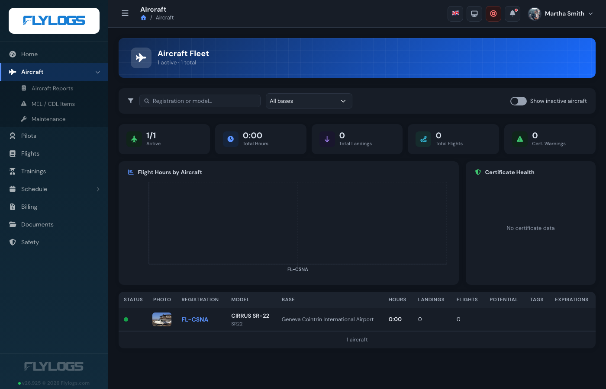
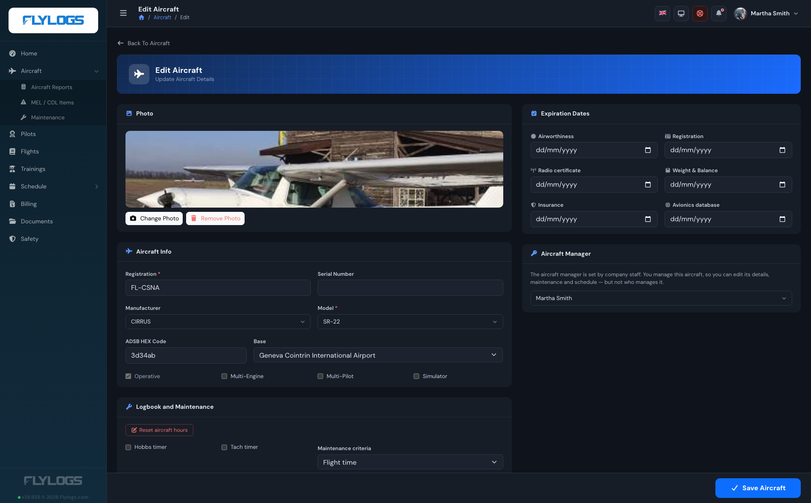
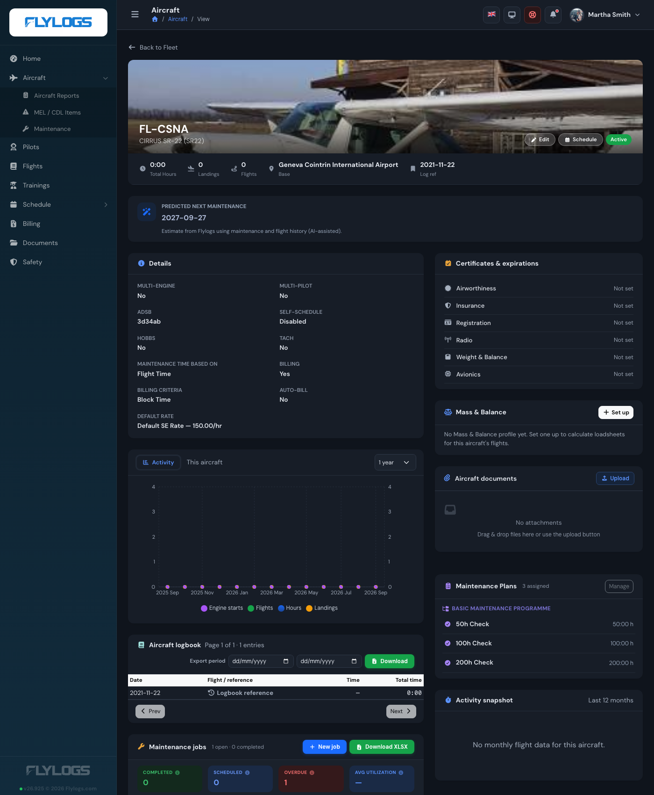
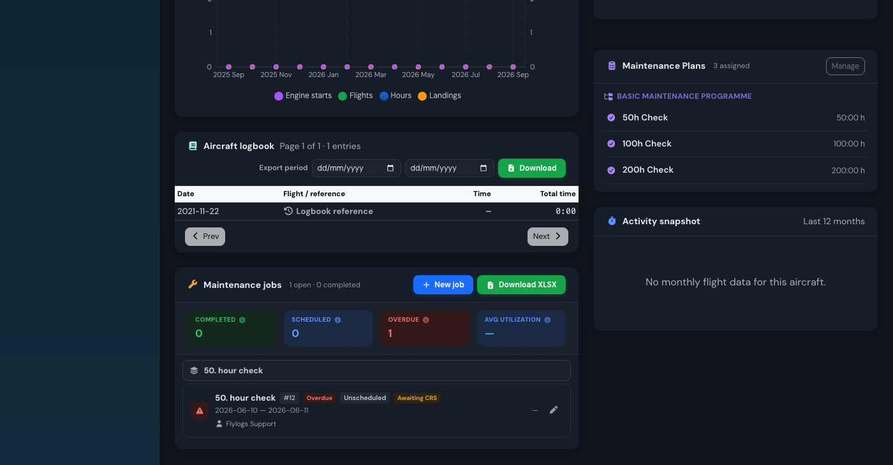
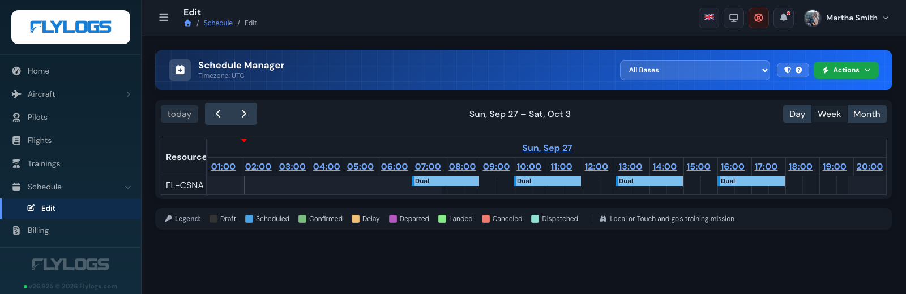

# Aircraft manager

Every aircraft can name its **aircraft managers**: the people responsible for that tail. They are
set from the aircraft's edit page, in the **Aircraft Managers** card, and they are stored on the
aircraft itself, not on the user.

An aircraft can have **as many managers as you need**, and they are equals — there is no primary
manager and no ranking between them. Each of them can do everything on the list below, including
work another one started. A tail with a deputy, a maintenance controller alongside the owner, or two
partners sharing an aeroplane are all just several names in the same card.

The function is deliberately **independent of the user group**. A Captain, a Flight Instructor, a
line Pilot or even a Student Pilot who owns the aeroplane they train in gets the same authority
over *that* aircraft as a Company Administrator has over the whole fleet — and no extra authority
anywhere else. Their user group is unchanged, and the rest of the fleet stays exactly as closed to
them as it was.

The typical use is an operator that **manages aircraft on behalf of third-party owners**: the owner
(or the crew member assigned to that aeroplane) gets a real seat in the system, sees their own
aircraft's hours, next maintenance, expiring certificates and upcoming bookings, and cannot see
anybody else's.

<figure><figcaption>
A Captain who manages one aeroplane: the fleet holds just that tail, and the Aircraft menu has gained its maintenance sections
</figcaption></figure>

## Setting the manager

1. Open **Aircraft → (the aircraft) → Edit**.
2. Scroll to the **Aircraft Managers** card, search by name and pick as many people as you need.
   Each one you pick is added as a chip below the selector; the **×** on a chip removes them.
3. Save.

Removing everybody from the card leaves the aircraft with no manager.

Only company staff can change this list: groups **1, 100, 105, 110, 150 and 300** (Flylogs
Administrator, Company Administrator, Operations Manager, Compliance & Safety Manager, Chief Pilot,
Mechanic). A manager editing their own aircraft sees the selector read-only — the server drops the
manager list, `company_id`, `active` and `deleted` from their save, so they cannot hand the
aeroplane to somebody else, drop a co-manager, move it to another company or retire it.

Anybody with an **active account in your company** can be named, whatever their role — the owner of
an aeroplane you operate does not have to be one of your pilots.

Leaving the card empty means the aircraft has no manager; only staff act on it.

<figure><figcaption>
The same edit form seen by a manager: everything is theirs to change except who manages the aircraft and whether it is in service
</figcaption></figure>

## What the manager can do

On **the aircraft they are named on** — and only those:

| Area | What they get |
|------|---------------|
| Aircraft record | The full aircraft page (certificate expiry dates, hours, landings, logbook, documents, fuel and oil tracking) plus **Edit**, and the photo upload / remove actions |
| Mass & Balance | Create and edit the aircraft's Mass & Balance profile |
| Maintenance jobs | Create, edit, duplicate and delete jobs; sign the **Certificate of Release to Service**; link and unlink aircraft reports to a job |
| Aircraft reports | Raise, edit, defer and delete defect reports, and raise, edit, extend and delete **MEL / CDL** items |
| Scheduling | The **Schedule Manager** page opens for them, showing only the aircraft they manage; they create and edit bookings on those tails and set the crew |
| Flights | Open any flight flown on the aircraft, even one they were not crewed on |

<figure><figcaption>
The aircraft page as its manager sees it — Edit and Schedule in the header, and every card an administrator gets
</figcaption></figure>

<figure><figcaption>
Maintenance for that aircraft: the manager opens, edits and signs off its jobs
</figcaption></figure>

The **Aircraft** and **Maintenance** menu entries appear for a manager who would otherwise not see
them at all. Inside those pages, every aircraft selector is narrowed to their own tails — the
"New Job" and "New MEL item" forms will not even offer another registration.

<figure><figcaption>
The Schedule Manager, narrowed to the tails the manager is responsible for
</figcaption></figure>

## What stays with company staff

The manager function is an authority over one aeroplane, not a promotion. These stay with the
staff groups:

* Adding, retiring (`active`) or deleting an aircraft, and reordering the fleet
* Changing **who** manages an aircraft — including adding or removing a co-manager
* Company-wide **maintenance plans** and the parts **inventory**
* Deleting somebody else's booking (a manager edits and re-crews bookings on their aircraft, but
  deletion still follows the normal booking-owner rules)
* Everything on every other aircraft in the company

## How it is enforced

Every check is made **on the server, per aircraft**, not merely hidden in the interface. The shared
rule lives in `AircraftManagerPolicy`:

* `canManageAircraft()` — maintenance jobs and aircraft reports: groups 1, 100, 105, 110, 300, **or**
  any manager of the aircraft.
* `canEditAircraft()` — the aircraft record, its photo and its Mass & Balance profile: groups 1, 100,
  105, 110, 150, 300, **or** any manager of the aircraft.

Each check asks "is this tail one of the aircraft this person manages?", so adding a second or third
manager changes nothing about how any of them is authorised.

A request aimed at a tail the caller does not manage is answered with `404 Not Found`, exactly as if
the record did not exist.

The Schedule Manager is narrowed the same way from both ends: the board only lists the aircraft the
manager is responsible for, and the bookings it loads are the ones made on those aircraft — by
anybody, not just by the manager. Bookings elsewhere in the fleet that they happen to be crewed on
still appear, read-only, exactly as they do for any other pilot.


Maintenance features (jobs, reports, MEL/CDL) also require a plan that includes maintenance. On the
Free plan the maintenance menus do not appear for anyone, manager or not — see
[Account limitations](../company-management/account-limitations.md).


## See also

* [Aircraft management](aircraft-basics.md)
* [Account types](../company-management/account-types.md)
* [Aircraft maintenance](aircraft-maintenance/README.md)
* [MEL / CDL items](aircraft-maintenance/mel-cdl-items.md)
