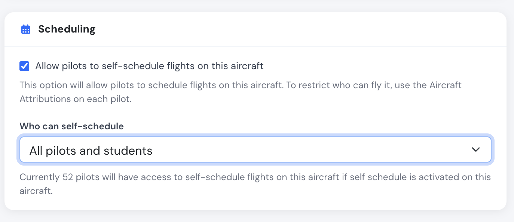

# Create your aircraft

Adding aircraft into your company account is a very fast process.

Navigate to the Aircraft section of your account, and click on the blue button that says Create new Aircraft on the right hand side.

In order to start you will first need the following details about the aircraft you want to create:

* Aircraft registration
* Aircraft manufacturer and model
* Current aircraft flight time

 

**Optional details:**

* Airworthiness and insurance certificate expiration dates
* Aircraft ADSB HEX code
* Aircraft rental price
* Authorized pilots
* Aircraft documents

### Create a Aircraft page

The main form is divided in 4 sections:

* Aircraft general information.
* Aircraft expiration dates.
* Aircraft logbook and maintenance.
* Aircraft permissions, rentals and billing settings.

**Note that** Flylogs allows you to create not only aircraft, but also simulators.

Simulator time will be separated in pilot logbooks but management is unified in this single form.

 

### Aircraft ADSB location tracking

If you provide a ADSB-out hex code, Flylogs will gather location data of your aircraft every 5 minutes and will attach this data to each flight of the aircraft. This could be useful for flight tracking and debriefing purposes.

_- This feature only works on Premium accounts._

### Aircraft Maintenance records

Aircraft logbooks are fully automatic and thus, the aircraft maintenance tracking.

You will only need to enter the flight time of the aircraft at the time of creating, and the maintenances as the CRS (Certificate release to service) are signed.

You can schedule future maintenance windows just by specifying a future date.

***

### Aircraft permissions, rental and billing

You can control who is allowed to fly each aircraft through the **Aircraft Attributions** on each pilot's profile. By default a pilot has no attributions, which means they are allowed on every aircraft. Attributing specific aircraft to a pilot restricts them to those aircraft.

Additionally, in the **Scheduling** box you can allow pilots to self-schedule flights on the aircraft. When you enable it, a **Who can self-schedule** dropdown lets you choose the access level:

* **All pilots and students** (default) — `user_group_id` ≤ 200.
* **Certified pilots** — pilots only, students excluded (`user_group_id` < 200).
* **Only instructors** — Flight Instructors and above (`user_group_id` ≤ 170).

A live counter under the dropdown shows how many pilots would have self-schedule access for the selected mode.

<figure><figcaption>
Scheduling settings on the aircraft edit page.
</figcaption></figure>

Your aircraft can also be configured for rental individually. You can specify different rental rates for different services. This rates at the same time, can also be customized for each pilot later on.

Flylogs will automatically calculate the correct amount to be billed based on the flight information. Billing by block time, flight time or tach time can be configured.

Flylogs will automatically suggest the billing price based on the aircraft configuration, flight information and pilot customized price (if any).  &#x20;

These are default settings, and if wanted, the price and the person to be billed can be edited before billing.
