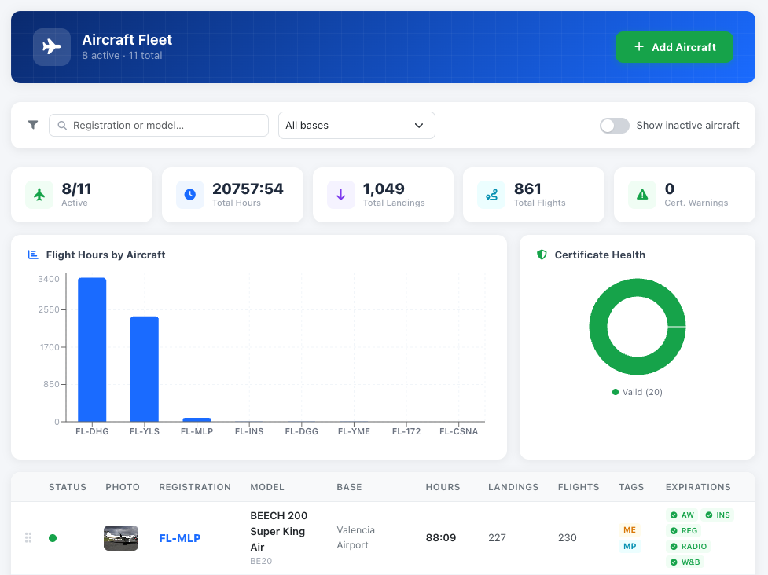
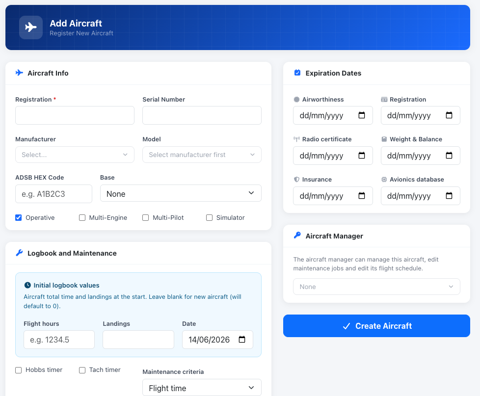
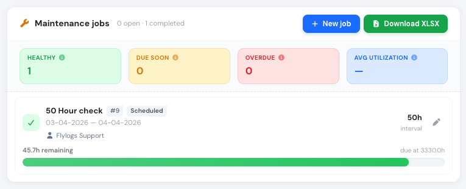
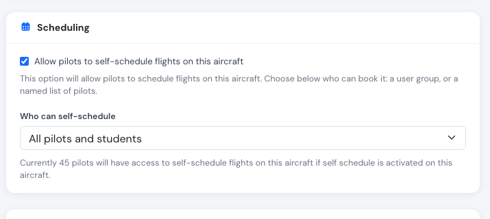

# Create your aircraft

Adding aircraft into your company account is a very fast process.

Navigate to the Aircraft section of your account, and click on the blue button that says Create new Aircraft on the right hand side.

In order to start you will first need the following details about the aircraft you want to create:

* Aircraft registration
* Aircraft manufacturer and model
* Current aircraft flight time

 

**Optional details:**

* Airworthiness and insurance certificate expiration dates
* Aircraft ADSB HEX code
* Aircraft rental price
* Authorized pilots
* Aircraft documents

### Create a Aircraft page

The main form is divided in 4 sections:

* Aircraft general information.
* Aircraft expiration dates.
* Aircraft logbook and maintenance.
* Aircraft permissions, rentals and billing settings.

**Note that** Flylogs allows you to create not only aircraft, but also simulators.

Simulator time will be separated in pilot logbooks but management is unified in this single form.

 

### Aircraft ADSB location tracking

If you provide a ADSB-out hex code, Flylogs will gather location data of your aircraft every 5 minutes and will attach this data to each flight of the aircraft. This could be useful for flight tracking and debriefing purposes.

_- This feature only works on Premium accounts._

### Aircraft Maintenance records

Aircraft logbooks are fully automatic and thus, the aircraft maintenance tracking.

You will only need to enter the flight time of the aircraft at the time of creating, and the maintenances as the CRS (Certificate release to service) are signed.

You can schedule future maintenance windows just by specifying a future date.

***

### Aircraft permissions, rental and billing

You can control who is allowed to fly each aircraft through the **Aircraft Attributions** on each pilot's profile. By default a pilot has no attributions, which means they are allowed on every aircraft. Attributing specific aircraft to a pilot restricts them to those aircraft.

Additionally, in the **Scheduling** box you can allow pilots to self-schedule flights on the aircraft. When you enable it, a **Who can self-schedule** dropdown lets you choose the access level:

* **All pilots and students** (default) — `user_group_id` ≤ 200.
* **Certified pilots** — pilots only, students excluded (`user_group_id` < 200).
* **Only instructors** — Flight Instructors and above (`user_group_id` ≤ 170).

A live counter under the dropdown shows how many pilots would have self-schedule access for the selected mode.

<figure><figcaption>
Scheduling settings on the aircraft edit page.
</figcaption></figure>

***

### Which flight types an aircraft can fly

Under **Scheduling** on the aircraft edit page there is a **Flight types** card. It is the aircraft's side of the aircraft restriction that lives on the [flight type](../flights/flight-types.md#aircraft) — the same setting, edited from whichever end is more convenient. Restricting one simulator type to two simulators is quicker from the flight type; setting up a newly delivered twin for the three types it may fly is quicker from here.

<figure><figcaption>
The B200 simulator, attributed to the <em>SIM</em> flight type. Every flight type in the company is listed; tick the ones this aircraft should be attributed to.
</figcaption></figure>

The important part is what an **empty** selection means, because it is not what it first looks like:

| Nothing ticked | This aircraft flies **every flight type that has no aircraft attributed to it at all** |
|---|---|
| **Something ticked** | Those flight types become restricted to this aircraft (plus any other aircraft already attributed to them) |

So an aircraft with nothing ticked is **not grounded** — that is the normal state for most of a fleet, and it is why the card starts empty on every existing aircraft. The reading of an empty list belongs to the flight type, not to the aircraft: a flight type nobody has restricted is open to everything.

Two things follow from that, and the card says so in the note under it:

* **Ticking a flight type here restricts that flight type.** If *Night* was open to the whole fleet and you tick it on one aircraft, *Night* is now flyable on that aircraft only. That is a company-wide change made from an aircraft page — deliberate, but worth knowing before you tick.
* **Unticking the last aircraft reopens the flight type.** Remove the only aircraft attributed to a type and the type goes back to "any aircraft", not "no aircraft".

If you want an aircraft simply excluded from one flight type, do it from the [flight type](../flights/flight-types.md#aircraft) instead: tick the aircraft that *may* fly it, and everything else is excluded by construction.

Your aircraft can also be configured for rental individually. You can specify different rental rates for different services. This rates at the same time, can also be customized for each pilot later on.

Flylogs will automatically calculate the correct amount to be billed based on the flight information. Billing by block time, flight time or tach time can be configured.

Flylogs will automatically suggest the billing price based on the aircraft configuration, flight information and pilot customized price (if any).  &#x20;

These are default settings, and if wanted, the price and the person to be billed can be edited before billing.
