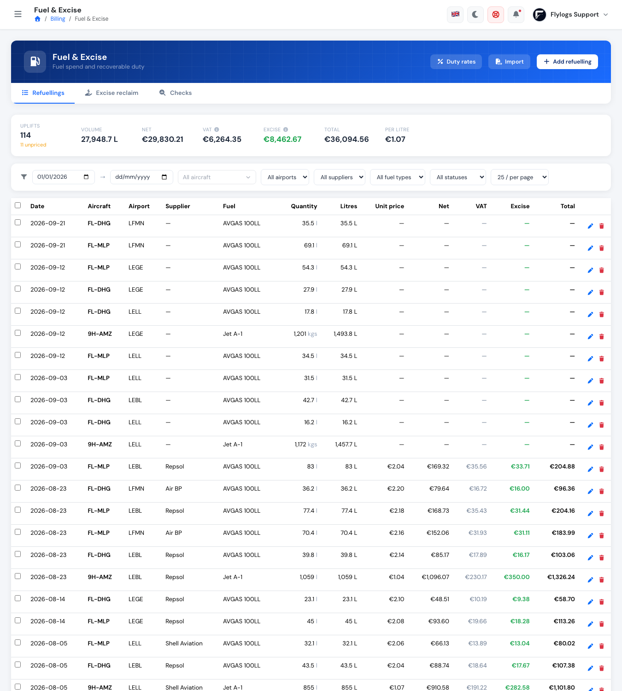
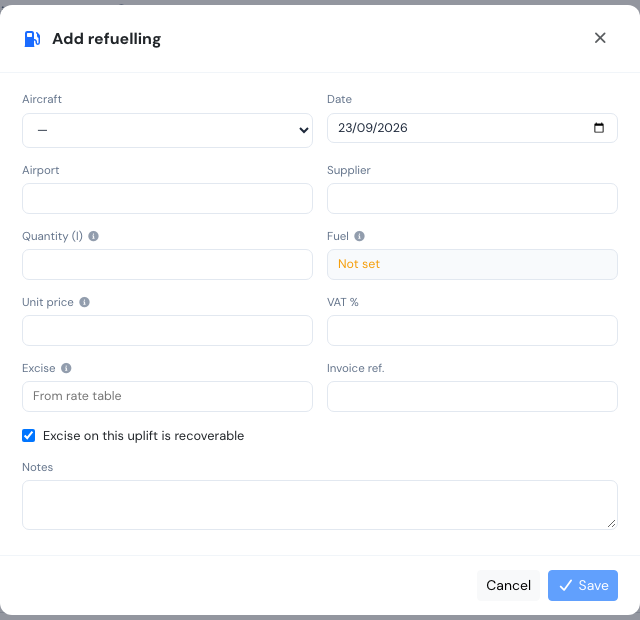
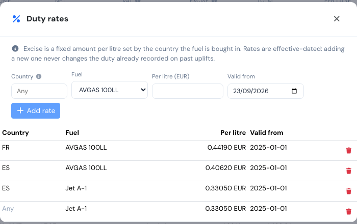
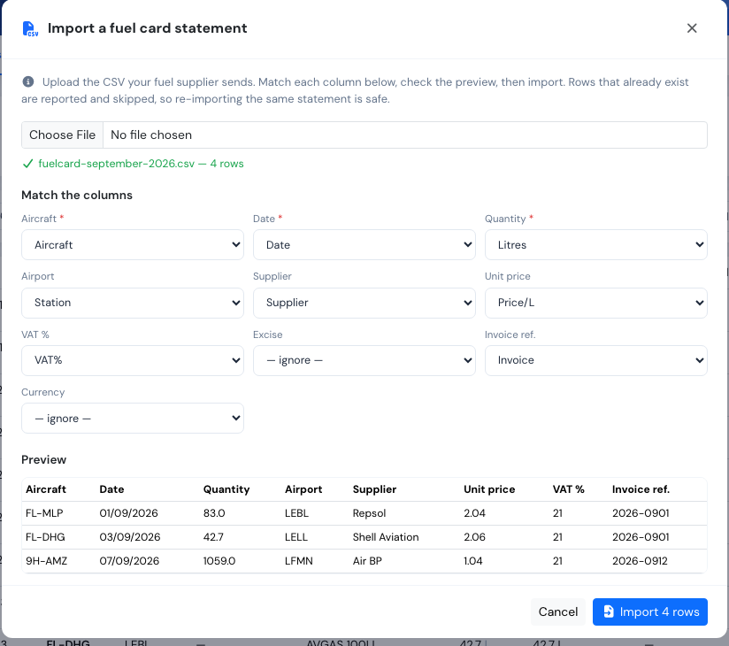
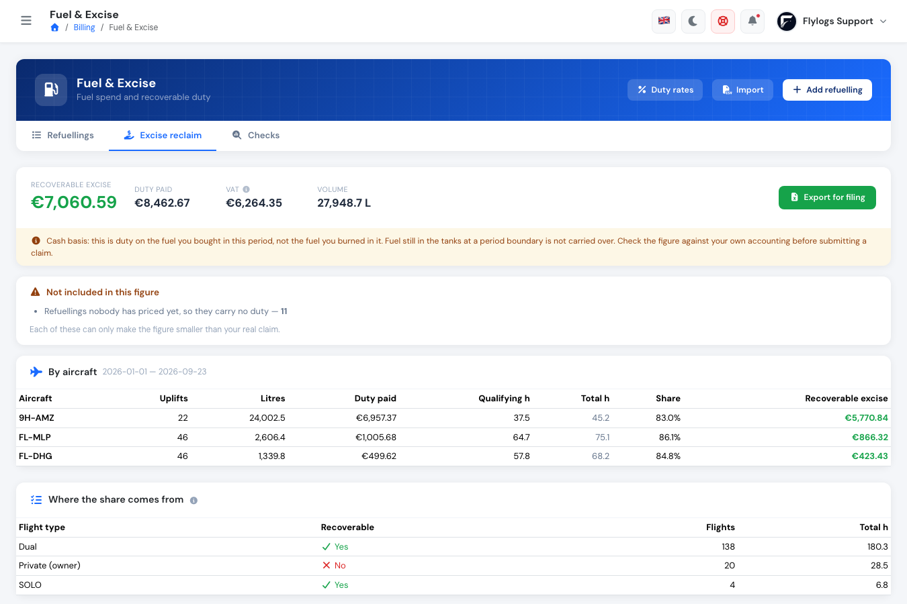
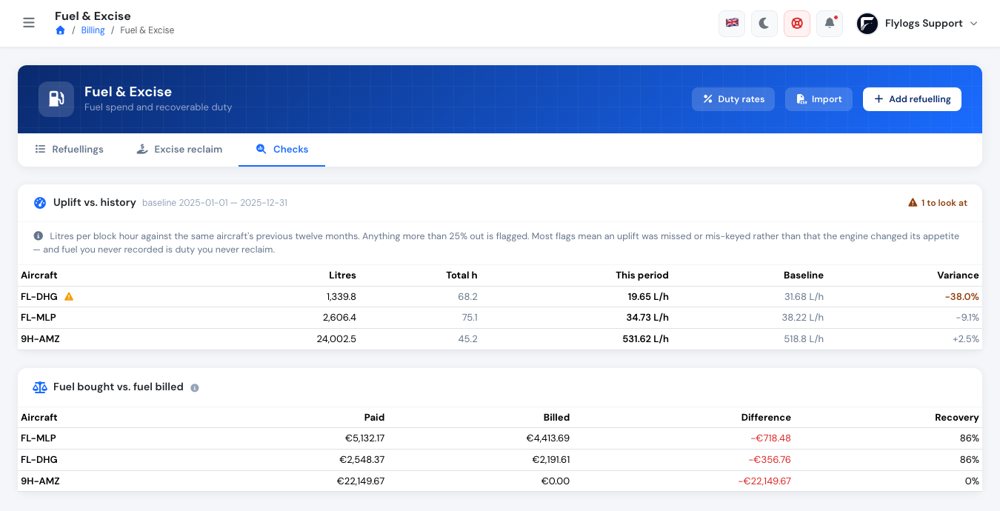
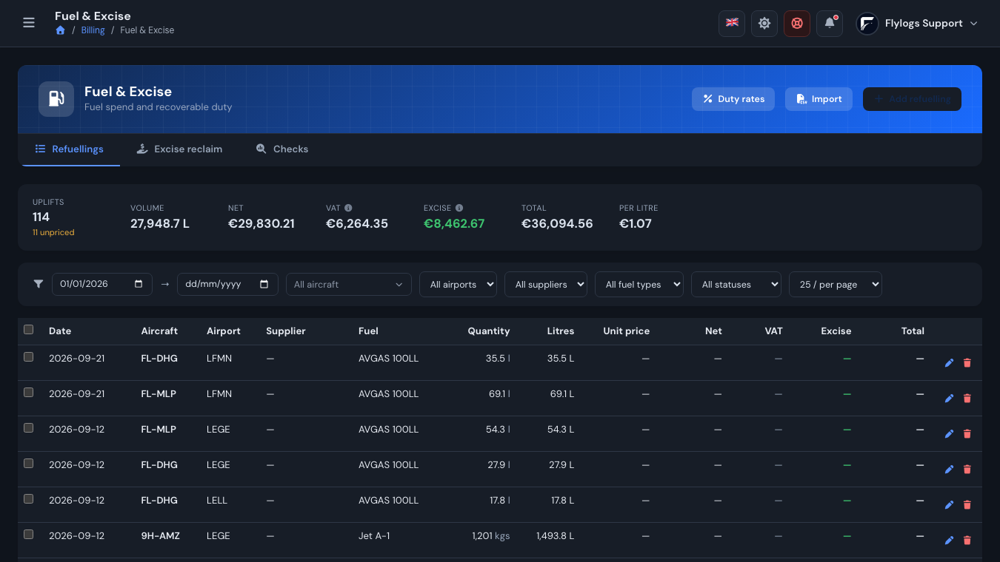

# Fuel & Excise

Fuel is usually an operator's largest variable cost, and a large slice of what you pay at the pump is excise duty — the government tax on mineral oil. Operators can normally reclaim that duty on fuel used for qualifying commercial and training flights. Flylogs records every uplift, splits what it cost into net, VAT and excise, and works out how much of the duty is recoverable.

**Who can see this page:** Financial Manager and above. It lives under **Billing → Fuel & Excise**, and like the rest of the billing module it needs a paid company plan. Pilots never see it.

<figure><figcaption><p>Every uplift in the period, with the totals above it</p></figcaption></figure>

## Where refuellings come from

You do not have to type them in. Whenever a flight is saved with a fuel quantity, Flylogs records a refuelling for it automatically — the fuel figure on a flight has always been an uplift (a tank top-up), not the fuel burned on that one leg. The refuelling arrives with the date, the aircraft and the landing airport already filled in, waiting only for what it cost.

Fuel quantity is recorded on the flight form whenever the aircraft has fuel tracking configured, whatever type of operation you run.

You can also add a refuelling by hand, for fuel bought outside a recorded flight.

<figure><figcaption><p>Adding an uplift by hand. Fuel type is read-only — it comes from the aircraft</p></figcaption></figure>

### What is inherited from the aircraft

Two things are never asked for on any form, because they belong to the aircraft:

| Inherited | Comes from |
| --------- | ---------- |
| **Unit** (litres, US gallons, imperial gallons, kg, lb) | The aircraft's fuel tracking setting |
| **Fuel type** (AVGAS 100LL, Jet A-1, Jet A, MOGAS, SAF, other) | The aircraft's fuel type |

Both are stored with each refuelling as they were on the day. Changing an aircraft's fuel type later corrects it going forward and leaves your filed history alone.


**Set the fuel type on each aircraft.** Fuel type is a new field, so it starts empty. Without it, an uplift recorded in kilos or pounds cannot be converted to litres — a kilo of AVGAS and a kilo of Jet A-1 are different volumes — and no duty can be calculated. The page flags these rows so you can see which aircraft still need it. Uplifts recorded in litres or gallons are unaffected.


## Pricing your refuellings

A new refuelling arrives marked **Needs pricing**. Open it, or use the bulk bar, and enter:

* **Unit price** — the price you were invoiced per unit. This is the pump price: excluding VAT, **including** excise duty.
* **VAT %** — your VAT rate on the purchase.
* **Excise** — leave it blank and Flylogs takes it from your duty rate table (below). Fill it in only when the invoice disagrees.
* **Supplier** and **invoice reference** — so you can trace a figure back to its paperwork.

Flylogs then works out the litres, the net amount, the VAT and the total.

### A worked example

A 1,000 litre uplift of AVGAS 100LL at a Spanish airport, invoiced at €2.10 per litre, VAT 21%, with the Spanish AVGAS duty rate of €0.40620 per litre configured:

| Figure | How it is reached | Result |
| ------ | ----------------- | ------ |
| Litres | 1,000 l, already in litres | 1,000.000 |
| Net | 1,000 × €2.10 | **€2,100.00** |
| Excise | 1,000 × €0.40620 | **€406.20** |
| VAT | €2,100.00 × 21% | **€441.00** |
| Total | net + VAT | **€2,541.00** |


Notice that the €406.20 of excise does **not** appear in the total. Excise is a **component of** the net amount, not an extra charge on top — you already paid it inside the €2.10 per litre. Net plus VAT is always your total; the excise figure simply tells you how much of that net was tax, and therefore how much is potentially reclaimable.


The same uplift measured in kilos works the same way, once the aircraft has a fuel type. 720 kg of AVGAS 100LL, at a density of 0.72 kg/l, is 1,000 litres — and produces exactly the figures above. Without a fuel type on the aircraft, Flylogs cannot make that conversion and leaves the row flagged rather than guessing.

### Pricing a whole invoice at once

One fuel invoice usually covers a month of uplifts at a single airport at a single price. Tick the rows, and the bar at the top of the list applies one price, VAT rate, supplier and invoice reference to all of them. Fields you leave blank are not touched, so bulk pricing never wipes a detail you already filled in on one row.

## Duty rates

Excise is a fixed amount per litre, set by the country where the fuel is bought — it is not a percentage, so it does not move when the fuel price does. Enter your rates once under **Duty rates**.

<figure><figcaption><p>Rates by country and fuel type. A blank country is the company-wide fallback</p></figcaption></figure>

* **Country** — the ISO code of the airport's country. Leave it blank for a company-wide fallback used when no country-specific rate matches.
* **Fuel type** — rates differ between AVGAS and jet fuel.
* **Per litre** — the rate itself.
* **Valid from** — the date the rate took effect.

Flylogs picks the rate for the airport's own country first and falls back to your company-wide rate. In the example above, an AVGAS uplift in Spain takes €0.40620, the same uplift in France takes €0.44190, and a Jet A-1 uplift anywhere else falls back to the €0.33050 rate with no country set.


Rates are effective-dated on purpose. Adding this year's rate does **not** restate the duty already recorded against earlier uplifts — those figures may already have been filed, and a rate correction should never silently rewrite a submitted return.


## Importing a fuel card statement

If your supplier sends a CSV — Shell, Air BP, World Fuel and most fuel cards do — **Import** reads it directly.

<figure><figcaption><p>Match each column once; the preview shows exactly what will be imported</p></figcaption></figure>

Upload the file and Flylogs shows you its columns. Match each one to a field (aircraft, date and quantity are required; price, VAT, excise, supplier, airport, invoice reference and currency are optional), check the preview, and import. Column matching is guessed from the header names, so most statements need no clicking at all — but every guess is visible and changeable before anything is written.

Registrations are matched loosely, so `EC-KMH`, `ECKMH` and `ec kmh` all find the same aircraft. Numbers are read in whatever format the file uses: the example above is a semicolon-separated file written with decimal commas (`83,0` litres at `2,04` per litre), and the preview shows it read correctly as 83.0 and 2.04.


**Importing the same statement twice is safe.** A row matching an existing refuelling on aircraft, date, quantity and invoice reference is reported as already on file and skipped, never added again.


Rows that cannot be read — an unknown registration, an unreadable date, a missing quantity — are listed with their line numbers rather than silently dropped, so you can fix the file or the aircraft and re-import.

## What the page tells you

**Period totals** — uplifts, volume, net, VAT, excise, total and the average price per litre, for whatever period and filters you have selected. If you buy fuel in more than one currency you get a subtotal per currency: amounts are never converted between currencies, because an invented exchange rate inside a tax figure is worse than two honest subtotals.

**Where fuel was bought** — the same figures grouped by airport, with the price per litre at each. This is the comparison that tells you where it is worth tankering from.

**Filters** — date range, aircraft, airport, supplier, fuel type, and whether a row has been priced yet. Filter to **Needs pricing** when an invoice lands, and you have your month's work in front of you.

## Reclaiming the duty

The **Excise reclaim** tab turns what you paid into what you can claim.

<figure><figcaption><p>The reclaim figure, with the working that produced it</p></figcaption></figure>

Excise is recoverable by **use**, not by purchase. Fuel burned on a qualifying flight can be reclaimed; the same fuel burned on a private flight generally cannot. Each flight type carries a **Fuel duty recoverable** switch, on the flight type's edit page under Visibility. The report takes the duty each aircraft paid in the period and apportions it by that aircraft's share of block time flown on qualifying types:

> duty paid × (qualifying hours ÷ total hours) = recoverable

In the report above, 9H-AMZ paid €6,957.37 of duty and flew 37.5 of its 45.2 hours on qualifying types — a share of 83.0% — so €5,770.84 is recoverable. The shares come from the flight type table at the foot of the page: 180.3 hours of Dual and 6.8 of SOLO qualify, while 28.5 hours of Private (owner) do not.

Because both sides of that ratio are per aircraft, an aircraft's own fuel consumption drops out of the sum — a thirsty twin and a light single are each apportioned on their own flying.


**Review your flight types first.** They all start switched on. If you leave a private-hire or owner-flight type marked recoverable, the report will claim duty you are not entitled to.


The report also lists **what it could not account for** — refuellings nobody has priced, uplifts that could not be converted to litres, priced rows with no duty (usually a missing rate), and rows with no airport. Every one of these can only make your claim *smaller* than it should be, so clear them before you file.

**Export for filing** produces a spreadsheet with all of the above, including the basis note, to attach to your claim.


The reclaim figure is calculated on a **cash basis** — duty on the fuel you *bought* in the period, not the fuel you *burned* in it. Fuel still in the tanks at a period boundary is not carried over. That matches the invoices a tax authority asks to see, but it is not a fuel-burn calculation, and Flylogs does not file anything on your behalf. Check the figure against your own accounting before submitting a claim.


VAT is shown alongside for reference and is never part of the reclaim figure — VAT is recovered through your VAT return, which is a completely separate mechanism.

## Checks

The **Checks** tab is two sanity checks on the data behind everything above.

<figure><figcaption><p>One aircraft flagged for review, and fuel cost recovery per aircraft</p></figcaption></figure>

### Uplift against the aircraft's own history

Litres per block hour is stable for a given airframe. This compares each aircraft's figure for the period against that same aircraft's previous twelve months, and flags anything more than 25% out.

In the example, FL-DHG recorded 19.65 l/h against its own baseline of 31.68 l/h — 38% low, and flagged. FL-MLP at −9.1% and 9H-AMZ at +2.5% are well within normal variation and are left alone.

Most flags do not mean an engine started drinking. They usually mean an uplift was missed or mis-keyed — and fuel you never recorded is duty you never reclaim, so it is worth chasing either way. It will also surface the less comfortable possibility, which is fuel leaving the airfield in something other than an aeroplane.

An aircraft that flew very little in the period, or has no history to compare against, is shown without a flag: the ratio would mean nothing.

### Fuel bought against fuel billed

What the fuel cost you, against the fuel extra charged on to pilots for the same period, per aircraft. Under-recovery usually means an hourly rate that has not kept up with the pump.

Above, the two training aircraft each recover 86% of what their fuel cost. 9H-AMZ shows 0% — that is not a fault, it is a charter aircraft whose fuel is inside the hourly rate rather than billed as an extra. Where an aircraft's fuel was bought in more than one currency no comparison is offered, because there is no exchange rate to make one with.

## Dark mode

The page follows your Flylogs theme.

<figure><figcaption><p>The same page with the dark theme selected</p></figcaption></figure>

## Linking to a tab

Each tab has its own address, so you can bookmark the reclaim view or send it to your accountant:

```
/manager/bills/fuel                    the refuellings list
/manager/bills/fuel?tab=reclaim        the excise reclaim report
/manager/bills/fuel?tab=checks         the checks
```
