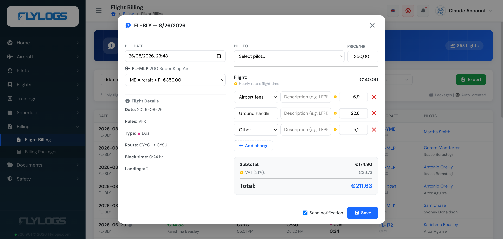
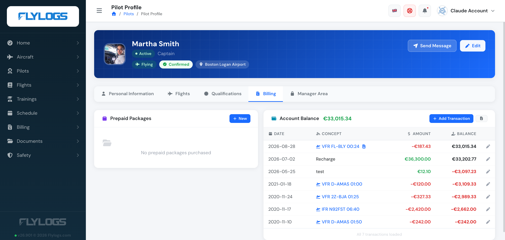

# Introduction

At Flylogs we strive to get what our customers really need, specially things to improve their flight data management efficiency.&#x20;

One of our most used tools to improve efficiency, and also customer engagement, is the Flight Billing System.&#x20;

**Flylogs Flight Billing System**, allows you to create bills directly from your existings flights in a single click. Just by clicking a flight from the Flight Billing list, you open the Flight Billing Panel shown below.

The flight price (hourly rate × flight time) is calculated automatically. On top of that you can add any number of itemized extra charges — Fuel, Airport fees, Ground handling, Catering, Permits & slots, Crew, De-icing or Other — each with its own description and amount, and each independently taxable per your company's VAT settings. Create the bill instantly: it only takes 30 seconds.

Your customer will receive a notification of the new bill and the amount billed will be deducted from the customer's balance. If the customer holds a valid [Prepaid package](prepaid-packages.md) for that flight, it's used first and only the remainder, if any, comes off the balance.

This is a great tool, because not only you have a single click billing solution in a single place, but also, your customers have full view of their expenses linked to their flights, creating a satisfying sensation of payment for a great service received.

<figure><figcaption>
Flight Billing Panel
</figcaption></figure>

If set in your company settings, your customer receives an instant email notification with the bill information and link. The balance is updated immediately and the bill — along with the customer's full running balance and transaction history — is available on their profile's Billing tab too.

 
