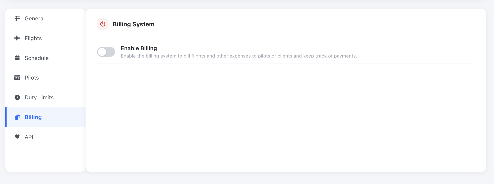
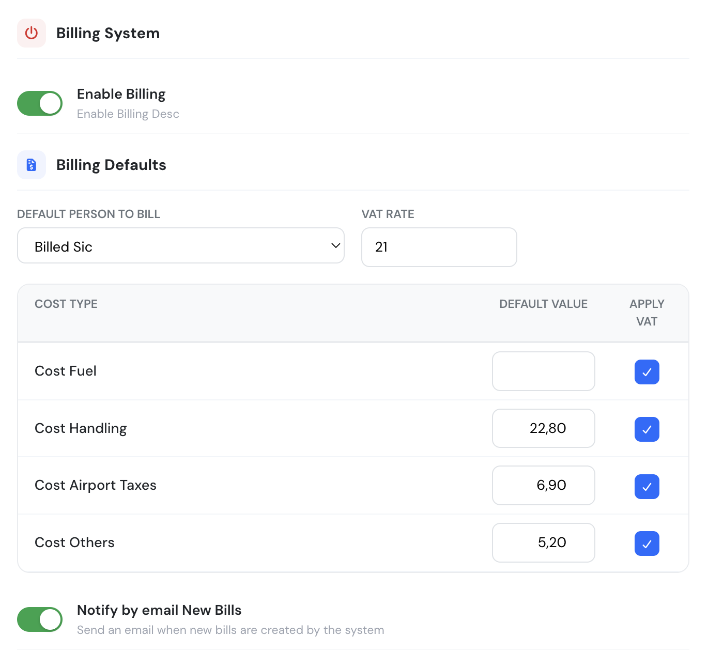
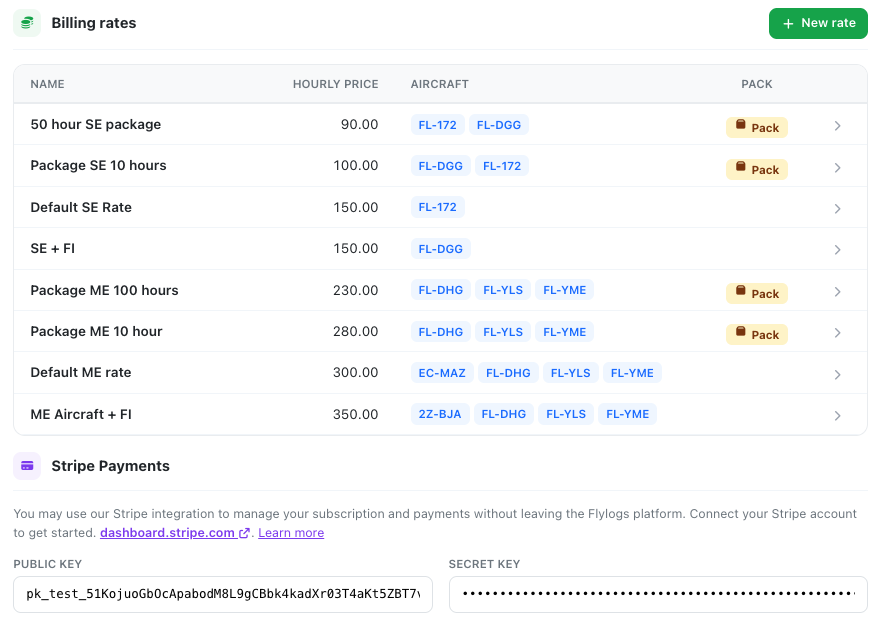
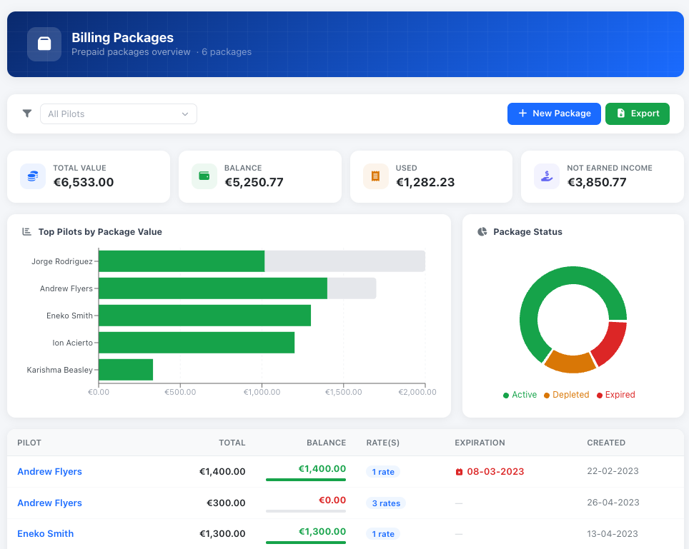
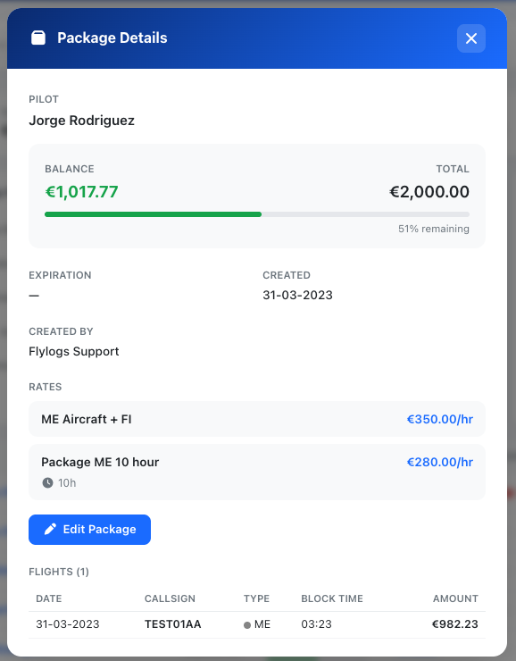

# Billing System

Flylogs includes a company wide flight billing tool. The tool is deactivated by default when your company account is created.

<figure><figcaption></figcaption></figure>

### Enable the billing system

**Navigate to:** Company > Billing system > Configure Billing

Once you click on the Configure billing button, a modal window will open with options to activate the system and configure various other options, like VAT, other expenses and the option to automatically send an email notification when the bills are created.

### Manage Billing rates

Once the system is active, you can create the billing rates easily by clicking the New Rate button.

The window that will open, will ask for rate name and hourly rate in your local currency. Flylogs gives you the option to create hour packages. If you click on the checkbox to do so, Flylogs will ask you for the number of hours included in the package and will display the total package price on the bottom left corner for you crosscheck.

***

### Flight Hour Packages

You can create hour packages in your billing rates. These packages are available for all company pilots

Once you have created your rates and packages, you can select the ones you want to apply for each aircraft, to do so, go into your aircraft edit page, and within the billing settings, select the appropriate rate or packages.

 

Once you have associated the rates and packages to the aircraft, you can go into any pilot´s profile page, click on the billing tab, and ad the purchased packages as required.

Flylogs will automatically remove the time from the package once every flight is confirmed.

If there are several packages, these will be expensed in order. If the pilot has no more packages to pay for a given flight, the flight will automatically billed using the default aircraft rate.

***

### Automatic billing

Once you have created your rates, you can enable flight billing on your aircraft.

You can define which rates apply to each one of your aircraft, define the billing and timing criteria.

