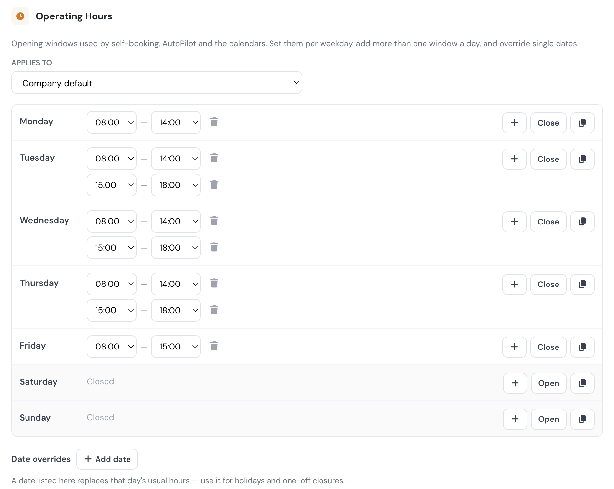

# Schedule

The Schedule tab shapes how your flight schedule works: who can manage it, who can see it, when self-bookings are allowed and how cancellations are handled.


This tab requires a **Premium** or **Unlimited** plan. On Free and Club plans the settings are hidden.


### Permissions

* **FI schedule management** — allows Flight Instructors to manage the schedule and book flights for other pilots, the same way scheduling staff does. When disabled, instructors can only handle their own bookings; the schedule editor is limited to staff roles.
* **All pilots see schedule** — when enabled, captains, pilots and students can see the schedule slots of **all** aircraft and bases. When disabled, each pilot only sees slots for the aircraft and bases they are assigned to, and the master schedule views are reserved for staff and instructors.

### Calendar appearance

* **Calendar slot color** — chooses what the slot colors in the schedule editor represent:
  * **Pilot color** — each pilot's personal color (default).
  * **Flight status color** — booking status (booked, confirmed, dispatched…).
  * **Flight type color** — the color assigned to each flight type.

### Operating hours

Your opening times. They decide which slots self-service booking offers, which flights AutoPilot may place, and how wide the schedule calendars are drawn.

<figure><figcaption>Company Settings → Schedule → Operating Hours. Tuesday to Thursday run a split day (08:00–14:00 and 15:00–18:00), Friday closes early, and the weekend is closed.</figcaption></figure>

**The weekly grid.** Each weekday gets its own times, so a field that shuts early on Saturdays no longer has to pretend it keeps weekday hours.

* **Several windows a day** — press **+** on a day to add another window. A day set to `08:00–12:00` and `14:00–19:00` offers slots in the morning and the afternoon, and never one that runs through the midday closure. Use this for lunch breaks, shift changes, or a gap reserved for maintenance.
* **Closed days** — press **Close** on a day the field does not operate. Self-booking then answers "Closed on this date" for that day instead of "no slots available", and AutoPilot skips it.
* **Copy to all days** — the copy icon applies one day's windows to the whole week, which is the fastest way to start from a uniform week and then adjust the exceptions.
* Times are set in 15-minute steps, in your company timezone.

**Per base.** The **Applies to** selector at the top chooses whose hours you are editing: the **company default**, or one base.

* A base with no hours of its own follows the company default, and says so.
* Pressing **Customise** gives the base its own week, seeded from the company hours so you start from what it already uses.
* Once a base has its own week, that week is the whole story for that base — a weekday the base leaves empty counts as **closed** there, it does not fall back to the company hours. This is deliberate: a base that opens only at weekends should be shut on weekdays, not silently inherit them.
* **Follow company default** clears the base's hours and puts it back to inheriting.
* Which hours apply to a booking is decided by the **aircraft's** base, so an aircraft stationed at a base with its own hours is offered that base's slots wherever the pilot happens to be.

**Date overrides.** Below the grid you can list single dates that replace that day's usual hours — public holidays, an airshow, a day the field closes for works.

* An override can either close the date or give it a different set of windows.
* A company-level override closes or changes the date for **every** base, unless that base lists the same date itself. A base override always wins over the company one, which is how one base stays open on a day the rest of the company is shut.

**Outside these hours.** The hours are a guide for managers, not a lock. In the schedule editor, both saving a flight outside them **and dragging or resizing one into** them show a confirmation naming that day's real windows; confirm and it saves normally, cancel and a dragged flight snaps back. Ferry flights, night training and one-off operations stay possible. Self-booking, by contrast, only ever offers slots inside the windows.

Flights that cross midnight are not checked against the windows, since they cannot fit inside a single day.

### Self scheduling

These limits apply to the [pilot self-scheduling feature](../../schedules/self-scheduling.md). Remember that self-scheduling must also be enabled per aircraft.

* **Max slots per day** — the maximum number of self-service reservations a pilot may hold on a single day. The server rejects any booking above the limit.
* **Min / Max slot duration** — the shortest and longest slot a pilot can self-book.
* **Default duration** — the slot length pre-filled when a pilot opens the booking form.
* **Allow self-booking without valid documents** — controls whether pilots with missing or expired documents can **complete** a self-booking. The widget is always visible and the pilot is always warned in the booking modal; the switch decides whether that warning is a hard stop:
  * **Off (default, stricter)** — the warning is red and the **Book this Slot** button is disabled until the pilot holds a valid **licence**, **rating** and **medical**.
  * **On (permissive)** — the same warning is amber and informational; the pilot can book anyway. Use this only if you check documents outside Flylogs or are still onboarding pilots.
  * Only has an effect while **Require pilot documentation** (Pilots tab) is on. With that off, certificates never block a self-booking.


**Students are exempt from the document gate.** A student never acts as PIC — Flylogs automatically assigns a Flight Instructor, or stores the booking as PENDING until one is available — so the student's own licence, rating and medical are not required to book.


### Schedule cancellations

* **Dispatch cancel limit** — how close to the scheduled start time a crew member (PIC, SIC or supervisor) may still cancel or edit their own booking. Inside the window the self-cancel/edit option simply disappears from their view — no on-screen message explains why, so crew must be told separately to reach out to the PIC or a scheduling manager instead. This limit only affects self-service: staff with scheduling rights are never blocked by it and can always cancel any booking from [Schedule Review](../../schedules/schedule-review-page.md). Options range from *Any time* to 48 hours; *Disabled* prevents crew self-cancellation entirely.
* **Not-flown grace** — how long after a flight's scheduled end time Flylogs waits before automatically cancelling a booking that was never dispatched or logged. The auto-cancellation is attributed to the PIC with the reason "Not flown" and shows in the [cancellation analytics](../../schedules/schedule-cancellations.md); it is silent (no notification). Default 72 hours; set to *Disabled* (0) to turn the behavior off.

This same window also drives two automatic behaviors:

* **PENDING student bookings** (self-bookings without an assigned instructor) are automatically cancelled when the window closes without an instructor being assigned. The slot frees up and pilots on the watchlist are notified.
* Reminders and confirmation deadlines around dispatch use the same cut-off.

See [Schedule cancellations](../../schedules/schedule-cancellations.md) for the pilot-facing behavior.
