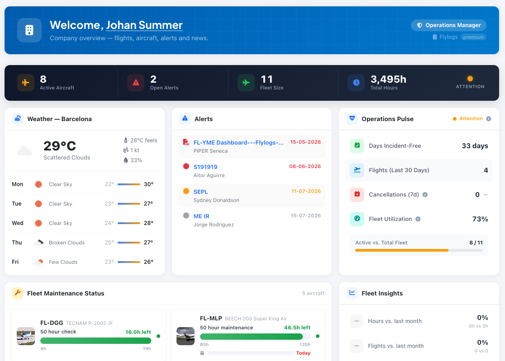
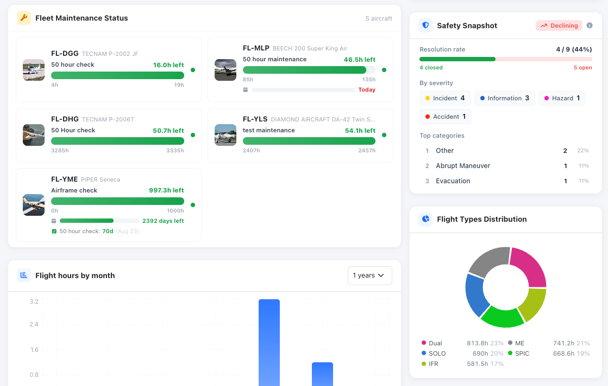

# Your Flylogs dashboard

The Flylogs dashboard is a dynamic environment that will change over time to show you the most important data right at the first screen you see when you log in.

 

Each user type has a different dashboard, pilots dashboard are more focused on flight availability and flight schedule.

Student dashboards are optimized to display training calendar, company news and upcoming classes, exams and flights.

***

### Dashboard evolution

As you enter more data in Flylogs, the dashboard continues to change and show you more relevant information. 

* Flight time history for 1,2,3,5 and 10 years back.
* Aircraft maintenances,&#x20;
* Live aircraft ADSB location
* Aircraft certificate expiration dates,&#x20;
* Pilot duty and flight overtimes,
* Pilot medical and License expirations 

***

### Alerts

The **Alerts** widget on your dashboard surfaces everything about to expire across your operation — aircraft certificates (insurance, airworthiness, registration, weight & balance, radio, avionics), scheduled maintenance, uploaded aircraft documents, company documents, and pilot certificates. Each item is colour-coded: red for already expired, amber for expiring within a month, grey for expiring within three months.

Use the **View all** link in the widget header to open the dedicated **Alerts page**, where you can filter the full list by:

* **Date range** — narrow to a specific window, or reach further ahead / into the past than the widget's default three-month horizon.
* **Type** — aircraft certificates, maintenance, aircraft documents, company documents, or pilot certificates.
* **User** — show a single person's alerts (their pilot certificates plus documents for aircraft they own).

Filters are remembered in the page address, so you can bookmark or share a filtered view.

**Who sees what:** company managers see alerts across the whole company. Flight instructors and other non-managers see only their own aircraft documents and the certificates of themselves and their supervised students — selecting another user never reveals that person's certificates.
