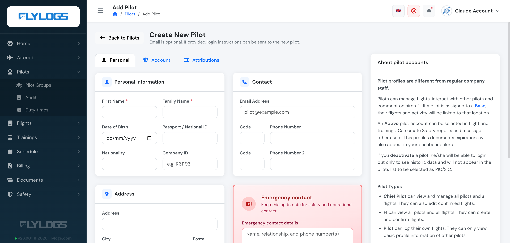
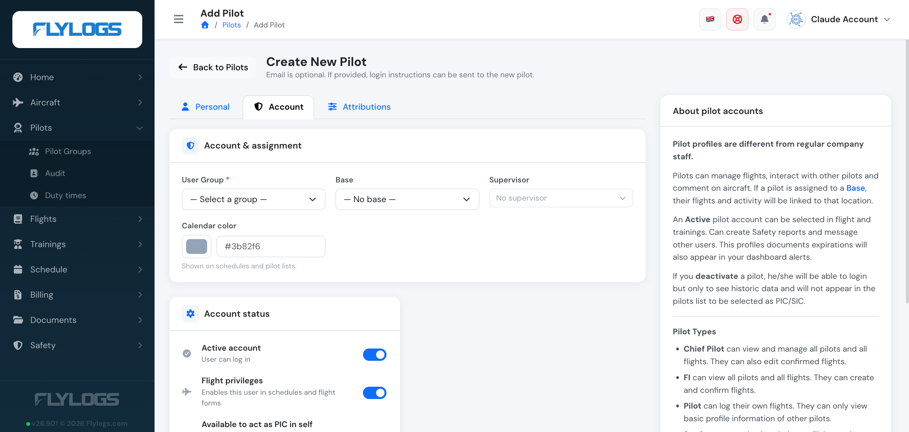
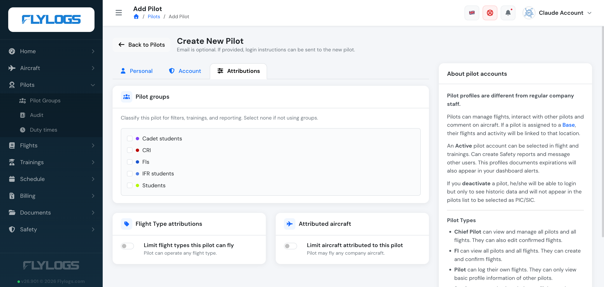
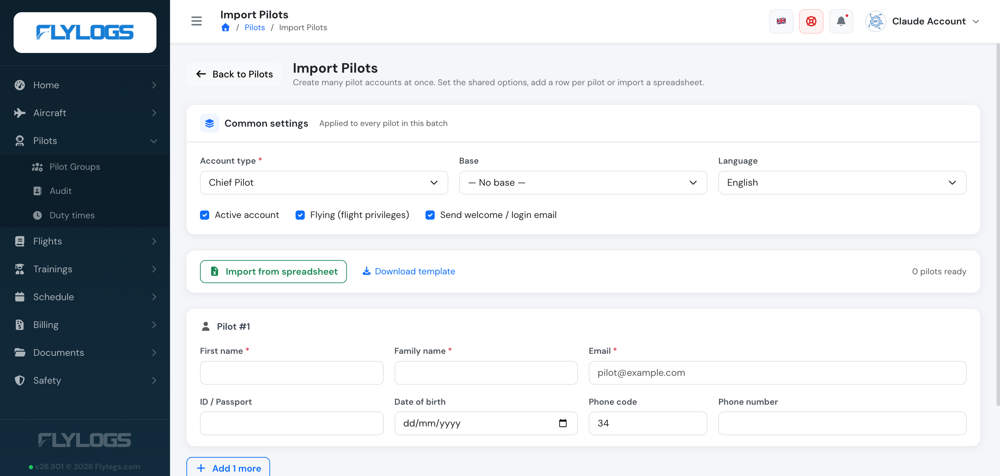

# Create Pilots or Students

In your Manager account, navigate to the pilots management area and click the blue **Add Pilot** button.

The create form is organized into three tabs — **Personal**, **Account**, and **Attributions**.

### Personal tab

Only **First Name** and **Family Name** are mandatory. Everything else — contact details, address, emergency contact, and previous flight time experience for crosschecking against an existing logbook — is optional.

If you do not have the email address of the pilot this is not a limitation, you can still create the pilot account so you and other pilots will be able to log flights for this new pilot.

**If the pilot does not have an email address, he or she will not have the ability to login to Flylogs to check flights, schedules or attend training courses.**

### Account tab

This is where the account's basic settings live: the **User Group** (Pilot Type, which defines the permissions given to the user — see [Pilot Account Types and options](pilot-accounts.md)), Base, Supervisor, and the **Active account** / **Flight privileges** toggles.

Additionally, if the account is Active, you can set an account expiration date at which this user will be automatically deactivated by the system.

Note that Inactive pilots can still access to their Flylogs account with READ ONLY permissions with the aim to have access to their own logbook.

If an email address was entered on the Personal tab, this account is created with the option to send login instructions to the pilot. They will receive an email notification asking to complete the sign up process by clicking on the link to create the account password.

### Attributions tab

The Attributions tab lets you assign the pilot to **Pilot groups** (for filters, trainings, and reporting), and optionally restrict which **Flight types** they can fly and which **aircraft** are attributed to them — by default a pilot can operate any flight type on any company aircraft.

### Import multiple pilots

Probably you will need to create multiple accounts at once. For this purpose, click **Import** from the pilots list.

This function is an optimized form in which you set the shared settings once — account type, base, language, and whether to activate, grant flying privileges, and send the welcome/login email — then add a row per pilot (name, email, ID, date of birth, phone), or skip the manual rows entirely and **import from a spreadsheet** (a downloadable template is provided).

The system applies the common options you selected to every profile in the batch and sends the invites instantly to all the new pilot accounts.

