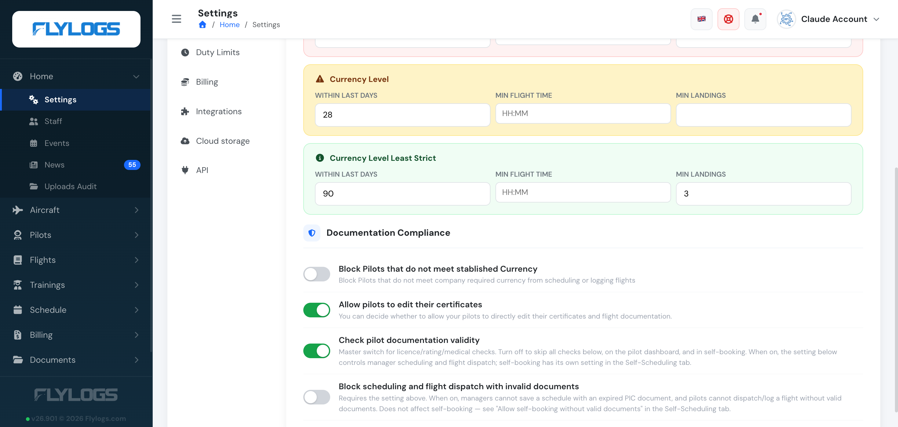
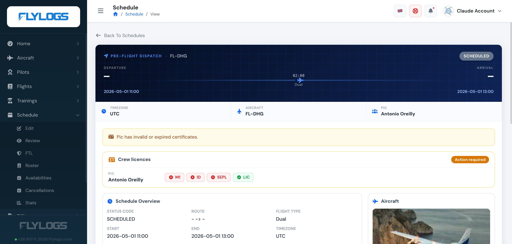
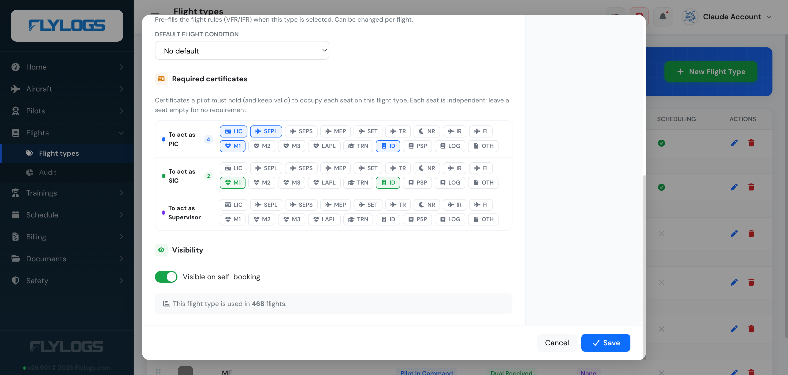

# Document & Certificate Requirements

We are glad to announce the new **Pilot Documentation Control System (PDCS)**, which can be enabled today in any Flylogs account from the Company Settings page.

The **PDCS** allows you to have a better control of pilot documentation and expiration dates.

**This new function also adds a safety barrier that will prevent pilots with expired or missing license or medical certificates from:**

* publishing their flight availability,
* confirming any scheduled flights,
* and logging any flights. 

Student pilots will only be required to upload a valid medical certificate in order to publish their schedule and confirm it.

**What the general check requires:** one valid licence, one valid rating and one valid medical. Pilots normally hold several ratings (type rating, IR, SEP, MEP, FI…), and only one of them needs to be valid for this general check to pass — a lapsed rating you no longer use, or one that only becomes effective in a few weeks, no longer blocks the pilot. Whether a *specific* rating is required for a given flight is decided by the flight type's [required certificates](#per-flight-type-certificate-requirements) for each seat, which are checked individually.

The configuration lives in **Company Settings → Pilots → Documentation Compliance**. Two toggles control the PDCS itself:

* **Check pilot documentation validity** — the master switch for licence/rating/medical checks. Turned off, all checks below, the pilot dashboard, and self-booking are skipped.
* **Block scheduling and flight dispatch with invalid documents** — requires the master switch above. When on, managers cannot save a schedule with an expired PIC document, and pilots cannot dispatch or log a flight without valid documents. This does not affect self-booking, which has its own **Allow self-booking without valid documents** toggle in the Self-Scheduling tab.

The two other toggles in this same panel are related but separate: **Block Pilots that do not meet established Currency** (recency of flight experience, not document validity) and **Allow pilots to edit their certificates**.

For example, a pilot with expired certificates will not be able to be scheduled or dispatched — like shown in the image below, from the pre-flight dispatch view.

### Manager warnings

When managers select any pilot for a schedule or dispatch, Flylogs automatically displays the crew's certificate status.

**If any certificates are expired, a visual alert pops up listing exactly which certificates are invalid or expired, and depending on your company settings, it will block the pilot from being scheduled or dispatched.**

### Per–flight type certificate requirements

Beyond the company-wide PDCS, you can define — **for each flight type** — exactly which certificates a crew member must hold to occupy each seat: **PIC**, **SIC** and **Supervisor**. The three seats are independent, and a seat with no requirements imposes none.

For example, on a school's **Dual** flight type you might require the instructor acting as **PIC** to hold a valid **licence**, **Class 1 medical** and **single-engine rating**, while the student sitting as **SIC** only needs a valid **medical**.

To configure this, open **Flights → Flight types**, edit a flight type, and pick the required certificates under each seat in the *Required certificates* section.

Once configured, Flylogs checks each crew member against **their seat's required certificates for the chosen flight type**, evaluating validity at the relevant moment — a check for a future flight reflects whether the certificates will still be valid then, and warns if one expires before the flight ends. These checks surface throughout the crew workflow:

* **Schedule editor** — when a manager assigns a PIC or SIC, the crew card shows *Docs OK* or lists exactly which required certificates that person is **missing or expired** (expired ones are tagged), and blocks the save when your documentation settings require it.
* **Dispatch briefing** — the crew readiness checklist shows, per seat, each required certificate as ok / missing / expired, plus the soonest expiry.
* **Booking a slot** — the booking modal warns when the person flying (or the chosen SIC) doesn't meet the flight type's requirements. It stops the booking only when *Require pilot documentation* is on and *Allow self-booking without valid documents* is off; otherwise the warning is informational and the pilot can book.
* **Flight form** — under each selected PIC/SIC, a badge names any missing required certificate.

A pilot always sees their own status; instructors, dispatchers and managers can see it for the crew they schedule.

> **What counts:** for a flight type, only the certificates you configured as *required* for that seat are checked — so keep those lists up to date. A seat with no configured requirements is always considered ready. The lists are validated against the same certificate catalog used on the pilot's documents page, so requirements always match the document types you actually track.
