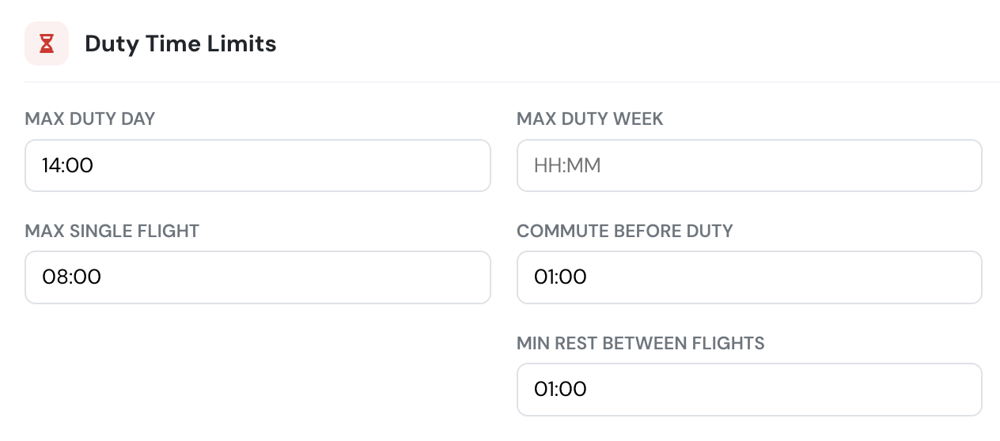
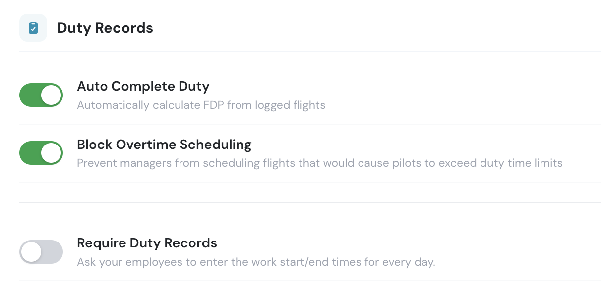
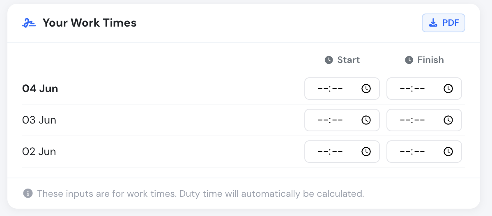
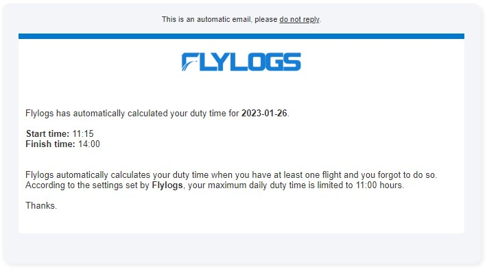

# Duty and Flight time storage

Control and comply with your CAA Duty and flight time limits.\
You can set the time limits that apply to your operations easily in your company settings page.



The system gives you the option to automatically block overtime proactively before the flight scheduling happens with a visual warning. So the warning happens before the flight is performed or even scheduled.

Flight duty is controlled after duty times are inserted by the pilots, or automatically calculated by the system.

### Automatic duty time calculation

Flylogs can automatically calculate your crew duty times based on a few parameters you need to configure before, like **before first flight**, and **after last flight mandatory** times.

If the system is set for automatic calculation, our automatic task will check daily for the previous day flights and calculate each pilot´s duty time based on database records and the company configured settings before and after mandatory times.

#### Which flights count toward a pilot's duty

Every flight the pilot is on the crew of counts — **all three seats**, CM1, CM2 and the third seat (shown as *Supervisor*, *Examiner* or *Specialist* depending on your company type). The duty period is stretched to cover the earliest departure and the latest arrival among them, plus the commute times.

This is independent of the flight type's time classification: a seat set to log **no** hours still produces duty. An instructor who supervises a student's solo flight from the ground gets the duty for it and none of the flight time.

The exception is **Flight Schools** and **SPO Operators**: there, a supervision or a simulator session only counts as duty when a flight the pilot operates (CM1 or CM2 on a real aircraft) follows it the same day. One after the last operated flight — or on a day with none — widens the pilot's **work times** instead of the duty period. See [Supervision and simulator sessions](../schedules/ftl-compliance-forecast.md#supervision-and-simulator-sessions).

Flight duty period (FDP) is counted more narrowly than duty — see [FTL Compliance & Forecast](../schedules/ftl-compliance-forecast.md#duty-is-not-fdp).

#### Duty, flight period and work

The Duty Times page can show three different measures. This is what each one includes:

| | **Duty** | **Flight period** | **Work** |
| --- | --- | --- | --- |
| **Flight the pilot operates** (CM1/CM2, real aircraft) | Yes | Yes | Only if the work times cover it (for Flight Schools and SPO Operators an automatically widened work window starts at the duty start, so it does) |
| **Supervising a real flight**, before or between operated flights | Yes | No | Not added automatically |
| **Supervising a real flight**, after the last operated flight | AOC / General Aviation: yes · Flight School / SPO: **no** | No | AOC / General Aviation: no · Flight School / SPO: **yes, automatically** |
| **Simulator session** (any seat), before or between operated flights | Yes | No | Not added automatically |
| **Simulator session** (any seat), after the last operated flight | AOC / General Aviation: yes · Flight School / SPO: **no** | No | AOC / General Aviation: no · Flight School / SPO: **yes, automatically** |
| **Day with only simulator and/or supervision sessions** | AOC / General Aviation: yes · Flight School / SPO: **no duty** | No | AOC / General Aviation: no · Flight School / SPO: **yes, automatically** |
| **Commute before / after duty** | Yes, both | No | No |
| **Who sets it** | Calculated from flights; pilots may edit it if the company allows | Calculated | The pilot, when *Require duty records* is on; Flight Schools and SPO Operators also get the automatic additions above |
| **Checked against** | *Max duty per day* and the weekly limit (red cells, *Duty time exceeded* message) | Nothing | Nothing on its own; with FTL compliance on it counts towards the 7- and 28-day cumulative duty |

* **Duty** runs from the first counted session (less the commute before) to the last counted session (plus the commute after).
* **Flight period** runs from the first off-blocks to the last on-blocks of the flights the pilot operated.
* **Work** runs from the start to the end the pilot entered. Automatic additions only ever widen it, so times entered by hand are kept.
* The **FDP** (FTL compliance, shown as *FDP (FTL)* when enabled) runs from the duty start — including the commute before and any simulator or supervision session before the first flight — to the last on-blocks of an operated flight. See [FTL Compliance & Forecast](../schedules/ftl-compliance-forecast.md#duty-is-not-fdp).


Duty is recalculated every time a flight on that day is saved, which overwrites a pilot's manual edit of the duty times. An automatic widening of the work times stays even if the simulator or supervision session is later deleted.


The pilots can have the option to enter/modify these times if the company allows them to do so.

In that case, the pilot will see this panel in his/her welcome and profile pages:

Pilots can enter up to X amount of days the duty times, this X is something you configure as company manager.

### Pilot notifications

If Flylogs automatically calculates the duty time, we notify the pilot with a message like the one below:

### Duty Time reports

Company manages can access the pilot duty time reports in **Pilots** > **Duty times**\
This report contains a list of all pilots with a filter, and another axis with all days of the selected month.

If any record is over the configured MAX DUTY TIME, the time will appear highlighted in red. This also applies to duty periods that cross midnight (e.g. a duty starting in the evening and ending after 00:00 the next day) — the full duty length is counted against the day the duty started.

Each pilot row has a **download** icon that generates a PDF version of the same report for that pilot and month. The PDF's duty time column is highlighted in red under the same rule as the overview.

