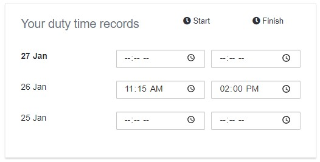

# Duty and Flight time storage

Control and comply with your CAA Duty and flight time limits.\
You can set the time limits that apply to your operations easily in your company settings page.

The system gives you the option to automatically block overtime proactively before the flight scheduling happens with a visual warning. So the warning happens before the flight is performed or even scheduled.

Flight duty is controlled after duty times are inserted by the pilots, or automatically calculated by the system.

### Automatic duty time calculation

Flylogs can automatically calculate your crew duty times based on a few parameters you need to configure before, like **before first flight**, and **after last flight mandatory** times.

If the system is set for automatic calculation, our automatic task will check daily for the previous day flights and calculate each pilot´s duty time based on database records and the company configured settings before and after mandatory times.

The pilots can have the option to enter/modify these times if the company allows them to do so.

In that case, the pilot will see this panel in his/her welcome and profile pages:

Pilots can enter up to X amount of days the duty times, this X is something you configure as company manager.

### Pilot notifications

If Flylogs automatically calculates the duty time, we notify the pilot with a message like the one below:

### Duty Time reports

Company manages can access the pilot duty time reports in **Pilots** > **Duty times**\
This report contains a list of all pilots with a filter, and another axis with all days of the selected month.

If any record is over the configured MAX DUTY TIME, the time will appear highlighted in red.

