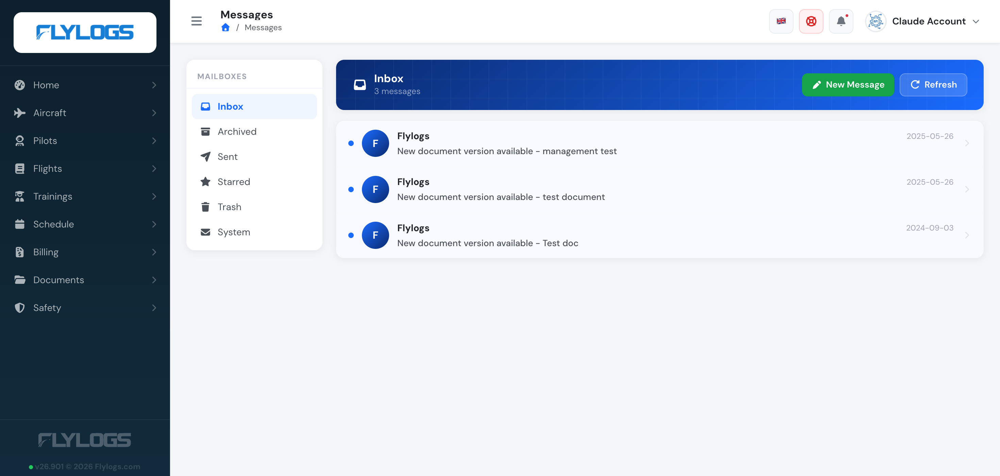
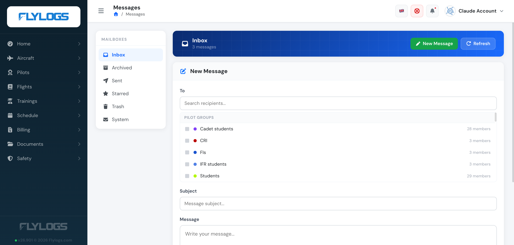
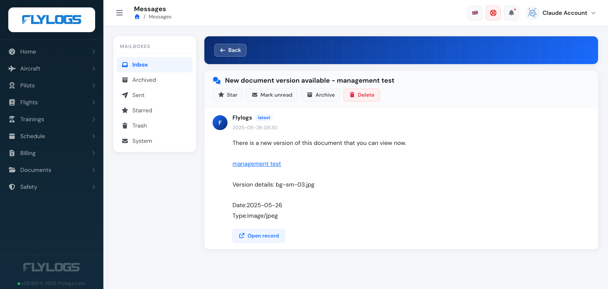

# Messaging System

Flylogs includes an internal messaging System. This, allows you to send notifications internally to any of your users in a secure and ordered manner.

Messages are organized into mailboxes — **Inbox**, **Archived**, **Sent**, **Starred**, **Trash**, and **System** (automated notifications, such as a document getting a new version, arrive here).

If there are any unread messages, you will see a RED number on the top right corner showing the amount of unread messages waiting for you. Clicking on the number, shows a quick preview of the messages and the option to navigate to your inbox.

### Sending a message

Click **New Message** to compose. You can address individual users, and — if you are staff (**group level 150 or lower**) — whole **Pilot groups** at once, addressed by name with their member count shown.

Only staff can mark a message **Urgent**. An urgent message that stays unread is checked every minute and triggers an automatic email reminder shortly after (subject to the recipient's notification preferences and a confirmed email address); non-urgent unread messages are instead summarized in a daily digest email.

### Reading a message

Click on any message to open it and its available actions: **Star**, **Mark unread**, **Archive**, **Delete**, and — for a message from another user — **Reply**.

