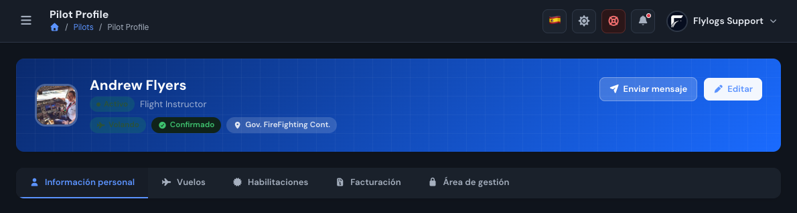
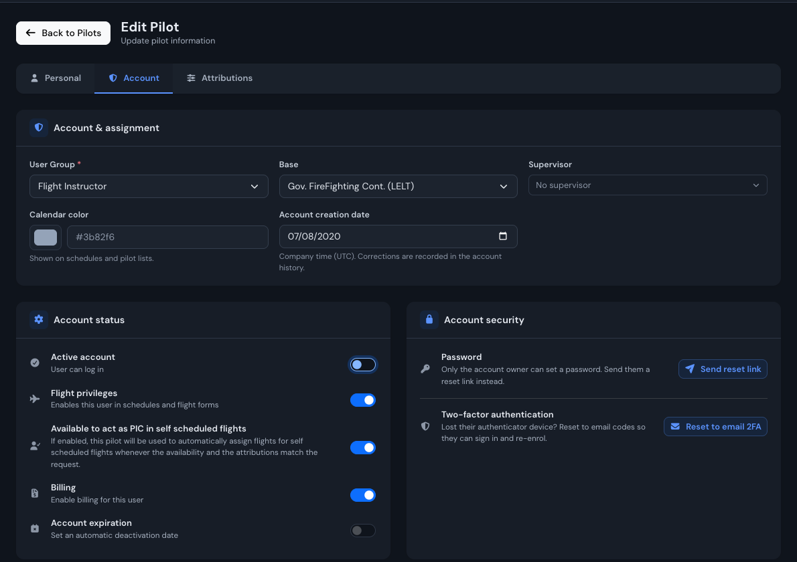
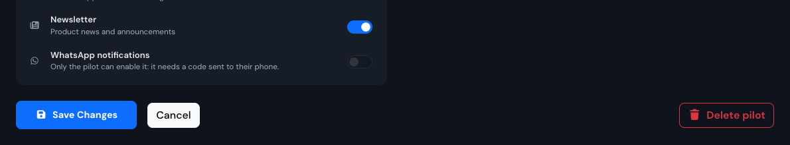
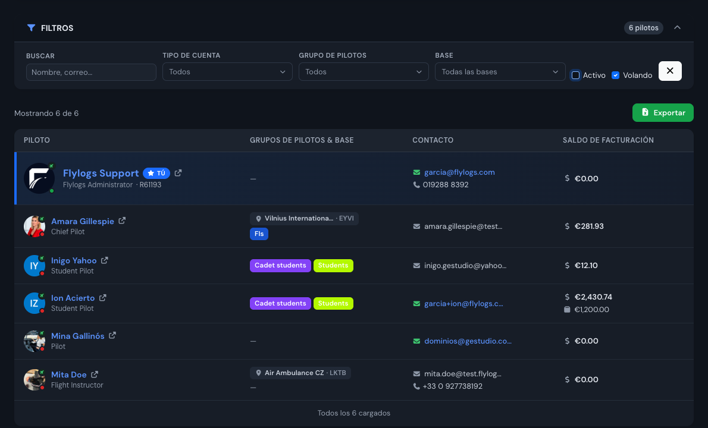

# Pilot accounts

You can create different access level pilot profiles. Each with different permissions that you can customize in your company settings page.



 

### Pilot account types

* Chief Pilot can view and manage all pilots and all flights. They can also edit confirmed flights.
* FI can view all pilots and all flights. They can create and confirm flights.
* Pilot can log their own flights. They can only view basic profile information of other pilots.
* Student can only view their own flights and training details.

#### Pilot accounts without email address

Pilot accounts can be set for internal use only.&#x20;

This means that no email address is associated with the account, the pilot will not have access to this data.

This accounts allow you to store flight time for a given user but without the need of giving access to the pilot.

#### Pilots with no FLYING PRIVILEGES

You can create pilot accounts without allowing them access to the flying features.

This could be Ground school teachers or any other person within your organization that does not perform flying duties.

When you disable the FLYING  PRIVILEGES from an account, this user will not appear in flight PIC/SIC fields and the user will not have the option to publish the flight availability in his/her calendar.

This user, will still have access to all the other functions like trainings, and will be able to check his/her flight logbooks if any.

#### Pilot list XLS export

From the manager pilot list you can download the full pilot roster as an XLS spreadsheet. The export includes each pilot's name, company ID, email, phone, passport / ID, nationality, account status, account type, pilot groups, base and (when billing is enabled) the billing balance.

> Passport / ID, nationality and other personal contact details are only included when the export is generated by a management account (Chief Pilot, FI or higher). Basic pilot and student accounts only receive the basic profile information of other pilots, so these columns will be empty for them.

#### Pilot notification preferences

Management accounts (Chief Pilot and above) can review and change a pilot's notification preferences from the **Account** tab of the pilot edit page: email alerts, message alerts and the newsletter.

> These preferences belong to the person, not to the company account. If the same email address is used in more than one company, changing them here changes them everywhere.

WhatsApp notifications can only be **switched off** from here. Enabling them requires a verification code sent to the pilot's phone, so only the pilot can turn them on, from their own account page.

#### Account creation date

Next to the calendar colour, in the **Account** tab of the pilot edit page, management accounts of **Chief Pilot level or above** can correct the date the account was created. Flight instructors, pilots and students never see this field.

Use it when accounts were imported or re-created and the creation date no longer matches when the person actually joined your organization.

> Only the day changes: the time of day originally recorded is kept, and the date is read and saved in your company timezone. Every correction is written to the pilot's account history, showing who changed it, when, and the previous date.

#### Deactivate pilot accounts

If a pilot has finished the relationship with your organization you can deactivate them.

By deactivating a pilot account, this user will disappear from all your forms and flight management functions.

**The pilot data will remain intact in the system but will not be displayed in the general forms that you will use daily.**

> Any deactivated pilots, will still be able to login to the Flylogs to see and download their logbooks, but all other functions will be removed.

**Step by step**

1. Go to **Pilots** in the left menu and open the pilot you want to deactivate, either by clicking their name in the list or from their profile page.
2. On the pilot profile, click **Edit** (top right).

3. Open the **Account** tab and, in the **Account status** card, turn **Active account** off.

4. Click **Save Changes** at the bottom of the page. Nothing is applied until you save.

> Deactivating is not deleting. **Delete pilot** (bottom right of the same page) removes the account and is not what you want when a pilot simply leaves the organization: deactivating keeps their flights, logbooks and training records.

**Find a deactivated pilot again**

Deactivated pilots are hidden from the pilot list by default. To see them, open **Pilots** and clear the **Active** checkbox in the filter bar. Reactivating is the same procedure in reverse: open the pilot, **Edit → Account → Active account** on, then **Save Changes**.

**Expire the access on a future date**

In the same **Account status** card, **Account expiration** sets a date from which the account can no longer sign in ("Your account has expired. Contact your administrator."). Use it for access that ends on a known date, such as a temporary or auditor account.

> An expired account still counts as active: it keeps appearing in the pilot list and in flight and schedule forms. To take the person out of your daily forms, turn **Active account** off as described above.

**If you only want to stop them flying**

Turning **Flight privileges** off instead keeps the account usable (trainings, documents, logbook) but removes the user from PIC/SIC fields and from schedule availability. Use it for ground school teachers or office staff, and keep **Active account** off for people who have left.

***

####
