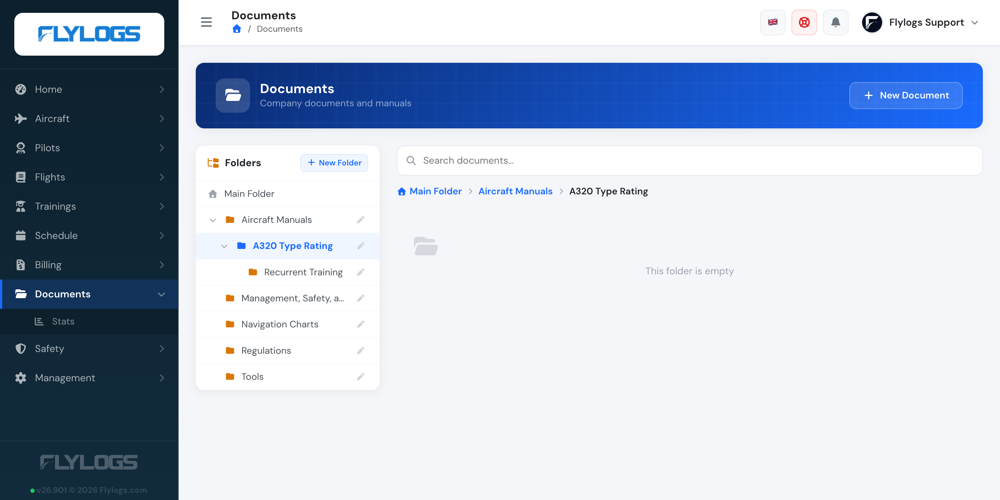
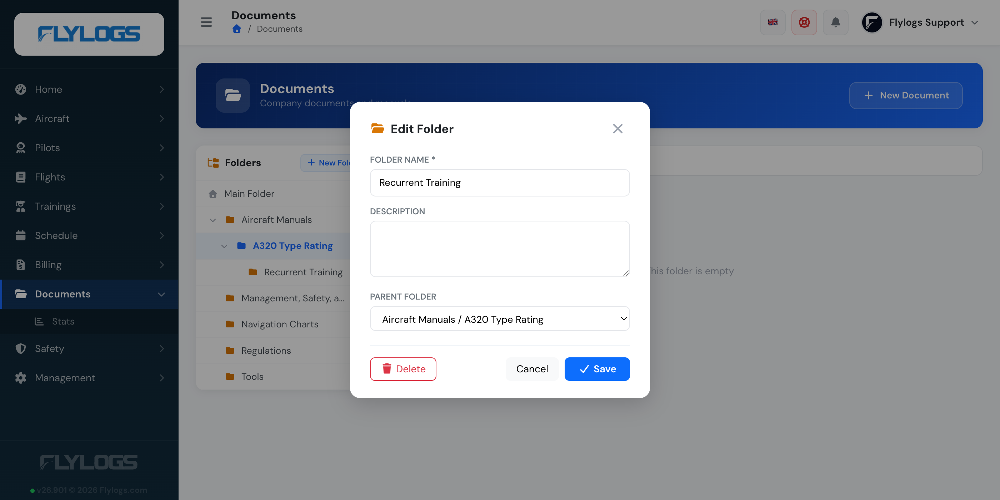

# Document Library

Discover all about the [Document Library here](https://flylogs.com/features/aeronautical-documentation)!

Flylogs Company Document Library is an embedded system in your Flylogs account that lets you store company manuals and other files and share them with the rest of your company.

The main features of the system are:

* Group level access privileges
* File version control
* Download registry
* File folders

### How the index page works

The index page is the entry point of the library. It lists the documents and subfolders inside the current folder, with the **Main Folder** shown by default. Click any folder card to open it, or use the search box to look up a document by name across the whole library.

Each row shows the document name, description, latest version uploader and creation date. A quick download button is offered for the current version.

### File folders

For better organization, you can create folders for your documents, and folders can contain subfolders — up to 4 levels deep in total. Each document belongs to exactly one folder, at any level of the tree.

The sidebar shows the full folder tree. Folders with subfolders get an expand/collapse arrow, and the breadcrumb above the document list always shows the full path from the Main Folder down to wherever you're browsing.

Use folders and subfolders to separate operational manuals, training material, forms, etc. — for example an "Aircraft Manuals" folder holding one subfolder per aircraft type. The same access rules apply regardless of where in the tree a document lives.

> Creating, renaming, moving and deleting folders is available to users in **group level 149 or lower** (administrators and managers) — a slightly broader set of roles than can publish documents themselves (group level 120 or lower). Other users can browse and open folders but won't see folder management controls.

#### Creating and moving folders

Clicking **New Folder** creates the new folder inside whichever folder you're currently browsing — click into a folder first to create a subfolder there, or stay on the Main Folder to create a new top-level folder.

Editing a folder also lets you move it elsewhere in the tree via the **Parent folder** field, without touching the documents inside it.

A folder can't be moved into itself or into one of its own subfolders, and a move that would push it past the 4-level depth limit is not allowed.

#### Deleting a folder

Deleting a folder removes it and every subfolder nested inside it. Documents are never deleted this way — any document found anywhere in the deleted branch is moved to the Main Folder, where it stays fully accessible. A folder with subfolders shows a warning to that effect before you confirm.

#### Folder limit by plan

The number of **top-level** folders you can create depends on your company's subscription plan. Subfolders don't count against this limit — once you're at the cap, you can still organize further by nesting subfolders inside your existing folders.

| Plan | Top-level folders |
|------|---------|
| Free | 3 |
| Club Essentials | Unlimited |
| Premium | Unlimited |
| Unlimited | Unlimited |

On the Free plan, once you reach 3 top-level folders the **New Folder** button is disabled while browsing the Main Folder. Delete an existing top-level folder or upgrade your plan to add more. All paid plans have no folder limit.

### Group level access privileges

For each document you publish you choose which **user groups** can access it. Permissions are evaluated when the index page is rendered, so users only see documents their group is authorized to read.

* Users outside the recipient groups will not see the document at all in the index.
* Documents marked as `flying_only` are hidden from non-pilots, even if their group is in the recipient list.
* Document owners always see their own documents in the index, regardless of the recipient list.
* Top-level company administrators (group level 105 or below) see every document in the company.

This filtering is applied **before pagination**, so search results and folder counts always reflect what the current user is allowed to see.

### File version control

Each time you update a published document you can publish the new version. Flylogs keeps old versions listed underneath the latest one, so they stay available for anyone with access to the document.

Every new version renews the cycle: every authorized member needs to download the file again, and the download registry is reset for the new version.

### File size limit

Files up to **2 GB** can be attached anywhere in Flylogs — documents, flights, safety reports, maintenance jobs and the rest.

Large files upload directly to secure cloud storage, so they are not limited by the app server. A progress percentage is shown while a file is transferring. Very large files need a stable connection for the whole upload: if it is interrupted, it restarts rather than resuming.
