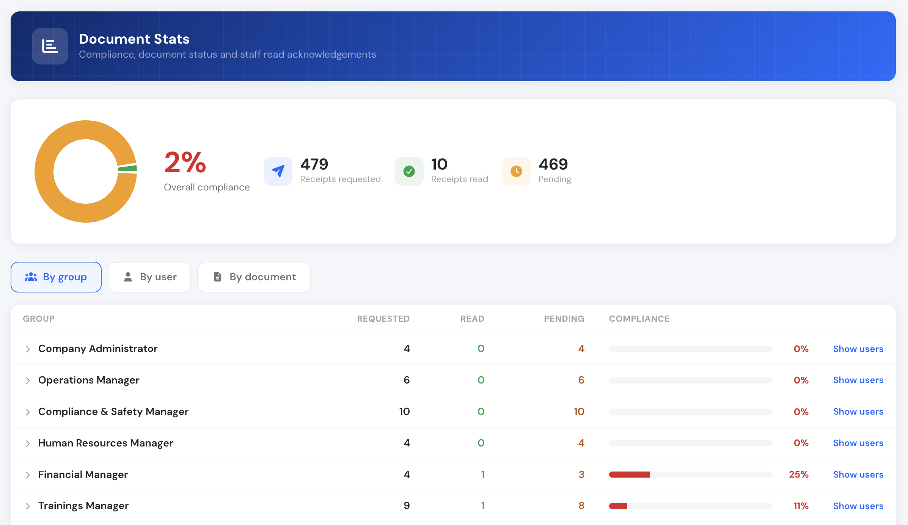

# Document Stats

The **Stats** page (in the left menu, under Documents) gives a company-wide view of compliance, document status and staff read acknowledgements — rather than the per-document figures shown on each document's [Manager tools](manager-tools.md).

> The Stats page is only visible and accessible to users in **group level 145 or lower**. It is hidden from the menu for everyone else, and opening its link directly shows an access-denied screen.

### Overall compliance

The summary at the top shows the headline figures for the whole company:

* **Receipts requested** — how many read acknowledgements are expected in total.
* **Receipts read** — how many have actually been completed.
* **Pending** — the remaining acknowledgements still outstanding.
* **Overall compliance** — the percentage of requested receipts that have been read, with a chart of read versus pending.

A receipt is requested once per document for every active user in the document's authorized groups (`flying crew only` documents count pilots only), and counts as read when the user has opened the **current** version. Publishing a new version resets those receipts, exactly like the per-document registry. Deactivated and deleted accounts are excluded.

### Breakdowns

The figures can be broken down three ways using the tabs:

* **By group** — requested vs read per user group, ordered by group level, with a compliance bar. Each group can be expanded to list the individual users inside it.
* **By user** — a searchable list, with a group filter, showing each person's requested vs read counts in alphabetical order.
* **By document** — requested vs read for each document, in alphabetical order, with its publication and expiration dates.

### User breakdown

Clicking any user — either inside an expanded group or in the **By user** tab — opens that person's breakdown: how many of their documents are read versus pending, a chart, and the full list of documents required of them. The list can be filtered to **read** or **not read**, and each entry links straight to the document.
