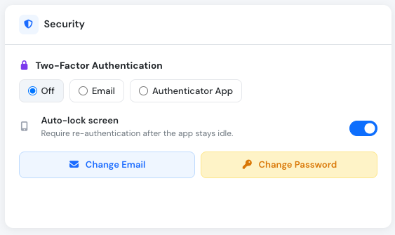
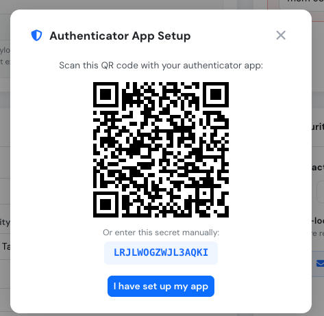
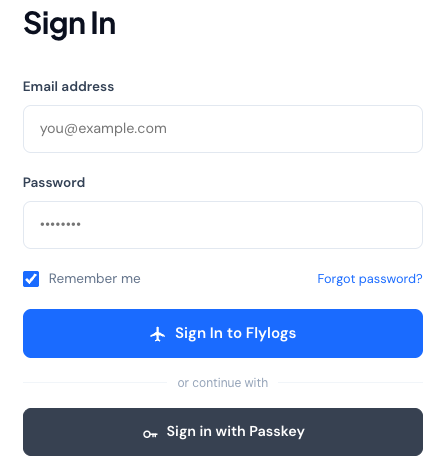

# Account security

Keeping a complex enough password, regularly updated sometimes could not be enought to maintain login credentials secure. Nowadays hacking methods are getting more sophisticated and so the security measures must.

Flylogs allows you to easily update your password from your user settings page, you can do so as often as you'd like. We encourage you to do so at least once a year.

On top of that, as an extra safety measure, upon every login from a different IP address, or every 7 days from the same address, Flylogs can send you a security code to be entered upon login. This code validation is a Second security measure, a **2FA** (Two-Factor Authentication) called in the IT industry.

### 2FA options

From your **Security Settings** page, you can choose between three 2FA methods:

<figure><figcaption>
Two-Factor Authentication options in Security Settings
</figcaption></figure>

* **Off** — no extra code is requested upon login, only your password is checked.
* **Email** — Flylogs sends a 6 digit security code to your email address, which you must enter to complete the login.
* **Authenticator App** — a 6 digit code is generated by an authenticator app on your phone (e.g. Google Authenticator), which you must enter to complete the login.


**2FA is mandatory for all company managers**, who must select either "Email" or "Authenticator App". The "Off" option is only available to non-manager users (pilots, FIs, mechanics, students), for whom 2FA remains optional but strongly recommended as an extra layer of security.

**External Auditor** accounts are a special case: 2FA is always **Email** and can't be changed to "Authenticator App" or "Off".


### Auto-lock Screen

Flylogs includes an **Auto-lock screen** feature that adds an extra layer of protection when you step away from your device. When enabled, the app will automatically lock after a period of inactivity and require you to re-enter your password before continuing.

<figure><figcaption>
The Auto-lock screen option is found in the Security section of your account settings
</figcaption></figure>

When the screen locks, you will see a prompt showing your name and profile picture. Enter your account password to unlock and resume where you left off. You can also sign out entirely from this screen.

<figure><figcaption>
The lock screen requires your password to resume the session
</figcaption></figure>


The Auto-lock screen is **enabled by default**. If you are working on a private, trusted device and do not need this protection, you can disable it from your **Security Settings** by toggling off the **Auto-lock screen** option.


If you have a passkey registered, you can also tap **Unlock with passkey** on the lock screen to resume your session with your fingerprint or Face ID instead of typing your password. See [Passkeys](#passkeys) below.

### Enable Google Authenticator 2FA

**How to Get Started**

Setting up Google Authenticator is a quick and simple process.

1. **Download the App:** The Google Authenticator app is available for free on both Android and iOS devices.
   * [Download on the Google Play Store](https://play.google.com/store/apps/details?id=com.google.android.apps.authenticator2)
   * [Download on the Apple App Store](https://apps.apple.com/us/app/google-authenticator/id388497605)
2. **Enable in Your Settings:** Navigate to your account's **Security Settings** page, and select **Authenticator App** under Two-Factor Authentication.
3. **Scan the QR code:** A setup dialog will appear with a QR code. Scan it with your authenticator app, or enter the secret manually if you can't scan it. Once your app shows a 6 digit code, click **I have set up my app** to finish linking your account.

<figure><figcaption>
Scan the QR code with your authenticator app, or enter the secret manually
</figcaption></figure>

### Passkeys

Passkeys are the **safest and most convenient** way to access your account. A passkey lets you sign in or unlock your account using your device's **fingerprint, Face ID, or screen lock**, instead of typing a password.

* On the **Sign In** page, choose **Sign in with Passkey** instead of entering your email and password.
* On the **Auto-lock screen**, choose **Unlock with passkey** instead of typing your password.

<figure><figcaption>
"Sign in with Passkey" on the login page
</figcaption></figure>

Because a passkey is tied to your device's biometrics and never leaves your device, it cannot be phished, guessed, or reused like a password — making it the strongest available login method. Passkeys also satisfy 2FA requirements on their own, so company managers can use a passkey instead of entering a separate email or authenticator code.

You can register a passkey from your **Security Settings** page on any device that supports biometric authentication (most modern phones, tablets, and laptops).
