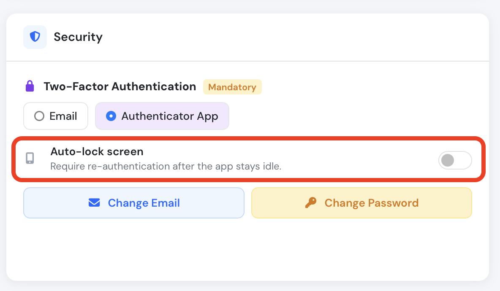
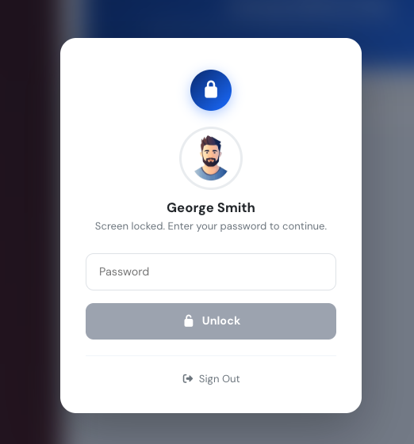

# Account security

Keeping a complex enough password, regularly updated sometimes could not be enought to maintain login credentials secure. Nowadays hacking methods are getting more sophisticated and so the security measures must.

Flylogs allows you to easily update your password from your user settings page, you can do so as often as you'd like. We encourage you to do so at least once a year.

On top of that, as an extra safety measure, upon every login from a different IP address, or every 7 days from the same address, Flylogs will send you a security code to your email address to be entered upon login.

This email code validation is a Second security measure, a 2FA called in the IT industry.

Please note:

* **2FA is mandatory for all company managers** to enhance account protection.
* For all other users, **2FA remains optional but strongly recommended** as an extra layer of security.

\
\
If receiving an email is not convenient for you, we also provide Google authentication. This method, still requires you to enter a 6 digit code upon user validation, but the code is provided by the Google Authenticator App instead of an emal address.

### Auto-lock Screen

Flylogs includes an **Auto-lock screen** feature that adds an extra layer of protection when you step away from your device. When enabled, the app will automatically lock after a period of inactivity and require you to re-enter your password before continuing.

<figure><figcaption>
The Auto-lock screen option is found in the Security section of your account settings
</figcaption></figure>

When the screen locks, you will see a prompt showing your name and profile picture. Enter your account password to unlock and resume where you left off. You can also sign out entirely from this screen.

<figure><figcaption>
The lock screen requires your password to resume the session
</figcaption></figure>


The Auto-lock screen is **enabled by default**. If you are working on a private, trusted device and do not need this protection, you can disable it from your **Security Settings** by toggling off the **Auto-lock screen** option.


### Enable Google Authenticator 2FA

**How to Get Started**

Setting up Google Authenticator is a quick and simple process.

1. **Download the App:** The Google Authenticator app is available for free on both Android and iOS devices.
   * [Download on the Google Play Store](https://play.google.com/store/apps/details?id=com.google.android.apps.authenticator2)
   * [Download on the Apple App Store](https://apps.apple.com/us/app/google-authenticator/id388497605)
2. **Enable in Your Settings:** Navigate to your account’s **Security Settings** page. You will now see the option to choose between "Email Code" and "Authenticator App" for your 2FA method. Select "Authenticator App" and follow the on-screen instructions to scan the QR code and link your account.

&#x20;
