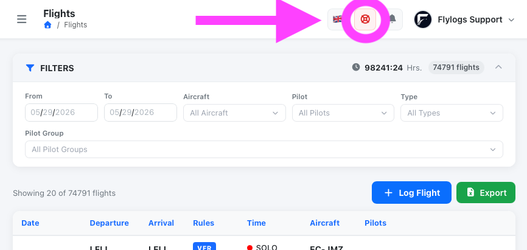
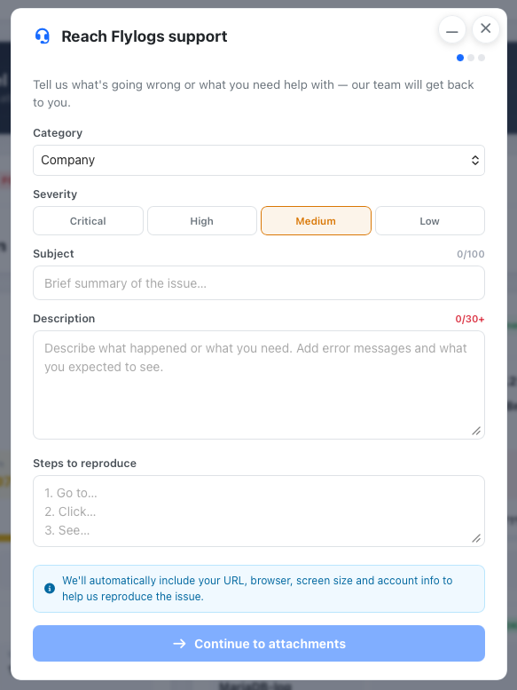

# Contacting Support

Flylogs includes a built-in support tool available from any screen. You can use it to report a bug, ask a question or request a change — without leaving the application.

***

## Opening the support modal

Look for the **red life-ring icon** in the top-right corner of the navigation bar. It sits between the language switcher and the notification bell.

<figure><figcaption>The support button is always visible in the top navigation bar</figcaption></figure>

Click it to open the **Reach Flylogs support** panel. If the panel is already open and minimised, clicking the button brings it back to full size.

> The support button is only shown on desktop screens. On mobile, use the **Help** section from the navigation menu.

***

## Filling in the report

The form has three steps indicated by the dots at the top of the panel.

<figure><figcaption>Step 1 — describe the issue or request</figcaption></figure>

### Step 1 — Issue details

| Field | Required | Notes |
|---|:---:|---|
| **Category** | Yes | The area of the product the report relates to (e.g. Flights, Schedule, Pilots). Pre-filled based on the page you were on before opening the panel. |
| **Severity** | Yes | How much this is blocking you: Critical, High, Medium or Low. |
| **Subject** | Yes | A short title for the issue (up to 100 characters). |
| **Description** | Yes | What happened or what you need. Minimum 30 characters. Include any error messages and what you expected to see instead. |
| **Steps to reproduce** | No | Numbered steps that let the team reproduce the issue from scratch. Helps resolve bugs faster. |

#### Duplicate detection

As you type the subject, Flylogs checks whether a similar report is already open. If a match is found, links to those existing reports appear below the subject field. Check them before submitting — your issue may already be tracked and being worked on.

#### Draft auto-save

Your work in progress is saved automatically in the browser. If you close the panel or navigate away, your draft will be waiting the next time you open it. The draft is cleared once you submit successfully.

***

### Step 2 — Attachments

After the issue details are submitted, you land on the attachments step. Here you can upload screenshots, screen recordings or audio clips that help illustrate the problem.

**Automatic screenshot:** When you first open the support panel, Flylogs silently captures a screenshot of the page you were on. This is attached to your ticket automatically once it is created. You will see a confirmation when the upload completes. No action is needed on your part.

You can also drag and drop or browse for additional files to upload.

Click **Done** when you have finished uploading attachments (or skip straight to Done if none are needed).

***

### Step 3 — Confirmation

The final screen confirms your ticket has been created and shows its reference number. From here you can:

* **View ticket** — go directly to the ticket detail page where you can read it and add follow-up comments.
* **Submit another** — start a fresh report without closing the panel.

You will also receive an email notification each time the status of your ticket changes.

***

## What information is sent automatically

In addition to what you type, Flylogs attaches context that helps the team reproduce the issue without needing to ask:

| Data | Value |
|---|---|
| **Page URL** | The page you were on before opening the support panel, and the current URL at the time of submission |
| **User ID and email** | Your Flylogs account identifiers |
| **Company** | Your organisation name and internal ID |
| **Browser language** | Your locale setting |
| **Timezone** | Your detected timezone |
| **Viewport size** | Your browser window dimensions (e.g. 1440×900) |
| **Pixel ratio** | Screen density (useful for display and retina issues) |
| **User agent** | Browser name and version |
| **Page screenshot** | A screenshot of the page captured the moment you opened the support panel |

This data is only used for support and debugging. It is not shared outside the Flylogs support team.

***

## Minimising the panel

Press **Escape** or click the backdrop to minimise the panel without losing your draft. A small dock button appears in the bottom-right corner of the screen. Click it to restore the panel to full size.

***

## Tracking your ticket

After submission, your ticket is visible at **Help → My tickets** or by following the **View ticket** link on the confirmation screen.

On the ticket page you can:

* Read the full details of what you submitted.
* See the current status and any resolution notes left by the team.
* Add follow-up comments if you have more information to share.

***

## How your report is handled internally

When you submit a report, it enters the Flylogs internal issue tracker with the following lifecycle:

| Status | Meaning |
|---|---|
| **New** | Just received. Not yet reviewed. |
| **Next** | Reviewed and queued for the next development cycle. |
| **Open** | Actively being worked on. |
| **On hold** | Paused — waiting for more information or a dependency. |
| **Resolved** | Fixed or addressed. Resolution notes are added to the ticket. |
| **Closed** | Confirmed complete. No further action expected. |
| **Won't fix** | Acknowledged but not planned for implementation, with a reason. |

**Notifications:** You are automatically subscribed to your own ticket. Every time the status, priority or resolution changes, you receive an email with a summary of what changed.

**Triage:** All incoming reports start as the lowest internal priority. The support team reviews each new report and adjusts the priority based on impact, severity and how many users are affected.

**Resolution notes:** When a ticket is resolved or closed, the team adds closing comments explaining what was done. These are visible on the ticket page inside Flylogs.
