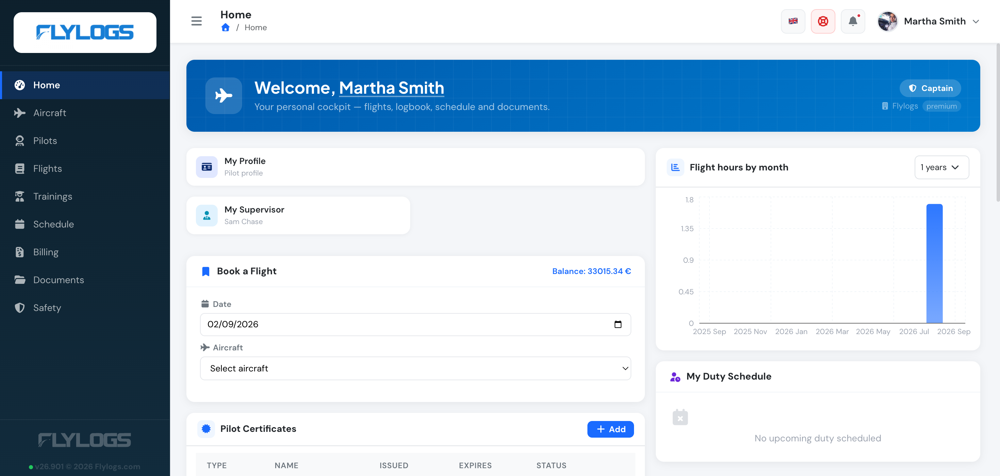
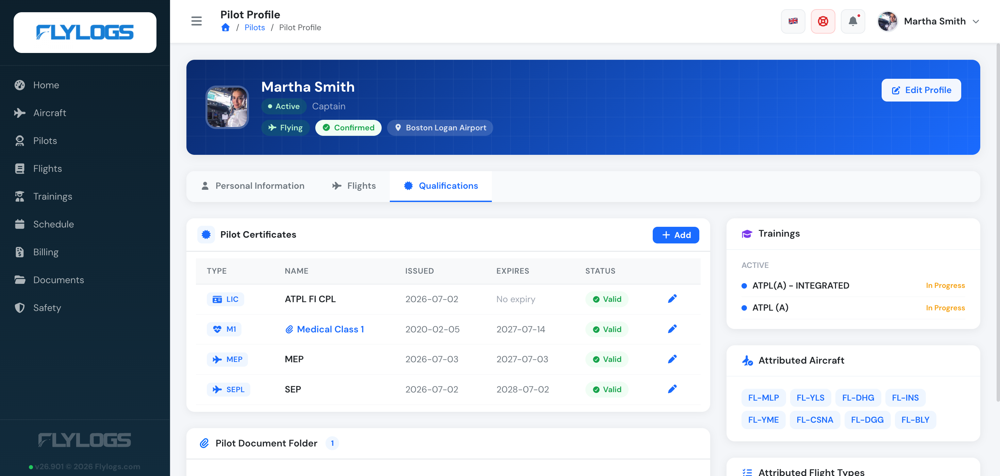
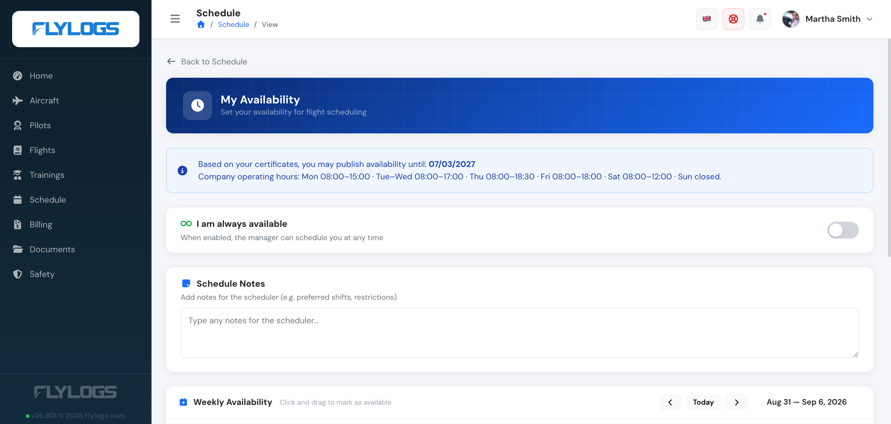
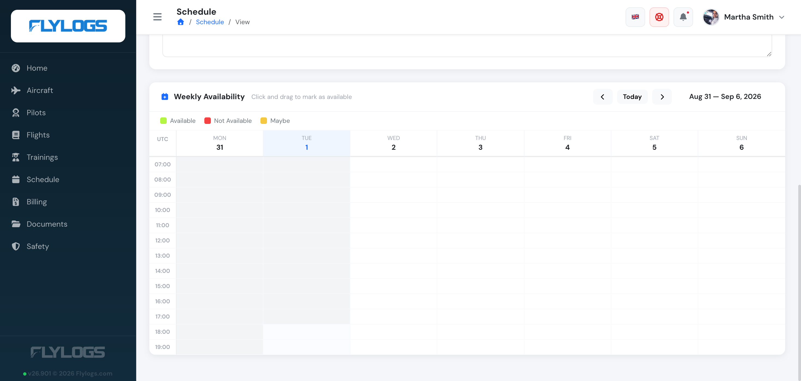
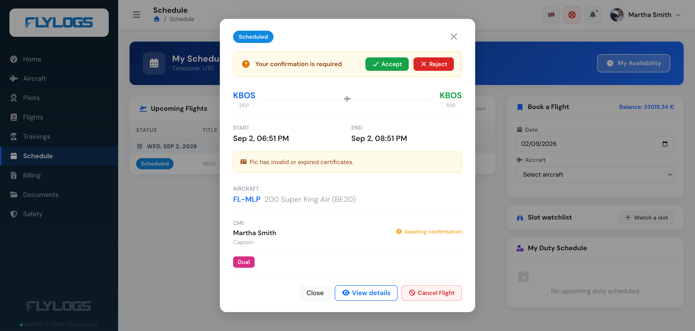

# Getting Started - Pilots

### What to Expect

Once you log in as a pilot or student, you will see your Home dashboard. Flylogs stores your academic information, trainings, flight history and flight availability in a single place, so you can easily manage your information from your computer or smartphone.

To access your information, **you first need to be invited by your company to join Flylogs**. You should have received an email to access the system, create your password and complete your profile.

### The Interface

Flylogs has a user friendly interface, which adapts to any device (computer, tablet, smartphone).

On the left-hand side, you will find your MAIN MENU. Depending on your company settings and your role, it can include:

• Home\
• Aircraft\
• Pilots\
• Flights\
• Trainings\
• Schedule\
• Billing\
• Documents\
• Safety

You may not be able to see all of these options. This is normal, as they depend on your company settings.

### Home

Home is your homepage and dashboard. It provides an overview of all your information — your profile, upcoming flights and duty, flight-hours chart, and a **Book a Flight** shortcut.

### My Profile

From the **My Profile** card on your Home dashboard, you will find all your personal information, flight history and qualifications.

Please, make sure that your personal information is up to date. You will also be required to upload your Medical Certificate and other licenses required.

To do so, open the **Qualifications** tab and click **Add** on the **Pilot Certificates** box, then fill in the form.

Flylogs will remind you (via email) to renew your certificates 90 days before they expire. Once a certificate is renewed, do not forget to upload the new version as otherwise you may not be able to fly.

From the **Personal Information** tab of your own profile, you will also find a **Calendar Subscription** card — a private feed URL you can add to Google Calendar, Apple Calendar or Outlook, showing your scheduled flights, recorded flights, events and training sessions. It's read-only: you still need to log in to Flylogs to confirm or reject a flight.

### Schedule

This section allows you to manage your schedule and flight availability.

Make sure to publish your flight availability well in advance, so your flights can be scheduled in a timely manner.

> Note that all flight schedule records are stored with a time stamp, so the roster manager knows when you published your availability.

To do so, click the **My Availability** button. It also shows the operating hours your company accepts availability within, and how far ahead your current certificates let you publish.

To indicate when you are available to fly, simply drag and drop your mouse over the **Weekly Availability** calendar — marking a slot Available, Not Available, or Maybe. If you are using a mobile device, tap and hold your finger down to create an availability block.

You can publish your availability on a regular basis (for example every week, month etc.), but you can also publish it for as many days in the future as you wish.

If you are fully committed to flying, you can activate the **I am always available** switch.

Once a schedule is created for you, it appears under **Upcoming Flights** on your Schedule page, awaiting your confirmation.

Click the flight to open it, then **Accept** or **Reject** it.

### Trainings

In this section you will find all the training courses in which you are enrolled, your progress and upcoming classes.

Your upcoming classes will appear in your calendar, alongside your scheduled flights. Teachers will have the option to publish documents related to each lesson and you can find them in this section and download them.

Your class attendance and exam records will be published here and attached to your training history.

### Flights

All your flights will appear in this list, you can review all flight information and download your flight logbook in XLS spreadsheet format.

If you navigate to your profile page, you will find your logbook totals divided by flight type (VFR, IFR, PIC, Dual...).

### Documents

Here you will find company documents that have been shared with you.&#x20;

Flylogs keeps track of which documents you have downloaded, so make sure you read the ones you are required to familiarize yourself with.

Keep in mind that from time to time, some of these documents may be updated or replaced with a new version.
