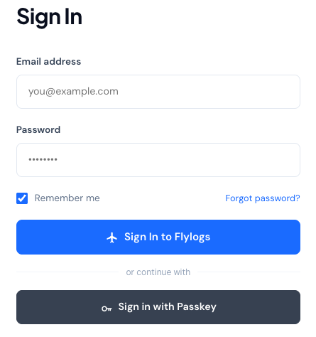

# User Login

### Login

Login to Flylogs occurs like in any other website. In order to do so, you need an account that only company Managers can create. If you already have a Flylogs account, go to [https://www.flylogs.com/login](https://www.flylogs.com/login) and user your account details to login.

<figure><figcaption>
The login page offers email/password or "Sign in with Passkey"
</figcaption></figure>

If you have registered a passkey, you can skip your password entirely by clicking **Sign in with Passkey** and confirming with your device's fingerprint or Face ID. See [Account security](account-security.md) for details on 2FA and passkeys.


You can not create your own **pilot** account. Your company needs to create it for you. When this happens, you will receive an invitation in your email inbox.


For each login, your IP address, location and time will be saved to your account history. This information is not reviewed by Flylogs or your company, it is stored for your own information and usage.

### Welcome Email

Your company manager will create your pilot account for you with your email address. When this happens, you will receive an email from atc@flylogs.com with instructions to login.


On your first login, you will be asked to create your account password.


If you did not receive the confirmation email, check your spam folder for emails from atc@flylogs.com. Otherwise, contact your company manager or CTKI; or follow the Password Recovery procedure described below.

***

### Forgotten password recovery procedure

If you forget your password, go to the login page and on the lower part of the white box, click the link: [Recover my password](https://neo.flylogs.com/password_recover/)

Enter your email address, and if it is in the database, you will receive a password recovery email.

In case you do not receive the email, check that you entered the correct email address. Take a look at your SPAM folder and as a last option, contact your company manager or CTKI for help and guidance.

***

### Login attempt limit

To protect your account from password-guessing, Flylogs limits how many times a wrong password can be tried.

After **10 failed login attempts**, further attempts are temporarily blocked for **15 minutes**. While blocked, the login page shows a message such as _"Too many failed login attempts. Try again in 15 minutes"_ — and the block applies **even if you then type the correct password**. Just wait for the period to pass and try again.

The limit is applied two ways at once:

* **Per account, per network** — repeated wrong passwords for your email address *from the same internet connection* block that combination.
* **Per network** — many failed attempts from the same device or internet connection are also blocked, even across different accounts.

Both are tied to where the attempts came from, so **someone else guessing at your email address from somewhere else cannot lock you out**. Your own sign-in from your own connection is unaffected by their attempts.

A **successful login immediately clears the limit** for your account on the connection you signed in from. If you are locked out and cannot wait, you have two options that are **not** affected by the limit:

* Reset your password with the [Forgotten password recovery procedure](#forgotten-password-recovery-procedure) above.
* Sign in with a [passkey](account-security.md#passkeys), if you have one registered.


This limit only applies to the **password** login. **Passkey** sign-in, entering your **2FA** code, and **switching between companies** once you are already signed in are never counted against it. 2FA codes have their own separate limit, described below.


### Verification code (2FA) attempt limit

Wrong two-factor codes are limited too, so a correct password on its own is never enough to get in.

* **Authenticator app (TOTP)** — after **10 wrong codes**, verification is blocked for **15 minutes** for that account, and the login page shows _"Too many failed verification attempts. Try again in 15 minutes"_. A correct code clears the counter immediately.
* **Emailed code** — each emailed code is destroyed after **5 wrong tries**. Request a new code (start the login again) to get a fresh one.

This limit is per account, and it is separate from the password limit above: being blocked on codes does not lock your password, and vice versa.

### Multiple company accounts

If the same email address (user) exists in more than one Flylogs company, **the user will have the option to choose which company to operate on every login and logout.**

Data from one company is not copied to the other, so the pilot will have to update personal details and create licenses and certificates on all the company accounts separately.

The feature is designed to avoid the need to have different email addresses for each company a pilot could be involved in.

Once logged in to a company, **the user can switch beetwen companies** by clicking on the company name on the navigation bar.

 

### Email validation

Company management accounts need to have an email address. FI, pilot or mechanic accounts do not have this requirement.

When a new email is entered for a new or an existing user, the system requires the email address to be confirmed. The confirmation is process is the same used in the sign up process. Just click on the received email with a confirmation link.

**Only confirmed email addresses will be able to login and receive email alerts from Flylogs.**

### Flylogs Authentication process

<figure><figcaption>
Authentication process possible outcomes
</figcaption></figure>

### Email bounces and complaints

If an email address bounces an email, the associated user account will be automatically set back to **NOT CONFIRMED**. If an account is marked as NOT CONFIRMED, the user must confirm the email address again the next time the user tries to log in. In the meantime, Flylogs will stop to send email notifications and alerts to that email address.

If the bounces persist, the email address will be completely removed from FLYLOGS, leaving the account without email address, and as a result, without option to log in.

If we receive a complaint for a given email address, Flylogs will automatically remove all notification options for that user account to avoid sending any non-essential emails to that email address. Login option for that email address will remain enabled.
