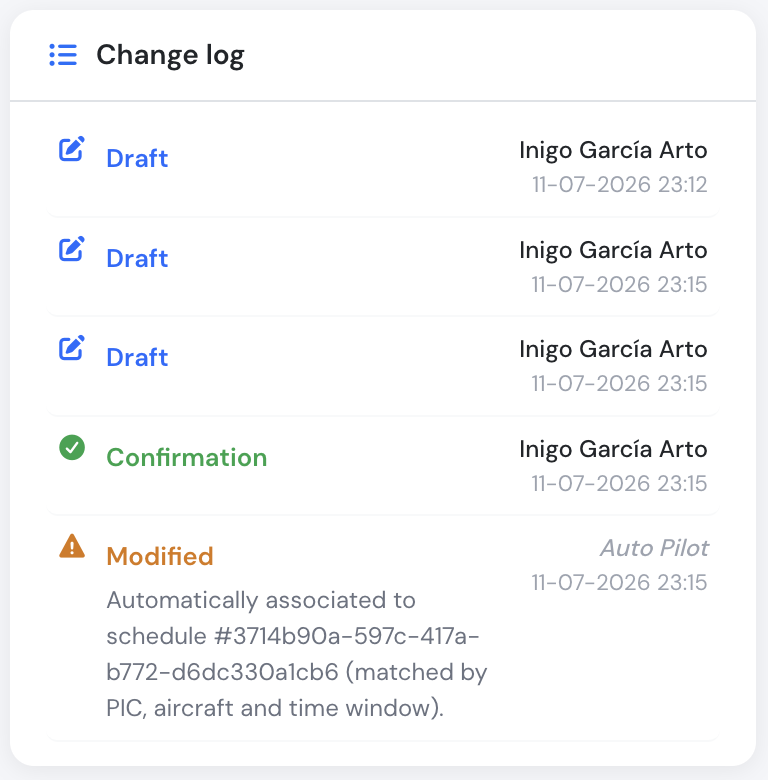

# Audit trails

Flylogs keeps track of all changes made to flights through an audit trail feature. Whenever a change is made to a flight, instead of modifying the original record, Flylogs creates a new record that replaces the old one. This means that there is always a complete history of all changes made to the flight, and none of the previous records are lost. By accessing the audit trail, you can view a timeline of all the changes made to the flight, including who made the change and when it was made. This feature ensures transparency and accuracy in flight data management, as well as providing a complete record of the flight's history.

&#x20;

On every flight, a complete history of changes is stored. Once a flight is confirmed, all changes are stored as new flight records, and the previous versions of the flight are available alogn with the user identification that made the changes and a brief description of those.

<figure><figcaption></figcaption></figure>

***

### Automatic schedule matching on confirm

If a flight is confirmed without ever being linked to a **Schedule** record — for example, the PIC forgot to use the **Dispatch** button and logged the flight directly instead — Flylogs automatically looks for the schedule that flight belongs to and links it, so the schedule doesn't sit unfulfilled forever.

**When it runs:** only at the moment a flight is confirmed, and only if that flight isn't already linked to a schedule.

**How a match is found.** Flylogs looks for an existing, still-unlinked schedule that has:

* The same **PIC** and the same **aircraft** as the confirmed flight.
* A status of **Scheduled**, **Confirmed**, or **Pending** (a Draft or Canceled schedule is never matched).
* A time window that overlaps the flight's block times, allowing up to **30 minutes** of tolerance on either side. Schedules are usually wider than the actual flight — a schedule from 12:00 to 14:00 will match a flight that flew from 13:00 to 14:15.

If more than one schedule fits, Flylogs prefers whichever has the same **SIC** as the flight; if that still leaves more than one (or none share the same SIC), it picks whichever schedule's start time is closest to the flight's.

**What happens on a match:**

* The schedule is linked to the confirmed flight and its status is set to **Landed**.
* The schedule's departure and landing airports are updated to match the flight's.
* The flight's audit trail gets a new **Modified** entry. Since nobody manually made this change, it's shown as **Auto Pilot** rather than a person's name:

<figure><figcaption>A flight confirmed without a linked schedule — Flylogs found and linked the matching one automatically.</figcaption></figure>

If no matching schedule is found, the flight is confirmed exactly as normal and no schedule is touched.

> This automatism is available on the **Club, Premium, and Unlimited** plans — schedules aren't part of the Free plan, so there's nothing to match on a Free-plan account.

