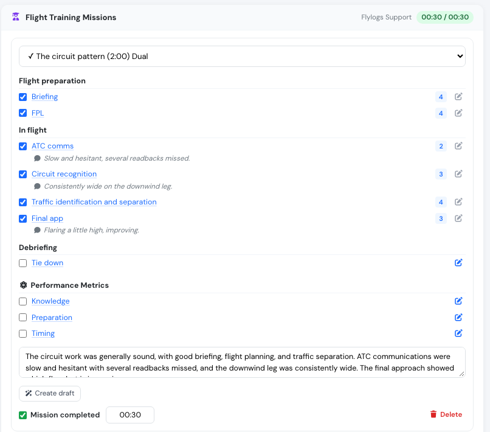

# Draft a mission comment

You have just graded a training mission exercise by exercise — a rating on each, a line of your own on the ones that needed it. Then you have to write the mission comment that says the same thing in prose.

Flylogs can write you a first draft of that comment from the gradings you just entered.

## Where it is

On the flight form, in **Flight Training Missions**. Under each mission's comments box there is a **Create draft** button.

It is greyed out until you have graded something. A draft can only summarise what is on screen, so grade at least one exercise first.

## How it works

Grade the mission as you normally would, then press **Create draft** and wait a few seconds.

The draft is **added to that mission's comments box**, below anything already written there. Nothing you typed is replaced.

Then read it, edit it, and save the flight as usual. Until you save the flight, the draft is not stored anywhere — leaving the page discards it, exactly like any other unsaved change on the form.


It reads what is **on the form right now**, not what is in the database. A mission you added a moment ago and have not saved yet, and a comment you typed into an exercise ten seconds ago, are both included.


## What it uses

* Every exercise you have graded, with its rating.
* Every comment you wrote on an individual exercise — these matter most, and the draft carries your point through rather than rewriting it.
* Performance metrics, if your course uses them.

Exercises you have not graded are left out entirely. An ungraded exercise was not assessed, and a comment that mentioned it would be describing something that did not happen.

The rating scale is taken from your course, so a `2` out of 5, a `STD -` and an `N` for *not competent* are each read correctly.

### A worked example

The mission above was graded like this:

| Exercise | Rating | What the instructor wrote |
|----------|--------|---------------------------|
| Briefing | 4 | |
| FPL | 4 | |
| ATC comms | 2 | Slow and hesitant, several readbacks missed. |
| Circuit recognition | 3 | Consistently wide on the downwind leg. |
| Traffic identification and separation | 4 | |
| Final app | 3 | Flaring a little high, improving. |
| Tie down | *not graded* | |

And the draft that came back:

> The circuit work was generally sound, with good briefing, flight planning, and traffic separation. ATC communications were slow and hesitant with several readbacks missed, and the downwind leg was consistently wide. The final approach showed a high flare but is improving.

Note what it did: it carried both of the instructor's own comments through in their
own terms, named the weak areas rather than softening them, said nothing about
*Tie down* because it was not graded, and made no judgement about whether the
mission was passed.

## What it will not write

**It will not pass or fail the mission.** It will not say the student is competent, that the mission should be repeated, or that anything is ready to be signed off. You sign the record, so that judgement stays with you.

**It will not invent anything.** No manoeuvre, rating, condition or event that is not in the gradings will appear in the draft.

**It will not soften the weak areas.** A low rating is described as a low rating. This is a training record.

## Who can use it

Instructors and managers — user groups **170 and below**. Students cannot generate a draft.

## Availability

The button only works if your Flylogs installation has the assistant switched on. If it reports that draft comments are not enabled, contact support.

## Related

* [Create a flight](create-a-flight.md)
* [Flight Training](../training-courses/flight-training.md)
* [Student evaluation](../training-courses/student-evaluation.md)
