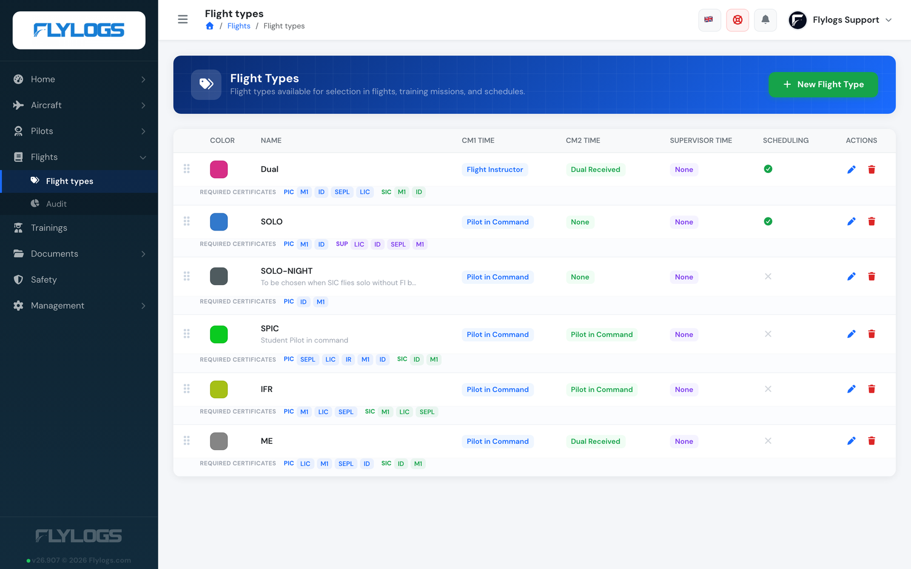
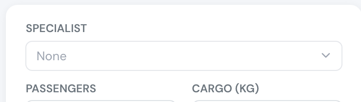
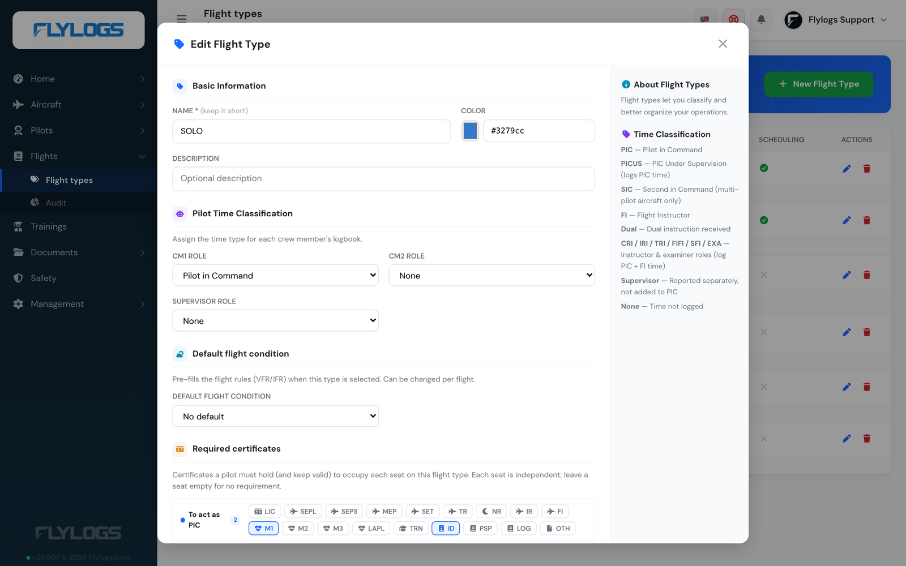

# Flight Types

**Flight types** classify every flight by purpose (Training, Ferry, Rental, OPC…) and drive a surprising amount of the system: how logbook time is credited to each crew member, what the flight form pre-fills, whether a slot can be booked, and which certificates the crew must hold. Getting them right once means the rest of Flylogs behaves correctly for every flight of that kind.

Each flight type belongs to your company. A starter set is created automatically when you sign up (tailored to your operation — school, commercial, special operations), and you can add, edit, reorder or remove them at any time.

## Where to configure

**Flights → Flight types.** Click **New Flight Type** to add one, or the pencil on a row to edit it. Drag rows by the handle at the left to change their order.

<figure><figcaption>
Each row shows the three seats' time classification, whether the type is offered on scheduling, and the certificates required per seat.
</figcaption></figure>

Flight types live in the manager area, so pilots and students never see this page; which of your staff roles can open it is decided by your company's role permissions. Reordering is stricter than the rest: it is refused for anyone above user group 110 (company administrators and above), so a manager who can create and edit types may still be unable to drag them into a new order.

## Naming: the three seats

Flylogs has exactly **three crew seats** on a flight, and the flight type sets what each one logs. The labels differ between the flight types page and the flight form, which is worth knowing before you go looking for a field that seems to be missing:

| Seat | Flight types page | Flight form |
|------|-------------------|-------------|
| First crew member | **CM1 Time** / **CM1 Role** | **CM1** |
| Second crew member | **CM2 Time** / **CM2 Role** | **CM2** |
| Third, non-operating seat | **Supervisor Time** / **Supervisor Role** | **Supervisor**, **Examiner** or **Specialist** |

The third seat is renamed to match your operation, from your company type: **Examiner** for general aviation companies, **Specialist** for special-operations companies, and **Supervisor** everywhere else. It is the same field and the same `Supervisor Role` setting in all three cases.

<figure><figcaption>
The third seat on the flight form — here labelled <em>Specialist</em>, because this is a special-operations company. It is the seat the flight type's <strong>Supervisor Role</strong> applies to.
</figcaption></figure>

## Options

<figure><figcaption>
The flight type form. The side panel repeats what each time classification credits.
</figcaption></figure>

### Name

A short label shown wherever the flight type appears (flight form, schedule, logbook, reports). Keep it brief — it's rendered as a compact badge.

### Color

A colour used for the flight type's badge on the calendar, schedule and lists, so different operations are easy to tell apart at a glance. Pick one manually or let Flylogs derive it from the name.

### Description

Optional free text to remind managers what the type is for. Shown under the name in the flight types list.

### Pilot time classification

The most important setting. For each of the three seats — **CM1 Role**, **CM2 Role** and **Supervisor Role** — you choose *how the time flown on this flight type is credited to that person's logbook*:

| Value | Credits |
|-------|---------|
| **PIC** | Pilot in Command time |
| **PICUS** | Counts toward the pilot's **PIC** total; also reported separately |
| **SIC** | Second in Command time — **only credited on multi-pilot aircraft** |
| **FI** | Counts toward **PIC and FI** totals; also reported separately |
| **Dual** | Dual instruction received |
| **CRI / IRI / TRI / FIFI / SFI / EXA** | Instructor & examiner roles — count toward **PIC and FI** totals; each also reported separately |
| **Supervisor** | Reported separately only — **not** rolled into PIC or FI |
| **None** | Time is not logged for that seat |

So a **Training** type is typically CM1 = *FI* (the instructor logs PIC + FI time) and CM2 = *Dual* (the student logs dual received); a **Rental** type is CM1 = *PIC*, CM2 = *None*.

> **Multi-pilot only:** *SIC* time is credited only when the aircraft is marked multi-pilot. On single-pilot aircraft a seat set to SIC logs no time. (This preserves the behaviour of the retired *Copilot* classification.)

> **None still means "on the crew".** A classification of *None* stops the **logbook time** for that seat. It does not remove the person from the flight: they are still crew, the flight still appears in their records, and — see below — the flight still shapes their duty day.

### Time classification and duty

Time classification and **duty** are separate things, and this catches people out.

Whoever occupies **any** of the three seats on a confirmed flight gets that flight folded into their duty record for the day: their duty period is stretched to cover it, plus the before/after commute times from company settings. That happens **whatever the classification is, including *None***.

(Duty is only calculated automatically when *Auto complete duty records* is enabled in company settings; the sector count and FDP limits additionally need FTL enabled.)

So *None* on a seat means "log no hours for this person", never "ignore this person". Use it exactly when someone is responsible for a flight but must not accrue flight time from it.

### Example: supervising a solo flight

A student flies solo; an instructor on the ground is responsible for the flight. The instructor must pick up the duty, but must not log the student's hours.

Configure it like this:

* On the flight type (a *Solo* or *SPIC* type), set **Supervisor Role** to **None**.
* On the flight, put the student in **CM1** and the supervising instructor in the **third seat** — remember it is labelled *Examiner* on general-aviation companies and *Specialist* on special-operations ones. Leave **CM2** empty.

The instructor then gets the duty period for that day and no flight hours at all.

> **Do not put the supervising instructor in CM2.** A CM2 whose classification is anything other than *None* logs block time — including the *Supervisor* classification, which is reported on its own line but still counts as time flown. That is the usual reason a ground-based instructor ends up with hours they never flew.

> **Known limitation:** the per-day **number of flights** in the activity-times report counts the CM1 and CM2 seats only, so a flight the instructor only supervised will show duty but will not raise their flight count for the day. The FDP sector count does include it.

### Default flight condition

Optionally set **VFR** or **IFR** as the type's default. When a crew member picks this flight type on the flight form, the flight's **Rules** field is pre-filled with that value (you can still change it per flight). Leave it empty for no default.

### Visibility — visible on self-booking

A toggle (shown as the **Scheduling** column in the list) that controls whether the flight type appears in the **self-booking / scheduling** flight-type picker. Turn it off for types that should only be used when logging a flight after the fact (e.g. Test or Ferry), and on for the everyday operations crew book themselves onto.

### Order

The position of the type in every flight-type list. Drag rows in the flight types page to set it — put your most-used types at the top.

### Required certificates

Define, **per seat** (*To act as PIC* / *To act as SIC* / *To act as Supervisor*, matching CM1 / CM2 / the third seat), which certificates a crew member must hold to occupy that seat on this flight type — for example a licence, Class 1 medical and single-engine rating for the PIC, but only a medical for a student in CM2. The three seats are independent, and a seat with no requirements imposes none. See [Document & Certificate Requirements](../crew-management/document-and-certificate-requirements.md) for how these are checked across the app.

## How flight types affect the rest of Flylogs

### Flights

* **Classification & reports.** Every flight carries a flight type; it's how flights are grouped and filtered in logbooks, exports and statistics.
* **Logbook time.** The CM1 / CM2 / Supervisor classifications above decide exactly what time each crew member's logbook receives — and how it rolls up into their PIC / FI totals.
* **Duty and FDP.** Independently of the classification, everyone in any of the three seats on a confirmed flight gets that flight folded into their duty day and counted as an FDP sector.
* **Rules pre-fill.** Choosing the type on the flight form sets the flight's VFR/IFR rules from the type's default flight condition.
* **Crew documentation.** Under each selected CM1/CM2 on the flight form, a badge names any required certificate that person is missing or expired for that flight type. The seat's classification is also shown next to its label, so you can see at a glance what the seat will log.

### Schedules, dispatch & booking

* **Booking picker.** Only types with **Visible on self-booking** enabled can be chosen when booking a slot.
* **Crew compliance.** When a manager assigns crew in the schedule editor, each crew card shows *Docs OK* or lists exactly which required certificates are missing/expired for that seat, and can block the save. The pre-flight **dispatch briefing** shows the same per-seat checklist. In **self-booking**, a flyer who doesn't meet the type's requirements is always warned, and is stopped from booking only when *Require pilot documentation* is on and *Allow self-booking without valid documents* is off. Validity is evaluated for the scheduled time, so a certificate that expires before the flight ends is flagged.

### Trainings

Training missions reference flight types, tying a syllabus exercise to the flight type (and therefore the time classification) used to fly it.

### Logbooks & reports

Because the time classification is set on the flight type, pilot totals, currency and statistics all derive from it — change a type's classification and future flights of that type log accordingly (past flights are unaffected).

On a pilot's page, *PICUS* and the instructor/examiner classes are added into the **PIC** total and also listed on their own line; *Supervisor* is only ever listed on its own line and is never added to PIC or FI.

## Deleting a flight type

Deleting is a soft delete: the type is hidden from new flights and schedules but existing flights that already reference it keep their classification and history. The delete dialog tells you how many flights currently use the type before you confirm.
