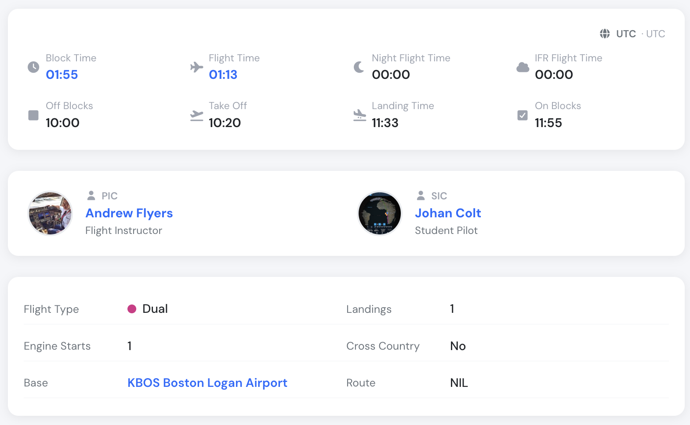

# Flight Dispatch Function

The **Flight Dispatch** feature allows operations staff to provide pilots with all necessary operational details before a flight.\
When a flight is dispatched, the system automatically creates a **Flight Draft** with the additional information entered, ensuring pilots have clear, accurate, and standardized pre-flight data.

This article explains how the feature works, what each screen shows, and how the information flows into the pilot-visible flight draft.

***

### Who can dispatch a flight?

The Dispatch button is visible in the Schedule Review page when **all three** conditions are met:

1. **Schedule status** — the record must be in **Scheduled** or **Confirmed** status and not yet have a linked flight.
2. **Full schedule access** — the user must have write access to schedules:
   - **Company Administrators and Operations Managers** (user group ≤ 140) always have full access.
   - **Flight Instructors / Supervisors** (user groups 141–170) have full access only when the company setting **Allow FI schedule management** is enabled.
   - Pilots and Dispatchers (user groups above 170) can view the schedule but cannot dispatch.
3. **Flight creation permission** — the user's account must be active and allowed to create flights. Users in groups above 150 additionally require an active pilot profile.

| User type | Can dispatch? |
|---|---|
| Company Administrator / Operations Manager | Yes |
| Flight Instructor / Supervisor (FI management enabled) | Yes |
| Flight Instructor / Supervisor (FI management disabled) | No |
| Dispatcher / Pilot | No |

> If the Dispatch button is not visible for a user who should have access, check that **Allow FI schedule management** is enabled under Company Settings and that the user's account is active.

### **1. Opening the Dispatch Menu**

From the **Schedule** view, locate the flight you want to dispatch.\
Click the **SCHEDULED** button to open the actions dropdown.

<figure><figcaption></figcaption></figure>

In the dropdown, select **Dispatch Flight**.\
This opens the _Create Flight Draft_ window.

***

### **2. Creating the Flight Draft**

The **Create Flight Draft** pop-up allows you to specify operational details needed by pilots.\
These fields may include:

* **Departure and Arrival airports**
* **Callsign**
* **Flight type** (e.g., Commercial, Dual, etc.)
* **Passenger count**
* **Cargo weight**
* **Route**
* **Remarks** (e.g., special cargo, restrictions, operational notes)

<figure><figcaption></figcaption></figure>

Once all required fields are completed, click **Create Draft**.\
The system will generate a flight draft visible to the pilots assigned to the flight.

***

### **3. How the Flight Draft Appears to Pilots**

Once created, the draft becomes available in the pilot interface.\
All information entered during dispatch is automatically inserted into the draft, ensuring the flight crew receives clear and complete data.

The pilot view includes:

* Flight type
* Distance and number of landings
* Cross-country status
* Passengers & cargo
* Route
* A dedicated **Remarks** section containing any operational notes added during dispatch

<figure><figcaption></figcaption></figure>

This ensures pilots can review all important details immediately, without needing additional communication from operations.

***

### **Pre-dispatch gates: checklist & FRAT**

Two optional safety gates can be required before a flight is dispatched. Both are **off by default** and are enabled per company under **Company Settings → Flights → Pre-dispatch gates**. The feature is available on **Club, Premium and Unlimited** plans.

* **Pre-dispatch checklist** — a short acknowledgement checklist (weather, NOTAMs, aircraft status, crew documents, SOPs) that must be fully ticked before the **Dispatch** button is enabled. The checklist is an acknowledgement only and is not stored.
* **Flight Risk Assessment (FRAT)** — a crew member dispatching their own flight must complete a FAA-style PAVE risk questionnaire; high-risk flights require a Supervisor. See the dedicated [Flight Risk Assessment (FRAT)](flight-risk-assessment-frat.md) article for the full details.

***

### **Remarks**

1. If a schedule record is **published** and **dispatched** and the PIC is changed, the record will automatically be switched back to SCHEDULED and the associated flight will be unlinked.
2. If a PIC or SIC tries to dispatch the flight, the system will check for required pilot certificates, and if the user lacks any of the required certificates (medical, license, rating), Flylogs will reject the flight dispatch function.

***

### **Summary**

The **Flight Dispatch** function streamlines communication between operations and flight crew by:

* Allowing dispatchers to add all relevant pre-flight information
* Automatically populating the pilot’s flight draft
* Reducing manual updates and potential communication delays
* Ensuring a standardized workflow for all flights

By using this feature for every dispatched flight, your team improves accuracy, operational clarity, and overall efficiency.
