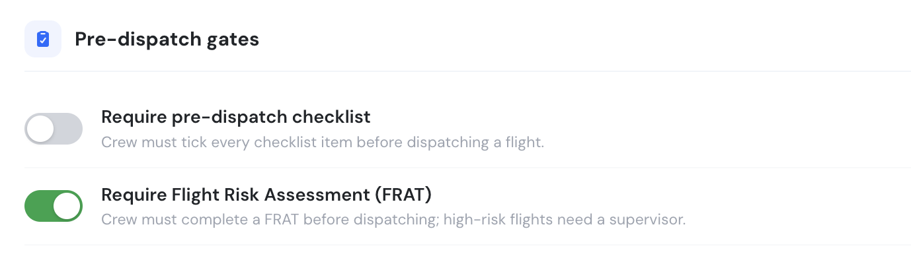
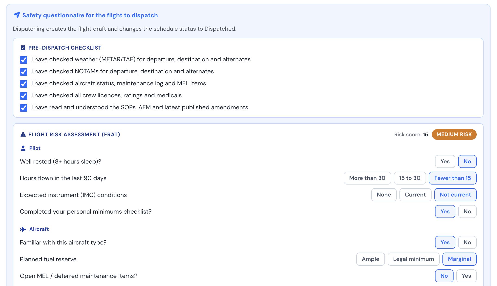
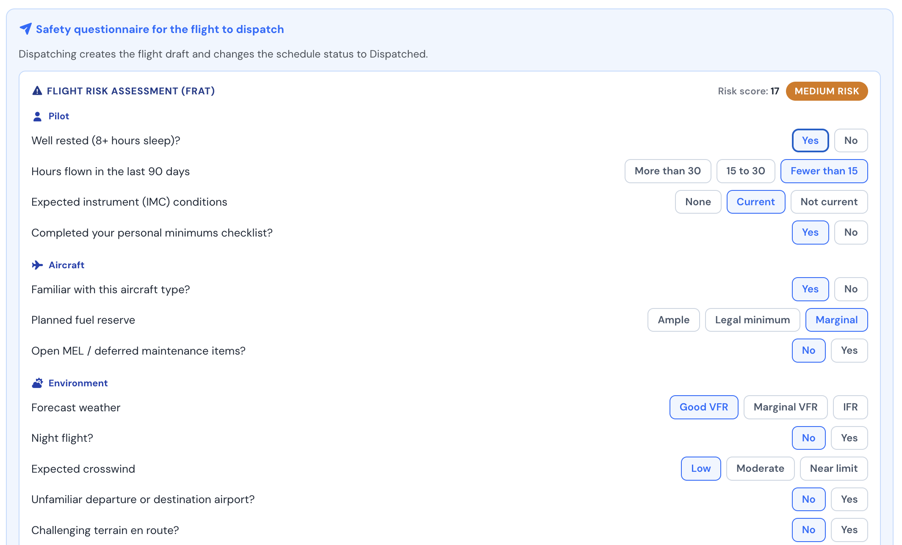

# Flight Risk Assessment (FRAT)

The **Flight Risk Assessment Tool (FRAT)** is a short safety questionnaire shown when a crew member dispatches their own flight. It follows the FAA Safety Team **PAVE** model — **P**ilot, **A**ircraft, en**V**ironment, **E**xternal pressures — and turns the crew's answers into a single risk score and a colour-coded risk band, so the decision to fly is made deliberately and on the record.

This article explains how to enable the FRAT, how the score and bands work, what is filled in automatically, and how it interacts with dispatch.

***

### Enabling the gates

The FRAT and the pre-dispatch checklist are both **optional** and **off by default**. A Company Administrator enables them under **Company Settings → Flights → Pre-dispatch gates**. The feature is available on the **Club, Premium and Unlimited** plans.

<figure><figcaption>Company Settings → Flights → Pre-dispatch gates</figcaption></figure>

* **Require pre-dispatch checklist** — shows an acknowledgement checklist (weather, NOTAMs, aircraft status, crew documents, SOPs) that must be fully ticked before a flight can be dispatched.
* **Require Flight Risk Assessment (FRAT)** — requires a completed FRAT before a crew member can dispatch their own flight; high-risk flights need a Supervisor.

You can enable either gate on its own, or both together.

***

### When the FRAT appears

The FRAT is shown in the **dispatch confirmation** on the schedule view, directly under the pre-dispatch checklist. It is required only when **the person dispatching is a crew member of that flight** — the assigned PIC, SIC or Supervisor. Operations staff who are not assigned to the flight can dispatch without completing it.

When both gates are enabled, the crew member sees the checklist first, then the FRAT:

<figure><figcaption>Pre-dispatch checklist and FRAT in the dispatch confirmation</figcaption></figure>

When only the FRAT is enabled, the checklist is hidden:

<figure><figcaption>The FRAT on its own</figcaption></figure>

***

### Risk score and bands

Each answer carries a risk weight. As the crew member answers, the weights are summed into a **Risk score** shown at the top of the questionnaire, with a live risk band:

| Band | Score | Meaning |
|---|---|---|
| **Low risk** (green) | 10 or less | Proceed. |
| **Medium risk** (amber) | 11 – 20 | Review and mitigate the contributing factors before flying. |
| **High risk** (red) | More than 20 | Elevated risk — a **Supervisor** must dispatch the flight. |

> **High-risk flights are blocked for ordinary crew.** If the assessment lands in the High band, the PIC or SIC cannot dispatch; a Supervisor must complete and dispatch the flight instead. A user dispatching as Supervisor is not blocked by the High band.

Every question must be answered before the **Dispatch** button is enabled.

***

### Questions filled in automatically

To save time and improve accuracy, several objective questions are **pre-answered from the dispatcher's own flight history and the live route weather**. These are only suggestions — the crew member can change any answer.

| Question | Filled from |
|---|---|
| **Hours flown in the last 90 days** | The dispatcher's logged flights (as PIC or SIC) over the previous 90 days. |
| **Familiar with this aircraft type?** | Hours flown on the same aircraft model over the last 12 months. |
| **Unfamiliar departure or destination airport?** | Whether the dispatcher has previously flown to or from each airport. |
| **Night flight?** | The scheduled departure time against the airport's sunrise/sunset, plus recent night experience. |
| **Forecast weather** | The live METAR/TAF flight category for the route (Good VFR, Marginal VFR, IFR). |

The remaining questions are subjective (rest, personal minimums, fuel planning, pressures) and are left for the crew member to judge.

***

### What is saved

When the flight is dispatched, the FRAT result — the **score**, **band** and the **answers** — is stored against the flight. It is saved **per crew member**, so a single flight can carry one assessment for each person who completes one.

***

### Summary

The FRAT helps crews make a structured, repeatable go/no-go decision before every flight by:

* Scoring objective and subjective risk factors using the FAA PAVE model
* Pre-filling the data-backed questions from flight history and live weather
* Surfacing a clear Low / Medium / High risk band
* Requiring Supervisor involvement for high-risk flights
* Recording the assessment with the flight for later review

See also: [Flight Dispatch Function](flight-dispatch-function.md).
