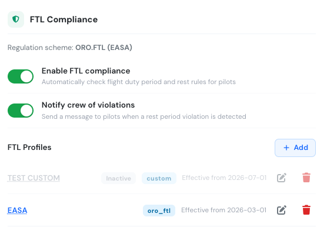
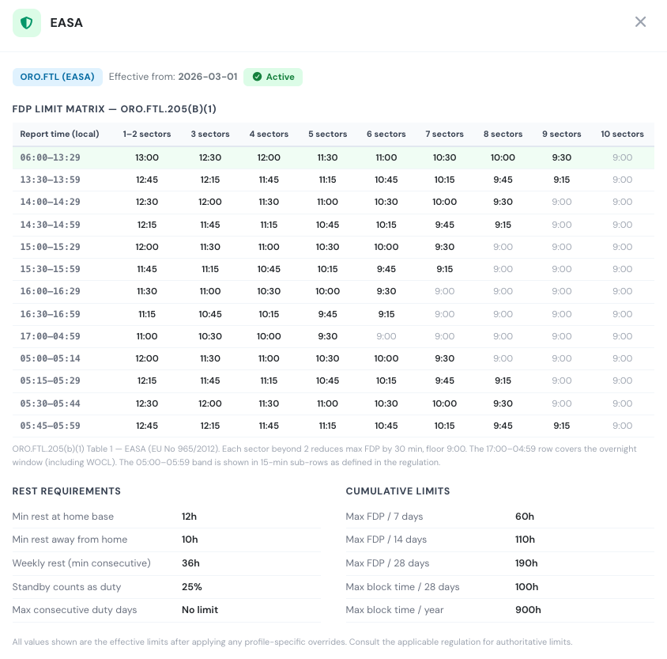

# FTL Compliance & Forecast


FTL Compliance requires a **Premium** or **Unlimited** subscription.


Flylogs can automatically calculate the **Flight Duty Period (FDP)** for every duty record and compare it against the regulatory limit that applies to each pilot on each day. When a limit is exceeded, the overage is flagged in red across duty reports, pilot views, and the FTL Forecast page.

The **FTL Forecast** page (`Schedule → FTL`) goes one step further: it projects FDP figures from the *scheduled* flights before any duty records are created, so roster managers can spot potential violations days or weeks in advance.

---

## Setup

### 1 — Enable FTL compliance

Go to **Settings → Duty Limits** and scroll to the **FTL Compliance** section on the right.

Turn on the **FTL enabled** toggle. From this point on, every duty record saved by the system (automatically or manually) will have its FDP and regulatory limit calculated and stored.

> **Note:** existing duty records saved before FTL was enabled will not have FDP data until they are re-saved. New records created after enabling will calculate correctly.

Optionally enable **Notify crew** to send an automatic message to a pilot when their FDP is projected to be close to or over the limit.

### 2 — Create an FTL profile

An **FTL profile** tells the system which regulatory scheme to apply and from when.

Click **Add** in the FTL Compliance section. Fill in:

| Field | Description |
|---|---|
| **Name** | A label for this profile, e.g. "ORO.FTL 2024" or "FAA Part 117". |
| **Regulatory scheme** | `ORO.FTL (EASA)`, `14 CFR Part 117 (FAA)`, or `Custom`. |
| **Effective from** | The date from which this profile applies. |

Click **Save**. You can have multiple profiles with different effective dates to handle regulatory transitions.

The system always picks the most recently effective active profile when calculating limits.

<figure><figcaption>The FTL Compliance section. Profile names are clickable to view the full FDP limit table for that profile.</figcaption></figure>

### Viewing the FDP limit table

Click any profile name in the FTL Compliance section (or click the **profile badge / ? button** on the FTL Forecast, Roster, or Schedule Manager pages) to open the profile detail panel.

<figure><figcaption>The FDP limit matrix for an ORO.FTL profile. Columns show maximum FDP for 1–2 up to 10 sectors; rows are the report-time bands from the regulation. Rest requirements and cumulative limits are shown below.</figcaption></figure>

The panel shows:

* **FDP Limit Matrix** — the full table of maximum FDP hours by report time and number of sectors, taken directly from the applicable regulation (ORO.FTL.205 Table 1, or 14 CFR §117 Table B). Values greyed out at 9:00 have hit the regulatory floor.
* **Rest Requirements** — minimum rest at home base and away, weekly rest, standby fraction, and maximum consecutive duty days.
* **Cumulative Limits** — maximum FDP and block time over rolling 7-day, 14-day, 28-day, and annual windows.

If the profile has custom rule overrides, a yellow callout lists which fields have been changed from the scheme default.

---

## How FDP is calculated

When a duty record is saved, Flylogs:

1. Finds all flights for that pilot on that day.
2. Takes the **earliest flight departure** as the start of the FDP (minus any commute time configured in Duty Limits settings).
3. Takes the **latest flight arrival** as the end of the FDP.
4. Looks up the regulatory FDP limit from the active profile using:
   - The **report time** (local hour of FDP start)
   - The **number of sectors** flown
5. Flags the record as a **violation** if the actual FDP exceeds the limit.
6. Flags **WOCL** if the duty period overlaps the Window of Circadian Low (02:00–05:59 local).

---

## Where violations appear

Once FTL is enabled, FDP data appears in three places:

### Pilot duty times grid (Pilots → Duty Times)

The monthly grid shows each pilot's daily FDP alongside their total duty time. Days with a violation are highlighted in red. A **W** badge indicates WOCL overlap.

### Pilot view page

Each pilot's profile page shows the current FDP and limit for recent duty records.

### FTL Forecast page (Schedule → FTL)

See the section below.

---

## FTL Forecast page

The FTL Forecast page projects FDP figures from **scheduled flights** — before the duty records exist. It is a planning tool, not a compliance record.

### Monthly navigation

Use the **‹** and **›** arrows to browse months. The current day is highlighted in the column header.

### Fatigue risk chart

The bar chart at the top ranks pilots by their **total projected FDP hours** for the month. Pilots with at least one projected violation are shown in red. Use this chart to identify the most fatigued crew on the roster at a glance.

### Day grid

Each row is a pilot. Each column is a day of the month. A cell contains:

| Content | Meaning |
|---|---|
| **Flight time** (e.g. `7:30`) | Projected FDP for the day. |
| **FDP badge** (red) | FDP would exceed the regulatory limit for that report time and number of sectors. |
| **W badge** (orange) | Duty period overlaps the Window of Circadian Low (02:00–05:59). |
| **SB** (light blue) | Standby duty from the base schedule. |
| **GD** (grey) | Ground duty from the base schedule. |

**Cell colours:**

| Colour | Meaning |
|---|---|
| White / transparent | No scheduled activity. |
| Light blue | Standby. |
| Light grey | Ground duty. |
| Light green | FDP projected at less than 80 % of the limit. |
| Yellow | FDP projected at 80–99 % of the limit — approaching the limit. |
| Red / pink | FDP would exceed the limit — violation. |

### Caveats

- The forecast is based on **scheduled departure and arrival times**. Actual FDP may differ if flights run early or late.
- Only flights with status **other than** CANCELED or DRAFT are included.
- Base schedule entries (standby, ground duty) are shown for context but do not generate FDP figures.
- The applicable **FTL profile** is the one active as of today, applied uniformly across the entire month shown.

---

## Regulatory schemes

| Scheme | Applies to |
|---|---|
| **ORO.FTL (EASA)** | Airlines and AOC holders operating under EASA rules (EU, UK, and many other countries). Table-based FDP limits from ORO.FTL.205, extended when WOCL is involved. |
| **14 CFR Part 117 (FAA)** | US air carriers under FAA flight and duty time rules. |
| **Custom** | Define your own FDP limits when your operations manual specifies values outside the standard tables. |

---

## Frequently asked questions

**My pilots have duty records but I see no FDP data.**
FDP is calculated when a duty record is saved. Records that existed before FTL was enabled need to be re-saved to trigger the calculation. New records will calculate automatically.

**The FTL Forecast shows "No active FTL profile found".**
No active profile exists with an effective date on or before today. Go to **Settings → Duty Limits → FTL Compliance** and add a profile with an effective date in the past or today.

**Can I use FTL tracking without the ORO.FTL or FAA schemes?**
Yes. Choose the **Custom** scheme and Flylogs will still calculate FDP and flag violations using the limits you define in the profile rules.

**Does the FTL Forecast block scheduling?**
No. The forecast is read-only. To block schedule creation that would cause violations, use the **Block overtime scheduling** setting in the Duty Limits tab.
