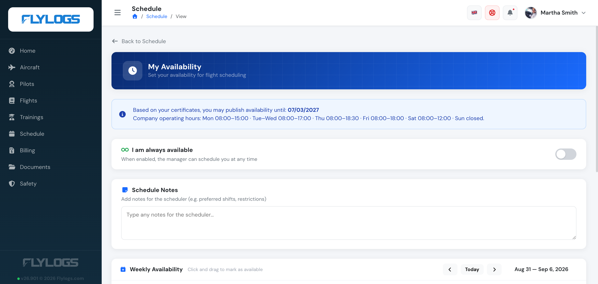
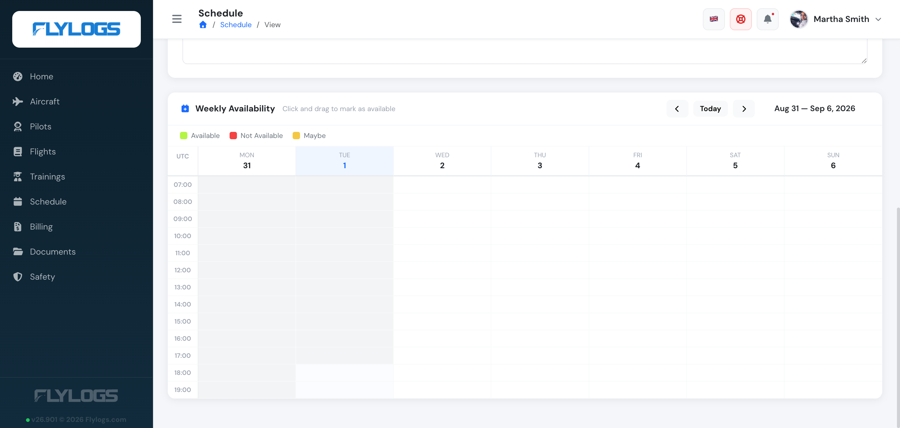

# Pilot availability records

My availability tool allows your pilots to store their flight availability records on Flylogs so you can schedule flights according to this information.

The tool is available for any pilot or company user with pilot functions enabled and can be accessed from the pilot dashboard using any desktop computer or smartphone browser.

***

### Access to the tool

You will find a **My Availability** button both in your pilot dashboard (home page) and in the Schedules section.

Every pilot has 2 main options in their availability management page:

* An option to enable the ALWAYS AVAILABLE option.
* A big text box to input any comments for the roster manager
* A big calendar, that will be enabled if the ALWAYS AVAILABLE is not checked. This is the calendar that just by click and dragging, the pilot can mark the availability for any future dates. 

Availability slots can be more than 24 hours long, so the pilot can easily mark 1 hours, or full days as available.

#### Example

You can click on Monday 10am, and drag the mouse to Thursday 5pm, creating a single slot of availability — marked Available, Not Available, or Maybe.

> The system allows to mark my self as I am always available or choose the desired time frames with 30 minute accuracy.\
> Additionally, just underneath the I am always available option, the pilot can enter some comments for the Roster Manager.

***

### How to enter custom time frames

To be able to select customized time frames, first disable the **I am always available** option. You will notice how all the green chunks disappear and you can click on the calendar.




If you are using a touch device (tablet or a smartphone), note that you need to tap and hold on the desired time, then drag to the desired finish time and release.


***

### Require confirmed availability

By default, when a manager assigns crew to a booking, Flylogs only blocks a pilot who has marked that time as **Not available**. A pilot who has not entered anything can still be selected.

If your pilots have changing rosters and should only be scheduled when they have said they are free, turn on **Require confirmed availability** under **Company settings > Schedule**. The option is off by default, so nothing changes until you enable it.

When it is on, a pilot or instructor can only be assigned to a booking if at least one of these is true for the whole time frame:

* They marked the time as **Available**, or they have **I am always available** switched on.
* They are on **Duty** or **Standby** in the base roster.

Pilots who marked **Maybe**, **Not available**, or who submitted nothing appear greyed out in the crew selector and cannot be chosen. The restriction is also enforced when the booking is saved, so it cannot be bypassed.


Pilots booking themselves (self-booking) are not affected. When editing an existing booking, only crew who are newly added, or whose time frame changed, are checked.

