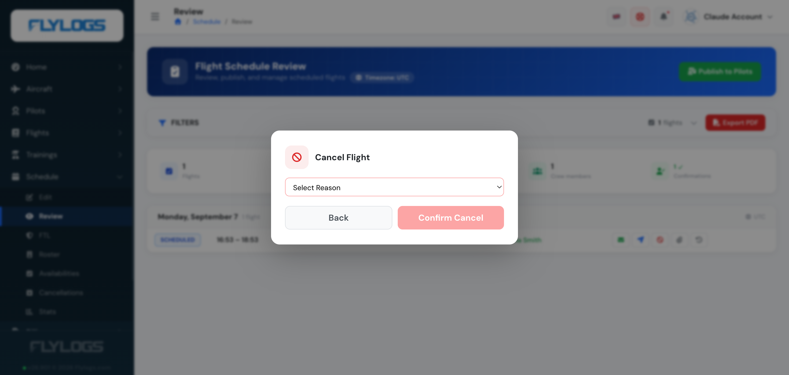
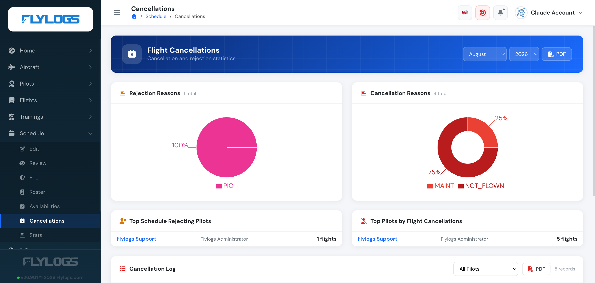

# Schedule cancellations

Flight cancellations are something we can not avoid. The important thing about them, is to keep a good track to analyze the factors and avoid the unnecessary events due to a lack of information about our own operations.

Flylogs is all about empowering you, the company manager, by giving you access to all the information in an easy to access and understand format.

Each scheduled flight, if confirmed by the pilots, is due to happen. A scheduled flight that is never dispatched or logged is treated as **not flown**. Once the company's *not-flown grace window* passes after the scheduled end time, Flylogs automatically cancels the booking, attributes the cancellation to the **PIC**, and records the reason **"Not flown"**. These appear in the Schedule cancellation analytics alongside manual cancellations. In the flight's history the action is shown as performed by **Flylogs Autopilot** (the system), while the count still goes against the PIC. The auto-cancellation is silent — no notification is sent. Logging the flight (even without dispatching it from the schedule) prevents it. The grace window is set per company under **Company settings → Schedule → Schedule cancellations**, and can be disabled.

The PIC, SIC or supervisor can cancel their own booking manually, right up until the company's *Dispatch cancel limit* (Company settings → Schedule → Schedule cancellations) is reached — inside that window the cancel option is no longer available to them, and they should ask the PIC or a scheduling manager to cancel it instead. Staff with scheduling rights are not subject to this limit and can always cancel any booking from the [Schedule Review page](schedule-review-page.md). Either way, the system asks for a cancellation reason.

This information is stored and displayed in the Schedule cancellation analytics page so you can have a better understanding of why your flights are being cancelled.

