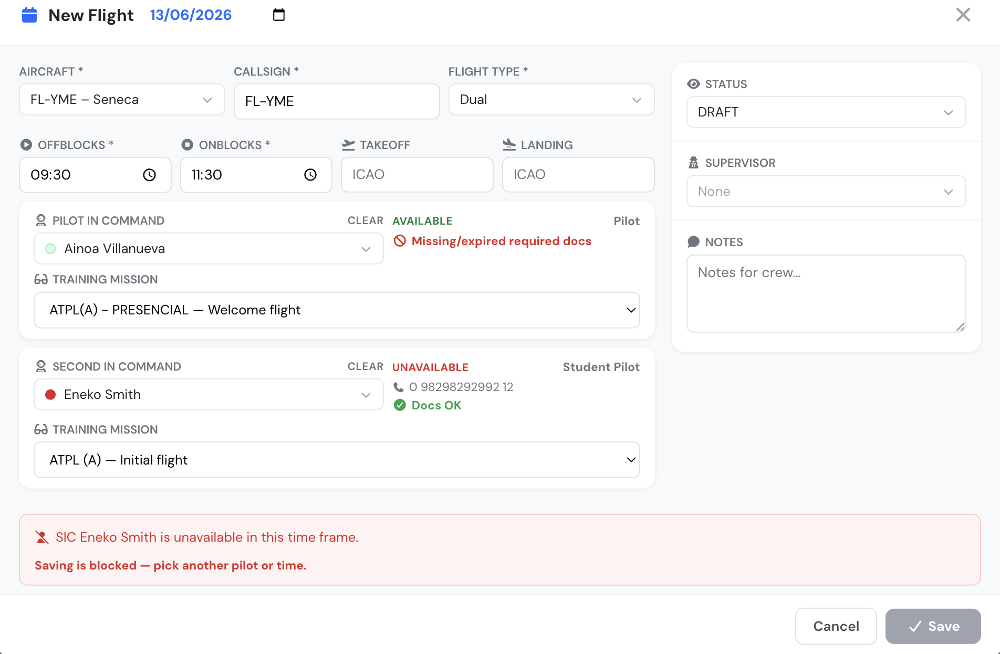

# Schedule Edit page (Schedule Manager)

The **Schedule Manager** is the main working view for building and editing your flight schedule. It shows a calendar of every aircraft and lets you create, move, edit and delete schedule records (bookings) directly on the grid.

This page is reserved for **schedule management roles** — Company Managers, Roster Managers and Aircraft Managers. Members with a Flight Instructor rank (or pilots, depending on your company settings) may see the calendar in a **Read‑only** mode, where flights are visible but cannot be created or edited. Members without any schedule access are blocked from the page.


All times on this page are shown in your **company time zone**, displayed in the page header.


### The calendar grid

Aircraft are listed down the left side; time runs across the top. Each schedule record appears as a coloured block on its aircraft row.

* **Views** — Switch between **Day**, **Week** and **Month** from the buttons in the top‑right of the calendar. Your browser remembers the last view you used. On large fleets the day view automatically uses the timeline layout.
* **Now indicator & navigation** — A line marks the current time. Use **today / prev / next** to move through dates, or click a day heading to jump to it.
* **Business hours shading** — Daylight hours for the base airport (sunrise to sunset) are highlighted so night operations are easy to spot.
* **Maintenance blocks** — Open maintenance jobs appear as striped 🔧 background bands on the affected aircraft, and the slot cannot be booked over them.
* **Colour legend** — A legend below the calendar maps the left‑border colour of each block to its status (Draft, Scheduled, Confirmed, Delay, Departed, Landed, Canceled, Dispatched). A 🛣️ road icon marks local / touch‑and‑go training missions.

### Creating a flight

Click and drag on an aircraft row to select a time slot. The **New Flight** form opens with the date, start and end times, aircraft and callsign pre‑filled from your selection. See [The schedule record edit form](#the-schedule-record-edit-form) below.

### Editing, moving and resizing

* **Click** a block to open the edit form.
* **Drag** a block to a new time or a different aircraft row.
* **Resize** the edges of a block to change its start or end time.

When you move, resize or edit a flight that is **not a Draft** (i.e. already published to crew), a confirmation prompt appears first. For moves and resizes you can tick **Notify crew** so the affected pilots are alerted to the change. Overlapping bookings on the same aircraft are not allowed.

### Base filter

If your company has more than one operational base, a **base selector** appears in the header. Choosing a base limits the calendar to that base's aircraft and loads that base's airport (sunrise/sunset and METAR for kiosk mode). Choose **All bases** to see the whole fleet.

### On‑duty pilots strip

Managers also see an **on‑duty pilots** strip above the calendar, summarising which crew are on duty for the dates currently in view. It follows the base filter and the visible date range.

## The schedule record edit form

The edit form has the flight data on the left and dynamic, supplemental information on the right. For the full list of fields and the schedule record lifecycle, see [Flight Schedule Records](flight-schedule-records.md).

Only five fields are mandatory: **Aircraft**, **Callsign**, **Flight Type**, **Offblocks** (start) and **Onblocks** (end). The callsign defaults to the aircraft registration if left empty.

<figure><figcaption>
Crew availability in the schedule record edit form
</figcaption></figure>

### Linked Offblocks / Onblocks times

The two time fields are linked: when you change **Offblocks**, **Onblocks** moves with it so the flight duration is preserved (e.g. a 10:00–12:00 flight moved to start at 23:00 becomes 23:00–01:00). Editing **Onblocks** on its own redefines the duration.

Flights may cross midnight — Offblocks 23:00 with Onblocks 03:00 is a valid 4‑hour flight ending the next day. A flight can never reach 24 hours, and Offblocks and Onblocks cannot be the same time.

### Crew panels (PIC / SIC)

Each crew slot has a searchable pilot selector grouped by user group. The selector shows an **availability dot** next to each pilot for the selected time window:

* 🟢 **Green** — the pilot has declared themselves available.
* 🟠 **Orange** — the pilot answered *maybe*.
* 🔴 **Red** — the pilot is **unavailable**; the entry is greyed out and cannot be selected.
* A muted red dot marks pilots already **busy** (booked on another flight, on an OFF/REST base‑schedule day, or teaching a scheduled class).

Use **CLEAR**, next to the field label, to deselect the pilot.

Once a pilot is selected, the side panel shows live context:

* The pilot's **availability status** for the current time window — AVAILABLE, MAYBE, UNAVAILABLE or BUSY — which updates automatically when you change the date or times.
* Pilot group, phone and **last flight** date.
* **Documents** — a green **Docs OK** indicator when the pilot is document‑valid for the flight. If not, only the problem documents are listed (expired items in red) together with a "Missing/expired required docs" warning. Validity is role‑aware: rank 200 members only need a valid medical, rank 300 members only a valid licence; pilots need licence, ratings, medical and training certificates.

If the selected aircraft is **multi‑pilot**, an SIC is required. The same pilot cannot be assigned as both PIC and SIC. The **Supervisor** selector shows the same availability dots.

### Training missions

If a selected PIC or SIC is enrolled in a flight training with pending missions, a **Training Mission** selector appears and the next uncompleted mission is auto‑selected (skipping missions already scheduled elsewhere). When a mission is auto‑selected, the schedule's **Flight Type** is updated to the mission's flight type automatically. If you pick a different mission by hand and its flight type differs from the schedule's, you are prompted on save to either switch to the mission's flight type or keep the current one.

### Status, supervisor and notes

The right column carries:

* **Status** — Draft, Scheduled or Canceled. Leave as **Draft** to keep the record private to managers, or set **Scheduled** to publish it to crew on save. See [Publishing multiple schedule records](publishing-multiple-schedule-records.md).
* **Supervisor / Examiner / Specialist** — a third crew slot, labelled to match your company type.
* **Notes** — free text for the crew.
* **Notify crew** — for non‑Draft records, tick to email the assigned crew when you save.

### Validation and warnings

Before saving, the form runs duty and safety checks and shows warnings for:

* Flight duration over the maximum.
* Daily / monthly flight‑time limits exceeded.
* Daily duty time exceeded and minimum rest (between days and between flights) not met.

If your company has **block overtime scheduling** enabled, these violations **block saving** until resolved; otherwise they are advisory. A separate, always‑blocking check stops you assigning a pilot to an **aircraft or flight type they are not entitled to** fly.

Crew availability is re‑checked whenever you change the date, the times or the crew:

* If an assigned PIC or SIC is **unavailable** for the new time window, a red message names the pilot and **saving is blocked** until you pick another pilot or time.
* If they are merely **busy** (another booking, base‑schedule OFF/REST, or a scheduled class), an amber warning is shown but you may still save.

## Actions menu

The green **Actions** menu (top‑right) gives bulk and utility tools. The first group is available to **top‑level managers** only:

* **Publish schedule** — email/notify pilots for a range of records at once (see [Publishing multiple schedule records](publishing-multiple-schedule-records.md)).
* **Copy week** — duplicate a whole week's schedule to another week.
* **Clear week** — delete a week's records in one step.
* **Auto‑pilot** — auto‑assign crew across the fleet.

Available to anyone who can edit:

* **Kiosk mode** — a full‑screen, auto‑refreshing display of the calendar for ops‑room screens, showing the base name and live **METAR**. It refreshes every couple of minutes and re‑centres on the current time.
* **Print PDF** — export the current calendar view to a PDF named by date.
