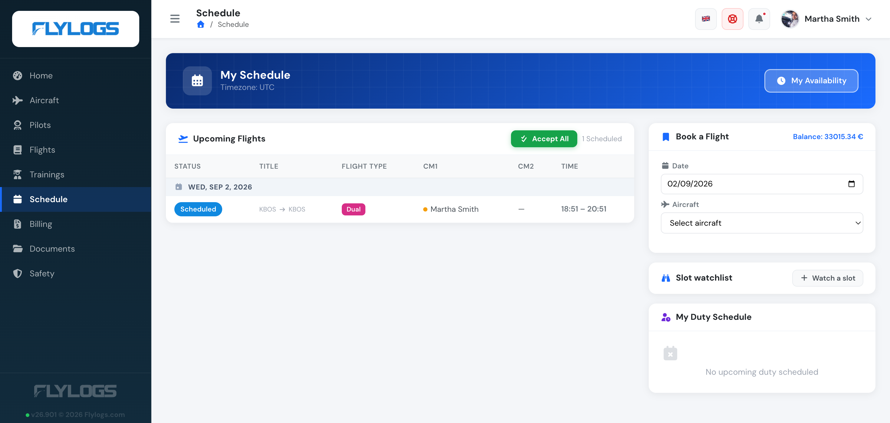
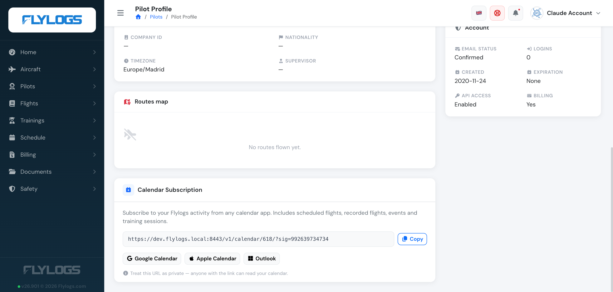

# Schedule notifications

Every time the flight schedule is published by your Roster Manager, Flylogs will deliver all flights to each pilot in a single email summarizing all flights.

If you require your pilots to confirm, they will have the option to do so — the flight appears under **Upcoming Flights** on their Schedule page, awaiting **Accept** or **Reject**.

Each pilot can subscribe to their Flylogs activity — scheduled flights, recorded flights, events and training sessions — from a private calendar feed URL, addable to Google Calendar, Apple Calendar or Outlook. It's found on the **Calendar Subscription** card on their own profile page.

The calendar feed does not allow to confirm or reject scheduled flights. To do so, the pilot still needs to login into Flylogs to manage the slots.
