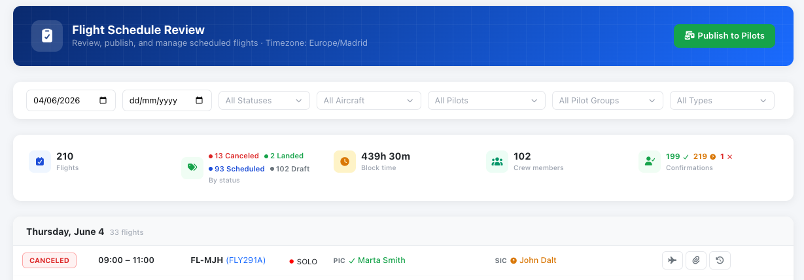

# Schedule Review page

The **Schedule Review** page is a list‑based companion to the [Schedule Manager calendar](schedule-edit-page.md). Instead of a grid, it shows your schedule records as a filterable, day‑grouped list with per‑flight actions — ideal for checking crew confirmations, publishing rosters, sending reminders, cancelling and dispatching flights.

<figure><figcaption>
Schedule records review page
</figcaption></figure>

### Access levels

What you can do on this page depends on your role:

* **Full management** — Company Managers, Roster Managers and Aircraft Managers. If your company enables **Flight Instructor schedule management**, instructors also get full access. Full access shows every row action.
* **Read‑only** — Flight Instructors (when FI management is off), and pilots when your company enables **allow pilots to see the master schedule**. They can browse and filter but see no action buttons.
* **No access** — everyone else is blocked from the page.

Some actions are further limited to **top‑level managers** (see each action below).


Times are shown in your **company time zone**, noted in the page header.


### Filters

Open the **Filters** bar to narrow the list by:

* **From / To** date range (defaults to today onward).
* **Status** — Scheduled, Landed or Canceled.
* **Aircraft**, **Pilot**, **Pilot group** and **Flight type**.

The bar shows how many filters are active and the total flight count. Results reload automatically as you change filters.

### Summary cards

Above the list, summary cards total the filtered results:

* **Flights** — total count.
* **By status** — a breakdown per status.
* **Block time** — combined scheduled hours and minutes.
* **Crew members** — distinct pilots involved.
* **Confirmations** — how many crew slots are **Accepted**, **Pending** or **Rejected**.

### The flight list

Records are grouped under date headers. Each row shows the **status**, **time**, **route** (departure → arrival), **callsign and aircraft**, **flight type**, and the **PIC / SIC** with their individual acceptance status (a tick for confirmed, a question mark for pending, a cross for rejected). Crew names and the aircraft link through to their records.

### Row actions

Depending on a flight's status and your role, these buttons appear at the end of each row:

* **View flight** ✈️ — opens the linked flight record once one exists.
* **Publish** 👁️ — publishes a **Draft** record to crew. *(Top‑level managers.)*
* **Notify crew** ✉️ — sends an email reminder to the crew of a **Scheduled** flight.
* **Dispatch** ✉️➤ — for **Scheduled / Confirmed** flights without a flight yet, opens the dispatch form to create the flight draft. Requires flight‑creation permission. See [Flight Dispatch Function](flight-dispatch-function.md).
* **Cancel** 🚫 — cancels a **Scheduled** flight. You must pick a **cancellation reason**; some reasons require a short explanation. See [Schedule cancellations](schedule-cancellations.md).
* **Attachments** 📎 — view and add files to the record; the icon shows the attachment count and turns green when files are present.
* **History** 🕘 — opens the audit trail of status changes, with who made each change, the reason/notes and the timestamp.

### Dispatch form

Dispatching turns a schedule record into a flight draft. The form pre‑fills departure/arrival airports, callsign and flight type from the booking, and lets you add a **route** and **remarks**. For **AOC operators**, **passenger** and **cargo** fields are also shown. On success the record is marked **Dispatched** and you can open the new flight directly.

### Publish to pilots (bulk)

Top‑level managers see a **Publish to pilots** button in the header. It opens a modal where you select a date range and choose whether to notify **only newly added/pending** records or everyone in range, then sends the roster notifications in one step. See [Publishing multiple schedule records](publishing-multiple-schedule-records.md) and [Schedule notifications](schedule-notifications.md).
