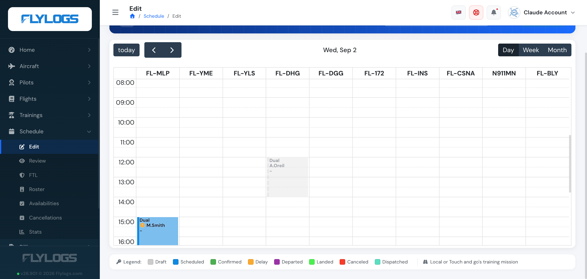
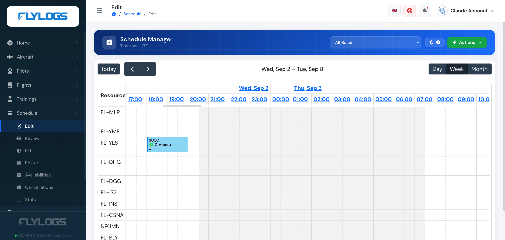

# Schedule Views

There are several ways to see or manage the schedules. The **flight schedule calendar** view is the main management view available in which all schedulled flights appear and can be easily edited just by clicking on the record desired to edit. 

**The flight schedule calendar view, has 3 modes:**

* Daily view
* Week view
* Month view

Each mode has its benefits, but in all of them, you can switch between them as desired. Your browser will remember your last setting for the next time you come back.

### Schedule LifeCycle Indicators

Each booking is color-filled by status, per the legend shown under the calendar:

* **Draft** (grey)
* **Scheduled** (blue)
* **Confirmed** (green)
* **Delay** (orange)
* **Departed** (purple)
* **Landed** (green, checkmark)
* **Canceled** (red)
* **Dispatched** (teal)

A small icon on the booking also flags crew confirmation status — for example a warning icon when a crew member hasn't confirmed yet, or when their documentation needs attention.

#### Daily View

Daily view is perfect for operators like flight schools with up to ten aircraft. This view allows to easily view all day schedule.

#### Week view

Week view is better suited for larger operators where tight scheduling of large fleets is a key factor of the operation, specially if night operation is very common. In this case, the user can scroll horizontally throughout the whole week.

This view enables easy view of night flights because of the continuous scrolling through the week.

#### Month view

Month view is a simple month calendar. Good for very small operators with one or two aircraft and not too many flights.

It allows easy view of the scheduled flights for a whole month. It is mostly suitable for a small number of scheduled flights.

### View only access

The calendar view can also be accessed by any company member with a higher or equivalent rank to a Flight Instructor, but in this case, the calendar will load as View Only, with no detailed information about each flight.
