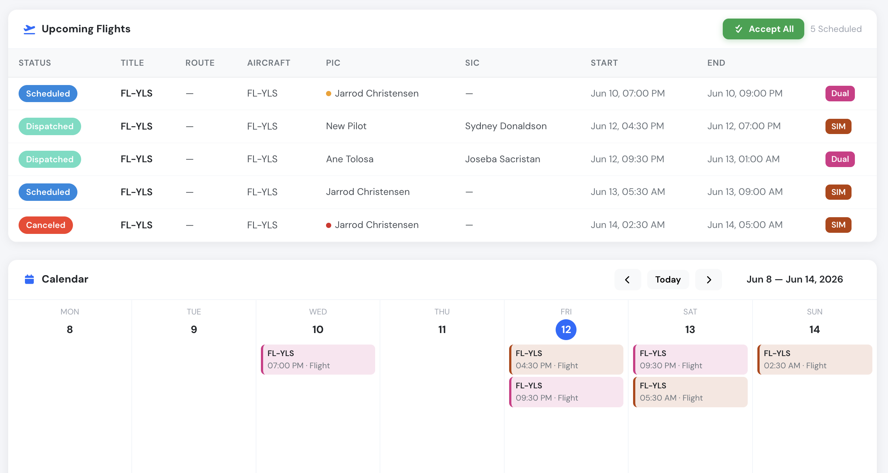
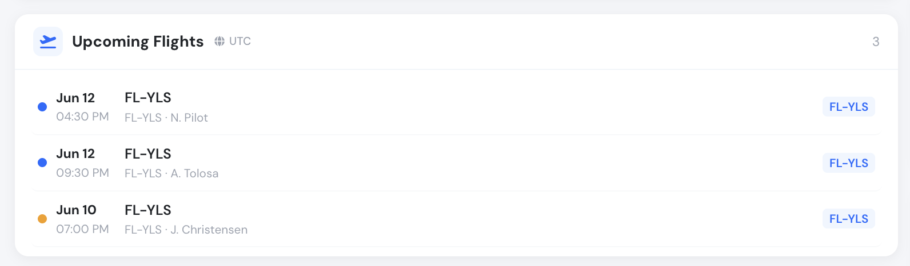
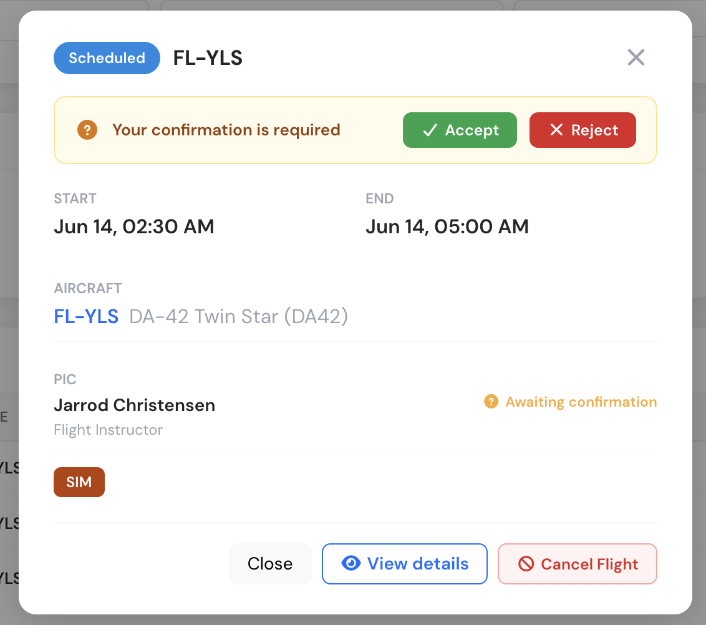
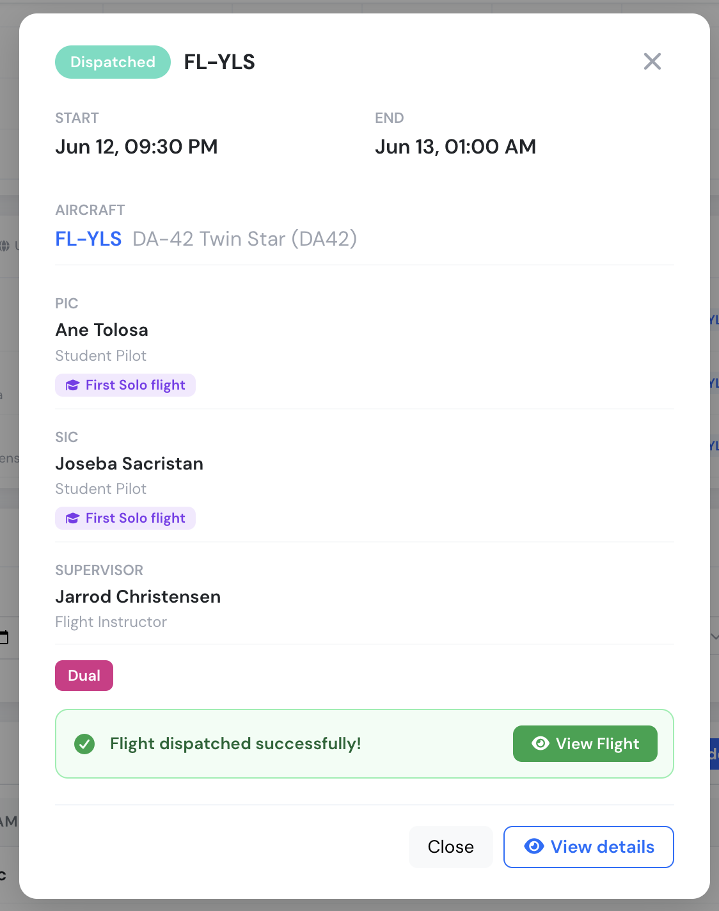

# Schedules for Pilots & Flight Instructors

This guide explains how pilots and flight instructors see their assigned flights, confirm or reject assignments, cancel a scheduled flight, and dispatch a flight directly from the schedule.

If you are looking for the operations/manager side of scheduling, see the [Schedule Review page](schedule-review-page.md) and the [Flight Dispatch Function](flight-dispatch-function.md).

***

### Where to see your schedule

#### Home dashboard

When you log in, your home dashboard shows the **Upcoming Flights** panel with every flight you are assigned to as PIC, SIC or Supervisor, together with a weekly **Calendar** of your assignments.

<figure><figcaption>
Upcoming Flights panel and weekly calendar on the pilot home page
</figcaption></figure>

Each row shows the schedule status, route, aircraft, crew, start and end times, and the flight type badge (for example **Dual** or **SIM**).

A compact version of the same widget is available on other dashboards:

<figure><figcaption>
Compact Upcoming Flights widget
</figcaption></figure>

#### Timezone

All schedule times are displayed in your **company timezone**, not in your device timezone. The active timezone is always shown next to the panel or page title with a globe icon (for example, _UTC_ or _Europe/Madrid_). If a time looks off by a few hours, check the timezone indicator first.

#### Status badges

| Badge | Meaning |
|---|---|
| **Scheduled** | The flight is published and waiting for crew confirmation. |
| **Confirmed** | All required crew members have accepted the flight. |
| **Dispatched** | A flight draft has been created and linked to this schedule. |
| **Canceled** | The flight was cancelled by the crew or by operations. |

#### Crew confirmation dots

A small colored dot next to each flight summarizes the crew confirmation state:

* 🟢 **Green** — crew member accepted the flight.
* 🟠 **Amber** — confirmation is still pending.
* 🔴 **Red** — crew member rejected the flight, or the flight is cancelled.
* 🔵 **Blue** — no confirmation is required for this record.

When a flight has both a PIC and a SIC, the dot is split in two halves: the **left half shows the PIC status** and the **right half shows the SIC status**.

***

### Viewing flight details

Click on any flight in the list or on a calendar event to open the schedule detail window. It shows the start and end times, the aircraft, the assigned crew with their roles, any linked training course exercise (for example _First Solo flight_), and the flight type.

<figure><figcaption>
Schedule detail window — this flight is awaiting your confirmation
</figcaption></figure>

From this window you can:

* **Accept** or **Reject** the assignment (when your confirmation is pending).
* **View details** — opens the full schedule view page with the complete overview, crew information, aircraft data, attachments and the change history of the record.
* **Cancel Flight** — see [Cancelling a flight](#cancelling-a-flight) below.

***

### Confirming your assignments

When operations publishes a flight you are assigned to, your confirmation is requested:

* The flight appears with an **amber pending dot** and the detail window shows the banner **“Your confirmation is required”** with **Accept** and **Reject** buttons.
* You can confirm each flight individually, or use the **Accept All** button at the top of the Upcoming Flights panel to accept every pending assignment at once.
* If you do not confirm before the scheduled departure time, the record is marked as **Confirmation missed**.

Rejecting a flight notifies the schedule managers so they can reassign the crew.

***

### Cancelling a flight

Crew members can cancel a scheduled flight they are assigned to from the schedule detail window using the **Cancel Flight** button. A cancellation **reason** must always be selected, and some reasons require an additional written explanation.

Cancellation is only possible:

* **Before** the scheduled departure time, and
* Outside the company's minimum cancellation window, if one is configured. For example, if your company sets a 24-hour minimum, flights can no longer be cancelled by crew less than 24 hours before departure — contact your operations department instead.

Cancelled flights remain visible with the **Canceled** badge and the cancellation is recorded in the schedule history. See [Schedule cancellations](schedule-cancellations.md) for more detail.

***

### Dispatching a flight from the schedule

Crew members can dispatch their own flight directly from the schedule view page — this creates the flight draft with all operational data pre-filled, exactly as described in the [Flight Dispatch Function](flight-dispatch-function.md).

The **Dispatch** button appears on the schedule view page when the schedule is in **Scheduled** or **Confirmed** status and no flight has been created for it yet. Who can use it depends on your role on that flight:

| Role on the flight | When can you dispatch? | Time restriction |
|---|---|---|
| **PIC** | As soon as you have accepted the flight | None |
| **SIC** | Only after **both** PIC and SIC have accepted | From **6 hours before** until **2 hours after** the scheduled start |
| **Supervisor** | **Always** — no confirmation required | None |

Additional notes:

* PIC and SIC also need an active account with permission to create flights. The **Supervisor of the flight is always allowed to dispatch**, regardless of confirmations, time window, or flight creation permission.
* On dispatch, Flylogs checks the required pilot certificates (medical, license, ratings). If any required certificate is missing or expired, the dispatch is rejected.

Once dispatched, the schedule switches to **Dispatched** status and the detail window shows a confirmation banner with a direct link to the created flight:

<figure><figcaption>
A dispatched flight — the crew, supervisor and the link to the created flight draft
</figcaption></figure>

***

### Summary

* Your assigned flights appear on your home dashboard and in the schedule calendar, always displayed in the **company timezone**.
* Confirm or reject assignments from the flight detail window, or use **Accept All**.
* Cancel only before departure and outside the company's minimum cancellation window, always with a reason.
* PIC, SIC and Supervisor can dispatch their own flight from the schedule view page, each under their own conditions — the Supervisor can always dispatch.
