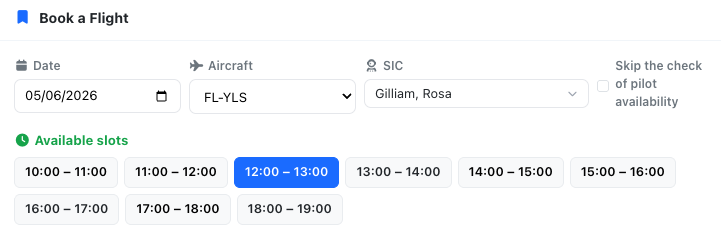

# Self scheduling

Flylogs enables you to establish automated scheduling with specific restrictions for your pilots. You have the flexibility to determine who can utilize the auto-scheduling feature, which aircraft can be assigned, and additional conditions such as minimum booking time and the requirement for a Flight Instructor.

### Initial setup

Within your company settings page, you'll discover the general Schedule settings. Here, you can configure settings that will be applicable to all schedules and users. You have the option to specify the time frame before a flight during which pilots can cancel a schedule. Additionally, there are checkboxes that allow you to decide whether you require both the PIC (Pilot-in-Command) and SIC (Second-in-Command) to confirm the scheduled flight.

[In the second part of this settings box, you can limit the self scheduling options. ](#user-content-fn-1)[^1]


Remember that self scheduling has to be enabled on each aircraft!


You have the flexibility to decide whether you want to restrict the reservations times or prevent pilots with insufficient billing credit. Furthermore, you can set the maximum number of reservations per day, the default length of the slot and define minimum and maximum slot durations as well.

 

### Restrict self-booking to pilots with valid certificates

At the bottom of the self-scheduling section you will find the **Allow self-booking without valid documents** toggle. It controls whether a pilot whose personal certificates are missing or expired can still see and use the self-booking widget.

* **Toggle OFF (default — stricter)**: the self-booking widget is hidden for any pilot who does not hold a valid **Licence**, a valid **Rating** and a valid **Medical**. **Students are always hidden** in this mode, regardless of certificate status — a student must wait until their school promotes them to a pilot role before they can self-book. The pilot has to update their documents on their profile page before the box reappears.
* **Toggle ON (permissive)**: the self-booking widget is shown to every pilot, regardless of the state of their licence, rating or medical. Use this option only if your operation handles document checks outside Flylogs or you are still onboarding pilots that have yet to upload their paperwork.


This setting only controls **visibility** of the self-booking widget. Other safeguards — such as the `Block PIC without documents` warning shown when scheduling, currency requirements or billing-credit checks — continue to apply independently.


<figure><figcaption>
Pilots with insufficient balance see this warning and cannot book a flight.
</figcaption></figure>

### Aircraft setup for Self Scheduling

You need to activate self scheduling on each aircraft.

On the aircraft settings page, you will find the Enable Self-Scheduling option along with the option to limit which pilots can fly this particular plane.

<figure><figcaption>
Enable self-scheduling on the aircraft edit page.
</figcaption></figure>

On the same aircraft edit page you can find the **Qualified pilots** list, where you can select which pilots are able to self-schedule on the aircraft. If no pilots are entered, the system understands that any pilot can fly the aircraft as PIC.

### Flight self-booking for pilots

As a pilot, on my dashboard, I can find a **Schedule a flight** box, see below:

<figure><figcaption>
Pilots automatically see the Schedule a flight option if they are entitled to do so.
</figcaption></figure>

When accessing the scheduling tool, the pilot can see a form called "BOOK A FLIGHT." By selecting the desired date, aircraft, and PIC, the system will display the available slots within the permitted times that the aircraft and PIC are available.

<figure><figcaption></figcaption></figure>

Once the pilot clicks on a time slot, the system will automatically pop up the booking confirmation window that you can see in the following screenshot:

<figure><figcaption>
Self-booking modal window
</figcaption></figure>

The self-booking modal shown above behaves differently based on the pilot profile making the appointment. Students are required to select a PIC, while pilots, flight instructors, and those with higher ranks have the option to choose themselves as PIC or leave the field empty.&#x20;

After the pilot clicks the "**Book this Slot**" button, the system locks the slot and sends a notification to the selected PIC, requesting confirmation. Once the PIC confirms the flight, the SIC will no longer be able to modify the booking.

[^1]: \- Remember that to give your pilots the option to self schedule a flight, you also have to enable this on each one of your aircraft. -&#x20;
