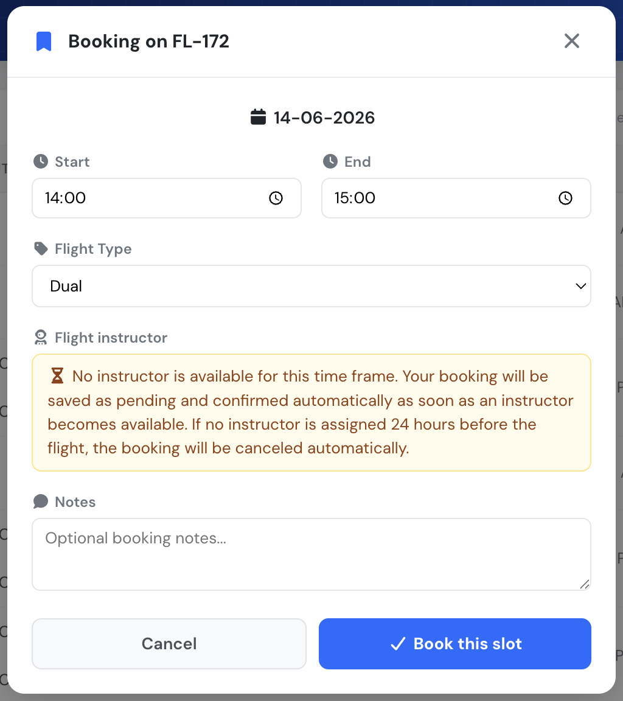
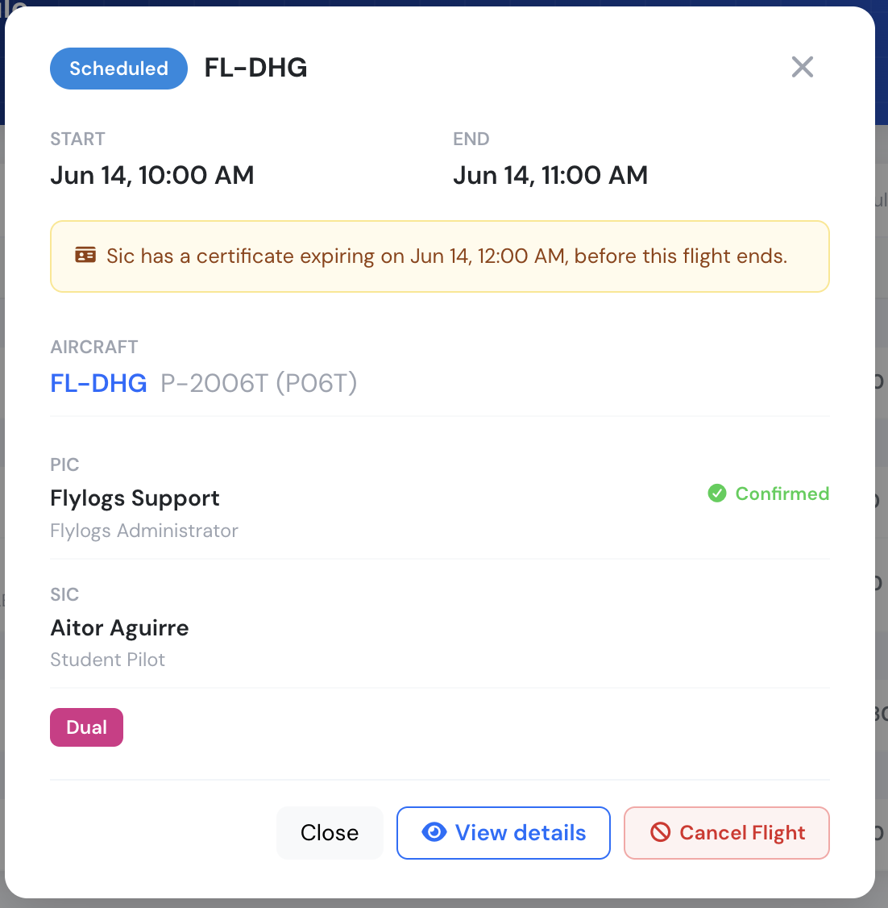
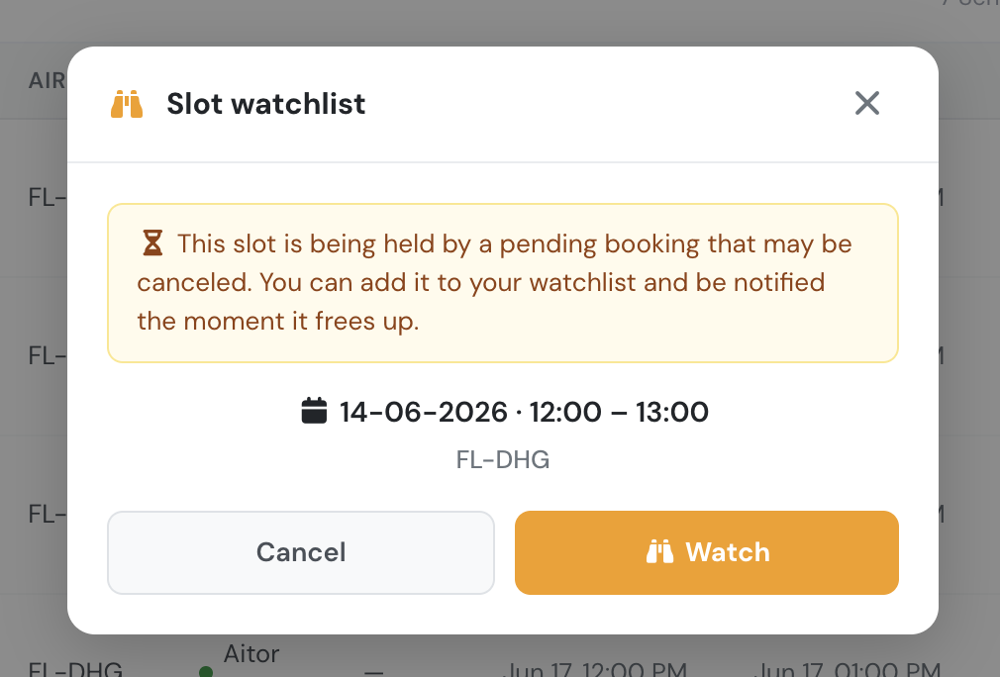
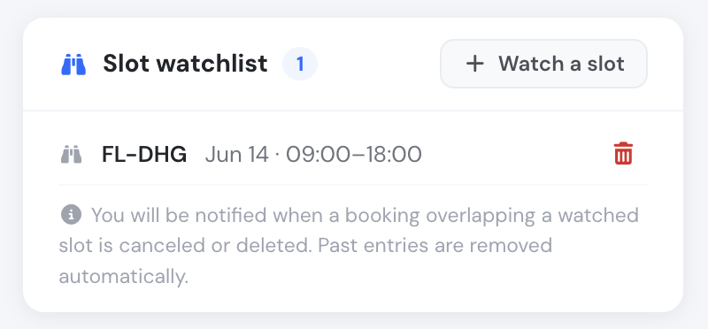

# Self scheduling

Flylogs enables you to establish automated scheduling with specific restrictions for your pilots. You have the flexibility to determine who can utilize the auto-scheduling feature, which aircraft can be assigned, and additional conditions such as minimum booking time and the requirement for a Flight Instructor.

### Initial setup

Within your company settings page, you'll discover the general Schedule settings. Here, you can configure settings that will be applicable to all schedules and users. You have the option to specify the time frame before a flight during which pilots can cancel a schedule. Additionally, there are checkboxes that allow you to decide whether you require both the PIC (Pilot-in-Command) and SIC (Second-in-Command) to confirm the scheduled flight.

[In the second part of this settings box, you can limit the self scheduling options. ](#user-content-fn-1)[^1]


Remember that self scheduling has to be enabled on each aircraft!


You have the flexibility to decide whether you want to restrict the reservations times or prevent pilots with insufficient billing credit. Furthermore, you can set the maximum number of reservations per day, the default length of the slot and define minimum and maximum slot durations as well.

 

### Restrict self-booking to pilots with valid certificates

At the bottom of the self-scheduling section you will find the **Allow self-booking without valid documents** toggle. It controls whether a pilot whose personal certificates are missing or expired can still see and use the self-booking widget.

* **Toggle OFF (default — stricter)**: the self-booking widget is hidden for any pilot who does not hold a valid **Licence**, a valid **Rating** and a valid **Medical**. The pilot has to update their documents on their profile page before the box reappears.
* **Toggle ON (permissive)**: the self-booking widget is shown to every pilot, regardless of the state of their licence, rating or medical. Use this option only if your operation handles document checks outside Flylogs or you are still onboarding pilots that have yet to upload their paperwork.


**Students (user group 200) are exempt from this certificate gate.** A student never acts as PIC — the system automatically assigns a Flight Instructor as PIC — so the student's own licence, rating and medical are not required to book.



This setting only controls **visibility** of the self-booking widget. Other safeguards — such as the `Block PIC without documents` warning shown when scheduling, currency requirements or billing-credit checks — continue to apply independently.


<figure><figcaption>
Pilots with insufficient balance see this warning and cannot book a flight.
</figcaption></figure>

### Aircraft setup for Self Scheduling

You need to activate self scheduling on each aircraft.

On the aircraft edit page, open the **Scheduling** box and tick **Allow pilots to self-schedule flights on this aircraft**.

<figure><figcaption>
Enable self-scheduling and choose who can self-schedule on the aircraft edit page.
</figcaption></figure>

Once self-scheduling is enabled, the **Who can self-schedule** dropdown appears. It controls which user groups may self-schedule this particular aircraft:

* **All pilots and students** (default): every pilot and student (`user_group_id` ≤ 200).
* **Certified pilots**: pilots only, students excluded (`user_group_id` < 200).
* **Only instructors**: Flight Instructors and above (`user_group_id` ≤ 170).

Restricting **who** is qualified to fly the aircraft is no longer done with a per-aircraft pilots list. Instead, use the **Aircraft Attributions** on each pilot's profile: a pilot with this aircraft attributed (or with no aircraft attributed at all, which means every aircraft) can self-schedule it, subject to the dropdown above.

Below the dropdown, Flylogs shows a live counter — **"Currently X pilots will have access to self-schedule flights on this aircraft"** — recalculated for the selected access mode. It counts active pilots (`pilot = 1`, `active = 1`) that are attributed to this aircraft or have no attributions at all, within the selected group cap. When **Only instructors** is selected, students (group 200) and regular pilots are excluded from the count.


**Students (user group 200)** never see aircraft set to **Certified pilots** or **Only instructors** in their Book a Flight aircraft list. Likewise, aircraft set to **Only instructors** are hidden from anyone above `user_group_id` 170.


### Flight self-booking for pilots

As a pilot, on my dashboard, I can find a **Schedule a flight** box, see below:

<figure><figcaption>
Pilots automatically see the Schedule a flight option if they are entitled to do so.
</figcaption></figure>

When accessing the scheduling tool, the pilot can see a form called "BOOK A FLIGHT." Only two fields are needed: the desired **date** and the **aircraft**. The aircraft list only shows planes the pilot is entitled to self-schedule — based on the aircraft's **Who can self-schedule** setting and the pilot's **Aircraft Attributions** (see the aircraft setup section above). The system then displays the available slots within the permitted times for that aircraft — pilot availability is no longer checked at this stage.

Slots are colour-coded: **green** slots are fully free and can be booked directly, while **yellow** slots are currently held by a **pending booking** (a student booking still waiting for a Flight Instructor). Yellow slots cannot be booked, but a pending booking may be canceled later — clicking a yellow slot lets the pilot add it to their **watchlist** with a single click, so they are notified the moment it frees up.

<figure><figcaption></figcaption></figure>

Once the pilot clicks on a time slot, the system will automatically pop up the booking confirmation window. Only flight types enabled for booking can be selected in this window.

The self-booking modal behaves differently based on the user group of the person making the appointment:

* **Pilots (user group 171–190)**: the process is unchanged — the pilot making the reservation is the PIC.
* **Flight Instructors and staff (user group 170 or less, with the pilot flag)**: they fly as PIC and can optionally pick a **SIC** from the list of all active pilots of the company. The booking is saved directly as **SCHEDULED**.
* **Students (user group 200)**: students can never be PIC, so they do not choose one. The system automatically selects an available **Flight Instructor** and assigns them as PIC (the student is stored as SIC). The chosen FI must: have published availability (AVAILABLE or ALWAYS — never MAYBE or UNAVAILABLE) covering the whole slot, have no conflicting schedule or class, be entitled to fly the selected aircraft (aircraft attributions — an empty list means all aircraft), and have the selected flight type attributed (empty list means all flight types). If the student has an **assigned instructor** (training supervisor), that instructor has priority over other available FIs.

When a **student** opens the modal, Flylogs checks for an instructor in real time. If one is available it is shown in the **Flight instructor** box; if none is available, the modal warns that the booking will be saved as **pending** and confirmed automatically as soon as an instructor becomes available — and that it will be canceled automatically if no instructor is assigned before the company's cancellation deadline (flight start time minus the "minimum cancellation time" setting).

<figure><figcaption>
Student booking modal when no instructor is available — the flight will be saved as pending.
</figcaption></figure>

#### Crew certificate check

Before a booking can be confirmed, Flylogs validates the certificates of every crew member that will fly (the pilot booking, plus a SIC if an instructor selected one). If any required certificate is invalid, or **expires before the flight ends**, the modal shows a warning and the booking is blocked until the documents are in order. The same warning appears on the flight detail card afterwards.

<figure><figcaption>
Flight detail card showing the PIC/SIC, the Dual flight type, and a certificate-expiry warning for the SIC.
</figcaption></figure>

### Pending bookings

If no Flight Instructor is available for the selected slot, the student's booking is stored with the new **PENDING** status: the slot is locked for the student, displayed like any scheduled flight, but it is not confirmed yet because it lacks an FI as PIC.

* Whenever an FI publishes availability (AVAILABLE or ALWAYS) that matches a pending booking — same checks as above: time frame, attributions, conflicts — the booking is automatically updated to **SCHEDULED**, the FI is assigned as PIC with a pending confirmation request, and the usual schedule notifications are sent.
* If no FI has been assigned when the confirmation deadline arrives (**flight start time minus the company "minimum cancellation time" setting, in hours**), the booking is automatically canceled by the system and the slot frees up for other users.

After the pilot clicks the "**Book this Slot**" button, the system locks the slot and sends a notification to the assigned PIC, requesting confirmation. Once the PIC confirms the flight, the SIC will no longer be able to modify the booking.

### Instructor availability calendar

When the **ALLOW FI SCHEDULE MANAGEMENT** company setting is enabled, Flight Instructors (user group 170 or less with the pilot flag) get access to a weekly **Instructor availability** calendar from the Schedules page, shown in the company timezone. Managers (user group 150 or less) always have access. This lets an FI plan around pending student bookings: if another instructor is available at the time of a pending slot, that instructor will likely take it.

### Slot watchlist

Pilots can watch an aircraft and time frame they would like to fly. There are two ways to add a watch:

* **From a yellow (pending) slot**: clicking a yellow slot opens a confirmation modal explaining that the slot is being held by a pending booking that may be canceled, and lets the pilot add it to their watchlist with one click.
* **Manually**: from the **Slot watchlist** widget, the pilot uses **+ Watch a slot** to enter an aircraft and a time frame directly.

<figure><figcaption>
Watching a pending (yellow) slot from the schedule.
</figcaption></figure>

If a booking overlapping a watched slot is **canceled or deleted**, every watcher is notified immediately (push notification and message) so they can grab the freed slot, and the watch entry turns **green** in the Slot watchlist widget with a "Slot free!" badge. If the requested time frame is already free at the moment the watch is added, the system tells the pilot right away (the slot is shown as free) instead of creating the watch. Past watchlist entries are cleaned up automatically every night.

The **Slot watchlist** widget on the dashboard lists the pilot's active watches and lets them remove any entry with the trash icon.

<figure><figcaption>
The Slot watchlist widget on the pilot dashboard.
</figcaption></figure>

[^1]: \- Remember that to give your pilots the option to self schedule a flight, you also have to enable this on each one of your aircraft. -&#x20;
