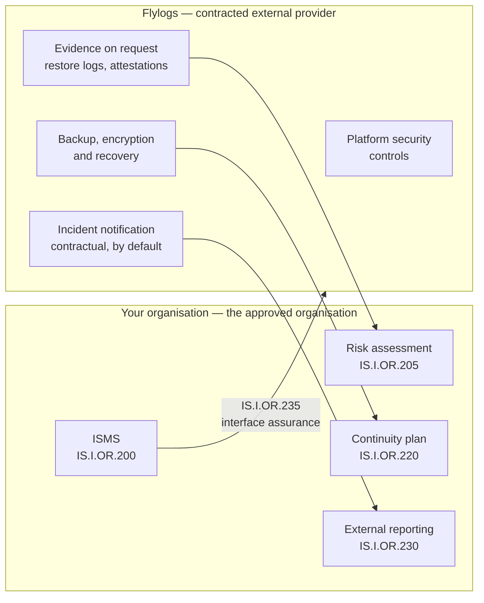
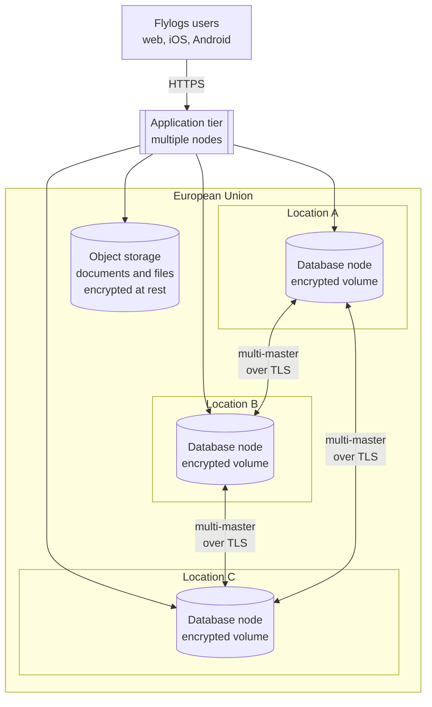
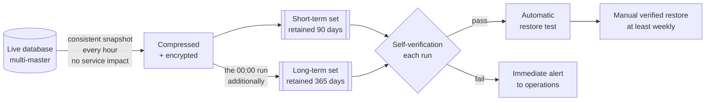
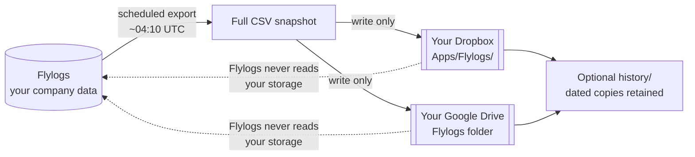

# Data security and continuity

This page is written for the person in your organisation who has to answer for Flylogs in an audit — a Compliance Monitoring Manager, an Information Security Manager under Part-IS, a DPO, or a customer's security reviewer. It sets out where your data lives, how it is protected, how it is recovered, and what you can obtain from us as evidence.


Everything on this page applies to every customer on a paid plan, with no configuration required. The only optional items are explicitly marked as such.


## Who is responsible for what

Part-IS (Regulation (EU) 2023/203 and Delegated Regulation (EU) 2022/1645) places the information security management obligation on the **approved organisation** — you. Flylogs is a contracted external provider. Under **IS.I.OR.235** you remain responsible for your ISMS and for assuring the interface with your suppliers; our role is to provide the technical and procedural evidence that lets you do that, and to notify you of any information security incident affecting your data.

In practice this means you do not inherit our controls, but you can rely on them and evidence them. The sections below are ordered to match the questions auditors normally ask.

## Where your data lives

| | |
| --- | --- |
| **Application and database** | Multiple independent nodes, held in **different geographic locations**, all within the European Union |
| **Database replication** | Multi-master — the operational database is held concurrently on more than one node, in more than one location |
| **Documents, attachments and generated files** | Object storage across **multiple EU regions**, delivered through a content delivery network |
| **Data residency** | All customer data is processed and stored within the **European Union** |
| **Inter-node traffic** | Encrypted in transit with **TLS**; database access additionally authenticated with **client certificates** |

Because replication is multi-master rather than primary-with-standby, and because the nodes are in different geographic locations, the loss of any single node — or of the site it sits in — does not take the platform down and does not lose committed data.

## Encryption and key custody

All data is encrypted **at rest** in the storage volumes and **in transit** between every component.


**The storage volumes are encrypted with our own keys.** No other vendor, and no infrastructure provider, holds a key that can read your data. A provider can see encrypted volumes; it cannot see their contents.


This is the distinction that matters in a supply-chain assessment. Many platforms rely on provider-managed encryption, where the infrastructure provider both stores the data and holds the key — technically encrypted, but not beyond the provider's reach. Flylogs holds the keys itself, so the set of parties able to decrypt your operational data is Flylogs alone.

| Layer | Protection |
| --- | --- |
| User to platform | HTTPS/TLS |
| Between nodes and to the database | TLS with client-certificate authentication |
| Storage volumes at rest | Encrypted with **our own keys**, not the provider's |
| Backup sets | Encrypted **by default**, without exception |
| Third-party credentials you store (e.g. cloud storage) | Encrypted, and never redisplayed once saved |

## Backups

Backups are fully automated. Nothing is scheduled, triggered or remembered by you.

| Property | Value |
| --- | --- |
| Frequency | **Hourly**, consistent snapshot, no locking and no service impact |
| Encryption | **Encrypted by default** |
| Short-term retention | **90 days** |
| Long-term retention | **365 days** (the midnight run is written to a separate set) |
| Transfer security | TLS with client-certificate authentication |
| Failure detection | Every run self-verifies and alerts on failure |

**Self-verification.** A backup run aborts and raises an immediate alert to our operations team if the snapshot fails, if compression fails, if the resulting file is implausibly small, or if the destination is unwritable or short of space. A backup that fails silently is not a state we rely on noticing later.

## Restore testing


**Every backup is automatically restore-tested.** In addition, a **manual restore is performed and verified at least once a week**.


A backup that has never been restored is an assumption, not a control. This is normally the single most useful piece of evidence in an **IS.I.OR.220** (response and recovery) assessment, and restore records are available to you on request.

## Recovery objectives

| Scenario | Recovery point |
| --- | --- |
| Loss of a node, or of a location | **Negligible** — the data is already live on the remaining nodes |
| Logical event requiring restore from backup (corruption, erroneous bulk change) | **At most one hour** — the last hourly snapshot |

Recovery is executed entirely by Flylogs. Platform availability can be monitored independently, without contacting us, at [status.flylogs.com](https://status.flylogs.com).


A **contractually committed RTO and RPO**, with the associated guarantees, is available as an **optional service**. Recovery itself is included as standard on every paid plan — the optional element is the formal commitment, which some operators need in order to close their own continuity plan.


## Does any of this require manual work from you?

No. The continuity arrangement is **autonomous**. There is no manual backup step for your staff to perform, schedule or remember. Backup, encryption, restore-testing, verification and alerting all run unattended, and recovery is executed by us.

Two optional additions exist if your own continuity plan calls for them:

1. **Your own independent copy**, via the Dropbox or Google Drive export described below.
2. **A contractually committed recovery objective**, as described above.

## Your own independent copy — Dropbox and Google Drive

Separately from our backups, Flylogs can write a scheduled **full CSV snapshot of your data directly into your own Dropbox or Google Drive account**.

For a Part-IS supply-chain assessment this is usually the cleanest way to close the question *"what happens if the supplier becomes unavailable?"* — because the copy sits in storage you own, control and can audit, in a format that does not require Flylogs to open.

| | |
| --- | --- |
| **Datasets** | Flights logbook; aircraft and aircraft logbook; pilots and certificates; training enrolments and records; safety reports — you choose which |
| **Schedule** | Nightly, weekly (Mondays) or monthly (1st), around **04:10 UTC**, plus an on-demand **Sync now** |
| **Contents** | A **full snapshot** each run, regenerated from scratch; optional dated copies retained under `history/` for a trail |
| **Direction** | **One-way out.** Flylogs writes only the files it generates and never reads your storage |
| **Scope** | Dropbox is confined to `Apps/Flylogs/`; Google Drive holds only the `drive.file` scope — files Flylogs itself created, nothing else |
| **Authorisation** | OAuth sign-in, never a pasted token. Credentials stored encrypted and never redisplayed |
| **Your own app** | You may register the integration in your own developer console, so the grant lives entirely inside your tenancy and can be inspected or revoked by you at any time |
| **Failure handling** | A revoked or broken connection shows a banner and sends an urgent message to every Company Administrator — once per breakage, not nightly |
| **Access** | Setup restricted to Company Administrators |

**Data minimisation.** Passport numbers, home addresses, emergency contacts, private notes and stored signatures are never exported. Draft safety reports are excluded until submitted. Deleted records are never included.

Full setup instructions: [Cloud storage](../company-management/company-settings/cloud-storage.md)

## Certifications and compliance

| | |
| --- | --- |
| **ISO/IEC 27001** | Compliance documentation is **published and available to customers**. We are **not yet certified** — the controls, policies and evidence are documented and auditable by you today, but the third-party certification audit has not been completed. We state this plainly rather than imply equivalence |
| **GDPR** | Flylogs acts as **processor** for the personal data you hold in the platform. Position published at [flylogs.com/static/gdpr](https://www.flylogs.com/static/gdpr); Privacy Policy at [/static/privacy](https://www.flylogs.com/static/privacy). A **Data Processing Agreement** is available on request |
| **NIS2** | Our security programme is structured against the NIS2 control areas — risk assessment, governance, technical controls, supply-chain security, incident response, monitoring, training and compliance |
| **EU data residency** | All customer data processed and stored within the European Union |
| **Sub-processors** | Our infrastructure providers hold ISO/IEC 27001, 27017, 27018 and SOC 1/2/3 attestations for the services we use. These cover the **hosting layer, not the Flylogs application**, and we do not present them otherwise — and, as above, they do not hold a key to your data |

## Security testing and remediation

Our most recent **independent penetration test** was carried out by an external white-hat security researcher in **2025** against the live application.


**Status: closed.** All findings were remediated, and the engagement produced **no Category 1 (critical) findings**.


We also run our own **source-level security reviews**, deliberately broader than a black-box penetration test because the reviewer has full source access. Work completed from the most recent review includes:

* **Password storage** migrated to **Argon2id**, applied transparently at next login with no customer password resets.
* **Authentication hardening** — persistent server-side brute-force throttling, two-factor attempt caps, and revocation of all other active sessions on password change or reset.
* **Source-IP integrity** — the client address is derived only from the trusted reverse proxy, so client-supplied headers cannot influence security decisions.
* **Secrets management** — credential material moved out of the codebase into a separate secrets store.
* **Tenant isolation** — identified cross-company read paths corrected, with regression tests asserting that cross-tenant access fails.

Continuing as programme work rather than as patches: framework and document-rendering library upgrades, retirement of legacy internal endpoints, and moving tenant scoping to a framework-level default.

**Process.** Findings are tracked to closure with an assigned severity and a named owner, security-relevant changes carry regression tests, and a re-review follows each remediation wave.

## Incident notification


A customer notification obligation for security incidents is **included in our standard contract by default**. It is not an add-on and does not need to be negotiated in.


This is the commitment that supports your own external reporting duty under **IS.I.OR.230**, and the equivalent duty under GDPR Article 33.

## End-user security controls

The controls your own users operate — two-factor authentication, passkeys, auto-lock, session handling and password policy — are documented separately in [Account security](../first-steps/account-security.md).

## What you can request

| Evidence | How |
| --- | --- |
| ISO/IEC 27001 compliance documentation | On request |
| Data Processing Agreement (GDPR) | On request |
| Penetration test attestation | On request |
| Restore-test records | On request |
| Committed RTO / RPO (optional service) | On request |

Contact us through [flylogs.com/contact](https://www.flylogs.com/contact), or ask your account manager to route the request to our security team.

## References

| Topic | Location |
| --- | --- |
| GDPR and NIS2 position | [www.flylogs.com/static/gdpr](https://www.flylogs.com/static/gdpr) |
| Privacy Policy | [www.flylogs.com/static/privacy](https://www.flylogs.com/static/privacy) |
| Legal terms | [www.flylogs.com/static/legal](https://www.flylogs.com/static/legal) |
| Dropbox / Google Drive export | [Cloud storage](../company-management/company-settings/cloud-storage.md) |
| Account security controls | [Account security](../first-steps/account-security.md) |
| Audit trails in the application | [Audit trails](../flights/audit-trails.md) |
| Platform status and uptime | [status.flylogs.com](https://status.flylogs.com) |
| Contact | [www.flylogs.com/contact](https://www.flylogs.com/contact) |
