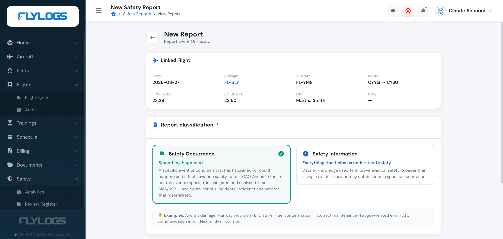
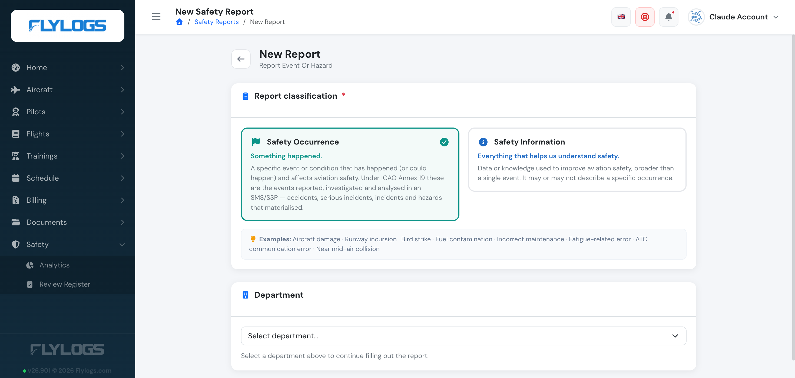
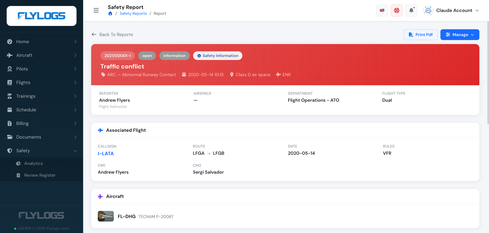

# Create a Safety Report

Flylogs SMS, is an integrated Safety Management System based on the [ICAO recommendations](https://www.unitingaviation.com/publications/safetymanagementimplementation/content/#/) fully compliant with the [ICAO Doc 9859](https://www.icao.int/safety/safetymanagement/pages/guidancematerial.aspx).

**Every report is filed under one of two ICAO Annex 19 classifications**, each with its own severities:

* **Safety Occurrence** → severity is **Incident** or **Accident**
* **Safety Information** → severity is **General Information** or **Hazard**

See [Report classification](#report-classification) below.

### Who can create a report?

Anybody in your organization can create a report. Reports can be created from scratch, from an existing flight, or even from another report.

### How to create a report

* Directly from the [SMS module](https://www.flylogs.com/features/safety-management) click on CREATE REPORT to initiate a blank report. Reports created this way do not inherit flight information and are not related to other reports.
* From any flight, anybody can create a report. In this case, the report will be linked to the flight. Any additional reports for this flight, will also be linked to this same report you create. You do not need to be part of the crew to create a report for a flight.

You can only create a report from a flight if the flight is confirmed. You do not need to be part of the flight crew.&#x20;

When saved, your report will automatically be associated to the flight, showing all flight information, aircraft maintenance and airworthiness status at the time of the event. Flylogs helps you gather all the information on any event by requesting to the flight's crew members to create a report for the same event.

Every time a new safety report is **submitted** or modified, a notification will be delivered to all company Safety and Operations Managers. Reports kept as a **draft** are the exception — they stay private and silent until you submit them (see below).

### Save as draft or submit

At the bottom of the report form you now have two options:

* **Submit report** — files the report into the SMS. Your Safety and Operations Managers are notified and the report enters the normal review workflow. This is the same behaviour as before.
* **Save as draft** — saves the report **privately on your account**. A draft is visible only to you: it does not appear to managers, is not counted in analytics, and nobody is notified. Use it to start a report and finish it later, or to prepare a report before you are ready to file it.

Hover over either button for a reminder of the difference.

A draft has no report number yet — it shows a grey **Draft** badge in your report list. When you are ready, open the draft and press **Submit report**: at that moment it receives its report number, becomes visible to your safety team, and the usual notifications are sent. Until then it remains entirely yours.

### Creating a report offline

You can create safety reports even with no internet connection. See [Offline safety reports](offline-safety-reports.md) for the full workflow — in short, the report is stored on your device and syncs automatically when you reconnect, and attachments are the only part that needs a connection.

### Report classification

Near the top of the form — before the department selector — you choose the report's **classification**, following the ICAO Annex 19 distinction:

* **Safety Occurrence** — something happened (or could have) that affects aviation safety: an incident, an accident, or a hazard that materialised.
* **Safety Information** — data or knowledge that helps understand aviation safety more broadly, whether or not it's tied to a single event: audits, inspections, risk assessments, manufacturer bulletins and similar.

The selector shows guidance and examples for each option inline, so you don't have to guess. It defaults to **Safety Occurrence**.

Your classification decides which **severity** you pick next:

* **Safety Occurrence** → severity (**Incident** or **Accident**) is derived automatically further down the form, from the damage and injuries you record.
* **Safety Information** → you choose directly between **General Information** and **Hazard**.

See [Safety Reports](safety-reports.md) for the full classification reference, including how it changes what a manager sees when reviewing the report.

### Department

A **Department** selector appears near the top of the report form. Choose the department that owns the activity where the event happened.

The department decides who reviews your report and where it is filed, so it matters: a report filed under the wrong department is hard to find again.

**You are asked to confirm it.** As soon as you choose a department, the form shows what that department covers and — just as usefully — what it is *not* for, with a note on where those events belong instead. The rest of the form stays closed until you press **Yes, use this department**; **Choose another** takes you back to the list. Picking a different department later re-opens the explanation for the new one.

This step is only on the create form. When you edit an existing report the department is already set, so it is shown without asking again.

#### Which departments you see

The department list depends on your organisation's type. **Flight schools do not see Flight Operations - AOC, Flight Operations - SPO or Cabin Crew** — departments a training organisation does not have, and a common source of misfiled reports. Every other organisation type sees the full list.

If an older report was filed under a department your organisation no longer sees, opening that report for editing still shows it, so it is never silently changed.

### Anonymous reports

Reports can always be created anonymously. In this case, Flylogs will NOT store your user id in the report or in any log.

> **Note;** if you create a report anonymously, you will not receive any notifications for future updates or changes done to the reported event. This is because the system does not know who is the initial reporter.

### Aircraft damage

If any damage is reported to an aircraft, the SMS form allows the reporter to deactivate the aircraft. In order to get this option, these are the conditions that the system requires:

* At least one aircraft should be selected
* The damage to the aircraft should be selected at least to MINIMAL
* The date of the event should be within the last 72 hours.
* The reporter is not a Student Pilot

If the option to deactivate the aircraft is selected by the reporter, an additional notification will be sent inmediately to the operations managers to let them know about it.

### Automatic grouping of reports

Different reports on a same flight are grouped and the kept with the same IDENTIFICATION number as shown in the image below. Additionally, from the second report you will always find a link to the first one.

In order to achieve this, reports must be created from the flight view page.

