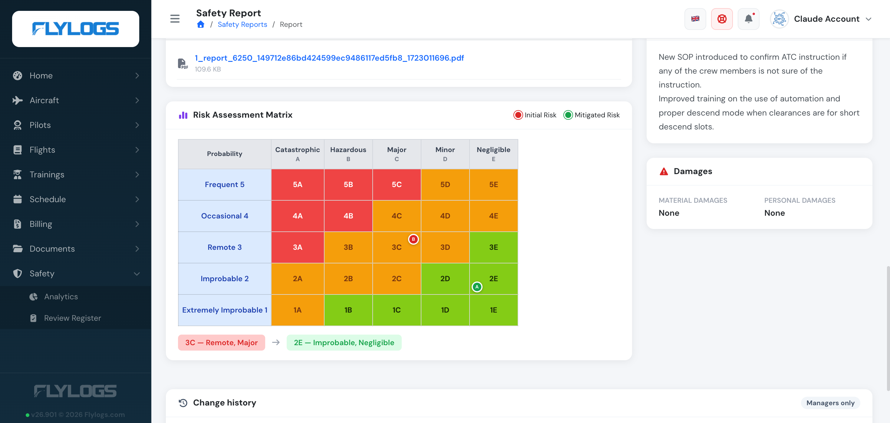

# ICAO 8951 Risk Matrix

### When Is the Risk Matrix Used?

The ICAO 8951 risk matrix is set from the **Manage** action on a safety report. From there, the safety manager can:

* Select the **initial risk severity**
* Select the **initial risk probability**
* Define **mitigation actions or corrective measures**
* (Optionally) Select the **mitigated risk severity** and **probability**

> **Access:** the Manage action, and the risk fields inside it, are only available to users in **group level 149 or lower** (administrators and managers).

Once saved, a visual risk matrix will be automatically generated and attached to the report for reference.

> **Note:** this is a different value from the report's own **severity** (Incident/Accident for a Safety Occurrence, or General Information/Hazard for Safety Information — see [Create a Safety Report](create-a-safety-report.md#report-classification)). The risk matrix's severity is the A–E ICAO scale below, used specifically to grade the assessed risk, independently of how the report itself was classified.

***

### How to Use the Risk Matrix

1. **Navigate to a safety report**\
   Open any report from the Safety menu that is ready to be closed or published.
2. **Select risk values**\
   Under the "Risk Assessment" section, choose:
   * **Risk Severity**: A Catastrophic, B Hazardous, C Major, D Minor, E Negligible
   * **Risk Probability**: 5 Frequent, 4 Occasional, 3 Remote, 2 Improbable, 1 Extremely Improbable (per ICAO Doc 9859: 5 = most likely, 1 = least likely)
3. **Enter corrective actions**\
   Clearly describe any actions taken to mitigate the risk.
4. **(Optional) Define mitigated risk**\
   If actions were effective, update the post-mitigation severity and probability.
5. **Save and close the report**\
   A dynamic matrix will be displayed on the report, showing both initial and mitigated risk levels.

***

### Understanding the Matrix

The matrix follows the ICAO 8951 standard: **severity** (A Catastrophic → E Negligible) across the columns, **probability** (5 Frequent → 1 Extremely Improbable) down the rows. Every one of the 25 cells is pre-colored to its ICAO risk tolerability band:

* 🟩 Green: Low risk
* 🟨 Yellow/Orange: Medium risk
* 🟥 Red: High risk

Your report's assessed risk is then marked on top of that reference grid — a red badge for the **initial risk** cell, and a green badge for the **mitigated risk** cell once mitigation has been recorded. When both are set, a before → after summary is shown underneath the grid.

#### Who can see it

* The matrix is hidden entirely while the report is **Open** — it only appears once a risk assessment has actually been recorded.
* While the report is **Reviewed**, only staff (group level 150 or lower) see the matrix; other users who can view the report see the rest of it without the matrix.
* Once the report is **Closed** or **Published**, the matrix is visible to everyone who can view the report.

***

### Why It Matters

The ICAO risk matrix helps:

* Standardize risk assessment across all reports
* Improve visibility for management decisions
* Ensure compliance with ICAO safety management practices
