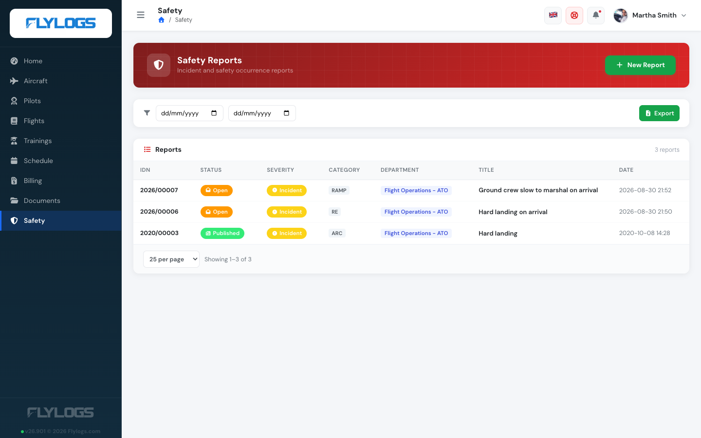
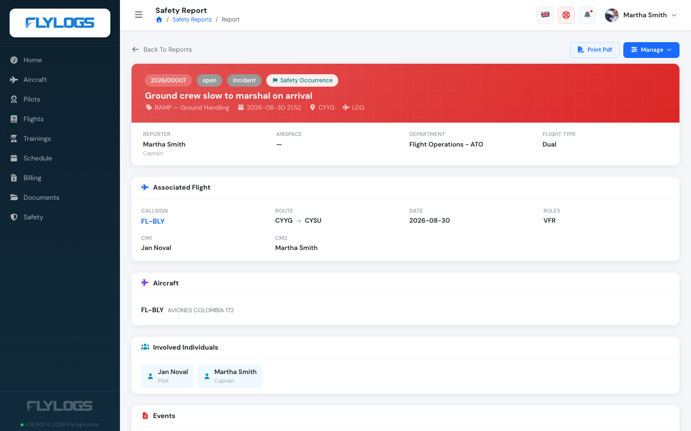

# Safety Reports

Flylogs SMS, is an integrated Safety Management System based on the [ICAO recommendations](https://www.unitingaviation.com/publications/safetymanagementimplementation/content/#/) fully compliant with the [ICAO Doc 9859](https://www.icao.int/safety/safetymanagement/pages/guidancematerial.aspx). It allows to receive safety events directly in your Flylogs account linked with all the relevant information like flight crew, aircraft, maintenance, flight crew, trainings, duty times, etc.

**Any member** of your organization **has the ability to** access the Safety Reporting System and **create a new report.**

These reports can be specifically related to a flight, or not, allowing any of your users to inform about more other types of risks. 

The safety manager and other company managers can see the whole list of events and access to the statistics.\
They can also request third parties to complete a report on an existing event, giving you more information of the a single event.

Related events will appear grouped together and will share some common details like date, location, type of event, etc.

***

### Flight safety reports

Each report can be associated to a flight. If it is, the flight information will be displayed on the top part of the report, along with the crew names and user types.

All other report information is displayed below and only the safety manager or other, higher level managers can edit or delete the stored information.

Additionally, the person writing the report or any manager can comment on the report and upload files as needed that will be attached to the existing report.

### Report classification (Occurrence vs Information)

When creating a report, the reporter first chooses its **classification**, following the ICAO Annex 19 distinction between safety occurrences and safety information:

* **Safety Occurrence** — *"Something happened."* A specific event or condition that has happened (or could happen) and affects aviation safety. These are the events reported, investigated and analysed under an SMS/SSP — accidents, serious incidents, incidents, and hazards that materialised. Examples: aircraft damage, runway incursion, bird strike, fuel contamination, incorrect maintenance, fatigue-related error, ATC communication error, near mid-air collision.
* **Safety Information** — *"Everything that helps us understand safety."* Data or knowledge used to improve aviation safety, broader than a single event. It may or may not describe a specific occurrence. Examples: Flight Data Monitoring (FDM/FOQA), LOSA observations, safety audits and inspections, safety surveys, risk assessments, safety performance indicators, manufacturer bulletins, airworthiness directives, regulatory findings.

The selector shows this guidance inline so the reporter chooses the right classification. It defaults to **Safety Occurrence**, and the chosen classification is shown as a badge on the report.

The classification determines the report's **severity**:

* **Safety Occurrence** → the severity is **Incident** or **Accident**, derived automatically from the damages and injuries recorded (an occurrence is at least an incident; important/catastrophic damage or serious injuries make it an accident).
* **Safety Information** → the reporter chooses between **General Information** and **Hazard**. Pick *Hazard* for a condition with the potential to cause harm that has not yet resulted in an event.

This is why the old "Information" and "Hazard" severities now live under **Safety Information**, while "Incident" and "Accident" live under **Safety Occurrence** — the severity list a manager sees when editing a report is filtered to match its classification.

### Report status

A report can be in the following status.

* **Draft.** A private working copy, visible only to the person who created it. It has no report number, is not counted in analytics, and does not notify anyone. When the author submits it, it becomes **New (Open)** and the safety team is notified. See [Create a Safety Report](create-a-safety-report.md#save-as-draft-or-submit) and [Offline safety reports](offline-safety-reports.md).
* **New.** Default status when the report is submitted.
* Reviewed. Initial review performed, waiting for more details or further processing.
* **Closed.** Report is closed and no further actions are expected.
* Deleted. Useful for test reports.
* **Published.** The report is closed and published to all members in the organization.

#### Published Reports

Published SMS reports are public to all members of your organization. This enables that every body learns from the findings of a report, which is the final goal of the Safety System.

All members can see all published reports, and a summary of them are also available on the aircraft page. Each aicraft, has a summary of SMS reports in which it has been involved.

***

### Departments

Reports can be assigned to a **department** within your organisation (e.g. Flight Operations, Maintenance, Cabin Crew). This allows safety managers to filter and group events by area of responsibility.

Departments are configured at company level. Once configured, a department selector appears at the top of the report creation and editing forms, and the selected department is shown in the report list, the report detail view, and the printed PDF.

The **Analytics** page includes a dedicated **Reports by Department** chart and a department filter so you can focus the statistics on a specific area.

### Filtering reports

The report list supports filters to help you find specific events quickly. Available filters depend on your role.

**All users**

* **Date range** — from / to

**Managers and Safety Officers** (`user_group_id < 150`) **only**

* **Status** — Open, Reviewed, Closed, Published
* **Category** — event classification category
* **Severity** — Information, Incident, Accident, Hazard
* **Department** — filter by organisational department

Filters can be combined freely. The date range is the only filter available to standard crew members, who already see only their own reports plus any published ones.

### Pagination

The report list shows **25 reports per page** by default. You can change the page size to **50 or 100** with the selector in the filter bar, and move between pages with the pagination controls below the list. The header shows the total number of reports matching the active filters.

The Excel export always includes **all** reports matching the current filters, not just the visible page.

***

### Attachments

The report view page lists a report's attachments but does not change them: there is no upload or delete button there. Files are added, renamed and removed from the report's **edit** page, by anyone who may edit the report.

One place to change a report's evidence means one place those changes are recorded from — every file added or removed appears in the change history below.

***

### Change history

Every report keeps a record of what was changed on it, by whom, and when. Open a
report and scroll to **Change history** at the bottom of the page.

**Who can see it:** managers only — Company Administrator, Operations Manager
and Compliance & Safety Manager. Nobody else sees the section at all, not the
person who filed the report and not the reviewer assigned to it.

Each entry names the action and the person behind it, with the date and time in
your company's timezone and format. Entries that changed report fields expand
into a before/after table:

| Entry | Meaning |
|-------|---------|
| **Created** | The report was filed, or saved as a draft |
| **Submitted** | A draft was submitted and received its report number |
| **Modified** | Report fields were changed — from the edit page, the investigation box or the management box |
| **Deleted** | The report was deleted |
| **File attached / File removed** | An attachment was added or removed, with the file name |
| **Comment added / Comment removed** | A comment was posted or deleted |

A save that changes nothing does not create an entry.

The long text boxes — description of events, root cause, result, corrective
measures and weather — are recorded as *changed*, with the length before and
after, rather than storing a second copy of the text in the log.

> **Reports filed before this feature was released have no history.** There was
> no record to rebuild one from, so their history starts empty and fills up from
> the next change onwards.

#### The reporter never changes

The person who filed a report is fixed at the moment it is created. Editing a
report — by anyone, manager included — cannot move it, and the anonymity choice
is likewise made once, when the report is filed. On the edit page the reporter is
shown as read-only text for exactly this reason.
