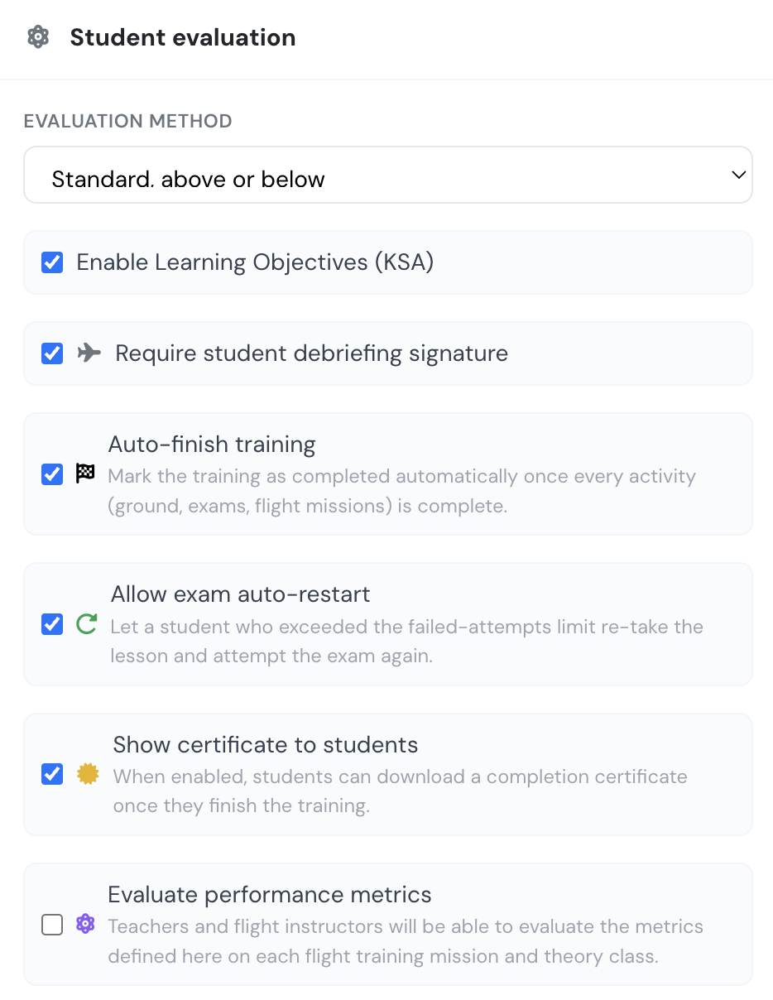

# Edit a training

Training management has been designed to be easy for anybody with little to none technical knowledge.

Main options in the training settings include the following:

* Name of training
* Type of training, (Onsite, remote or distance learning)
* Activate/deactivate the training, and method of flight mission evaluation,
* Activate flight missions,&#x20;
* Training availability and validity dates for expiration,
* Student announcements,
* Training description and syllabus details,
* and subjects.

All this training settings can be modified at any time and will change the settings for all trainees signed up in the course.

<figure><figcaption>
Training edit window
</figcaption></figure>

### Flight Missions

Activating the Flight training checkbox, you will have the option to create a list of flight missions with exercises for the current training course. \
Also, when enabling Flight training this box shown below will appear.\
This additional box, allows you to select the exercise grading scale, require student signature of debriefings and it will also give you the option to activate the competence evaluation system.

<figure><figcaption></figcaption></figure>

### Training availability and validity

**Training availability** sets a timeframe when the training course will be open to students enrolled in the course. You can define either the start date or the end date or both.

**Training validity** defines until when the training endorsement is valid (after training completion). It works like an expiration period for the training endorsement in the pilot profile page.

<figure><figcaption>
Training  availability and validity dates
</figcaption></figure>

Example of pilot valid and expired training endorsements:

<figure><figcaption>
Pilot trainings displaying the finished trainings.
</figcaption></figure>

### Managing online exam questions

Online exams draw from a **shared question bank**. The same question can be reused across several exams — for example a subject-level test and the lesson exams that feed it. Because the question is shared, editing its text or answers updates it **everywhere it appears**.

**Deleting a question** removes it from the exam you are working on **only**. If the same question is still used by another exam or lesson, it stays there untouched. A question is fully retired from the course bank only once nothing else uses it — and even then it is hidden rather than erased, so it can be recovered if needed. Past student results keep showing the questions and answers exactly as they were taken.


An online exam is available to students only when its bank holds at least as many questions as the exam's **required question count**. If you delete questions below that number the exam shows as *unavailable* until you add more questions or lower the required count.

