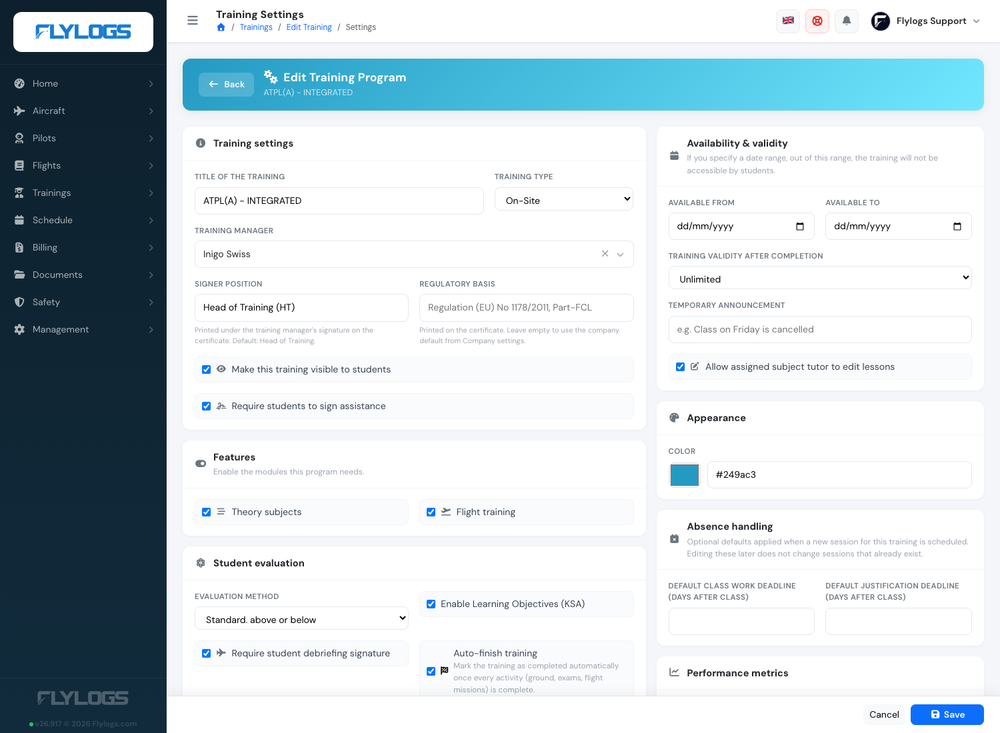

# Edit a training

Training management has been designed to be easy for anybody with little to none technical knowledge.

Main options in the training settings include the following:

* Name of training
* Type of training, (Onsite or distance learning)
* Activate/deactivate the training, and method of flight mission evaluation,
* Activate flight missions,&#x20;
* Training availability and validity dates for expiration,
* Student announcements,
* Training description and syllabus details,
* and subjects.

All this training settings can be modified at any time and will change the settings for all trainees signed up in the course.

<figure><figcaption>
Training edit window
</figcaption></figure>

### Flight Missions

Activating the Flight training checkbox, you will have the option to create a list of flight missions with exercises for the current training course. \
Also, when enabling Flight training this box shown below will appear.\
This additional box, allows you to select the exercise grading scale, require student signature of debriefings and it will also give you the option to activate the competence evaluation system.

<figure><figcaption></figcaption></figure>

### Requiring student attendance signatures

**Require students to sign assistance** asks every student recorded as present to countersign their own attendance for each class. The teacher's signature certifies who was in the room; the student's confirms they were there — the classroom equivalent of signing a flight debrief.

The option appears on onsite and remote courses. Distance courses show **Do not allow to skip lesson time** in its place.

<figure><figcaption>
"Require students to sign assistance" on the training settings page.
</figcaption></figure>

With it on, each student marked **Attended** or **Attended (post-class)** is notified once per class, signs from the class page with their password, and the signature date is kept on the register and printed on the class report PDF. Students can sign from four hours before the class onwards, whether or not the teacher has already signed and locked the register. Absent students are never asked.

**Close signatures after (days)** is optional and empty by default, meaning there is no deadline: a student can always complete the record. Set a number of days only if your organisation wants signatures to stop being accepted after a while — nothing else changes when that date passes, so leaving it open is usually the better choice.

**Enabling it is not retroactive.** The requirement applies to classes from the moment you switch it on. Classes taught before that are not subject to it and will never be reported as missing a student signature — switching this on cannot make your existing training history look unsigned.

Leaving it off changes nothing for students: no request is sent, no signature is expected, and the class report has no signature column.

See [Teacher tools](teacher-tools.md) for what this looks like on the class page.

### Training availability and validity

**Training availability** sets a timeframe when the training course will be open to students enrolled in the course. You can define either the start date or the end date or both.

**Training validity** defines until when the training endorsement is valid (after training completion). It works like an expiration period for the training endorsement in the pilot profile page.

<figure><figcaption>
Training  availability and validity dates
</figcaption></figure>

Example of pilot valid and expired training endorsements:

<figure><figcaption>
Pilot trainings displaying the finished trainings.
</figcaption></figure>

### Certificate signer and regulatory basis

The **Training manager** you pick on the training settings page is the person who signs the course completion certificate: their stored signature (or a stamp with their name when no signature is on file) is printed at the bottom right. Two fields next to it shape what the certificate says:

* **Signer position** — free text printed under the signature, e.g. `Head of Training` or `Accountable Manager`. When empty, the certificate prints *Head of Training*. It replaces the signer's Flylogs role, which never appears on the certificate.
* **Regulatory basis** — printed under the course name, e.g. `Regulation (EU) No 1178/2011, Part-FCL`. When empty, the company default from **Company settings → General → Training organisation** is used. Set it per course when your account runs courses under different regulations.

Both fields only affect certificates issued from the moment you save. A certificate that has already been downloaded keeps the text it was issued with.


If a training has no training manager, Flylogs falls back to any Company Administrator or Operations Manager with a signature on file so the certificate always carries a signatory. Pick a manager explicitly for courses you issue as an approved organisation.


### Managing online exam questions

Online exams draw from a **shared question bank**. The same question can be reused across several exams — for example a subject-level test and the lesson exams that feed it. Because the question is shared, editing its text or answers updates it **everywhere it appears**.

**Deleting a question** removes it from the exam you are working on **only**. If the same question is still used by another exam or lesson, it stays there untouched. A question is fully retired from the course bank only once nothing else uses it — and even then it is hidden rather than erased, so it can be recovered if needed. Past student results keep showing the questions and answers exactly as they were taken.


An online exam is available to students only when its bank holds at least as many questions as the exam's **required question count**. If you delete questions below that number the exam shows as *unavailable* until you add more questions or lower the required count.

