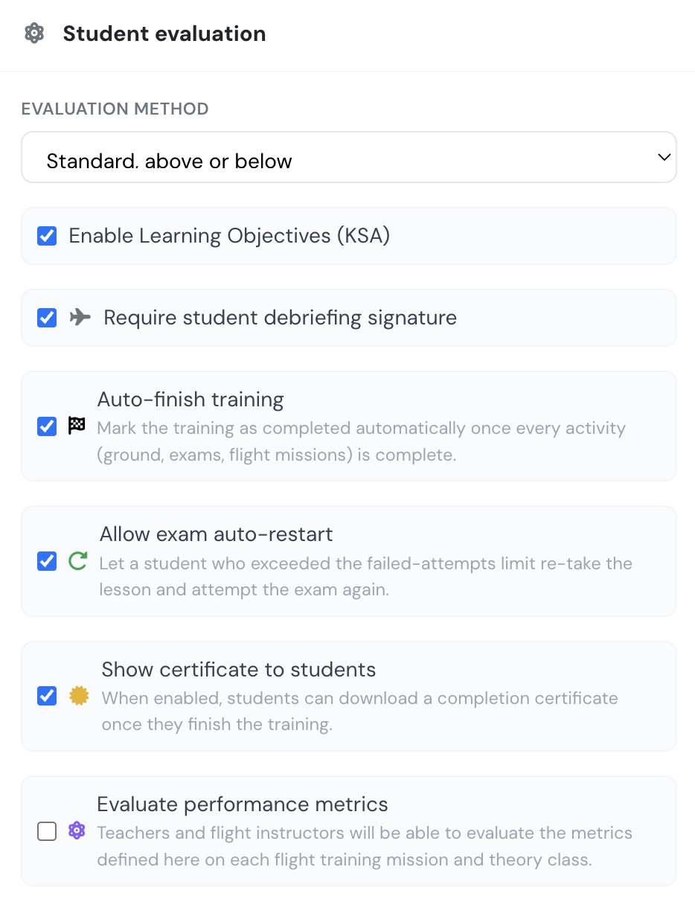
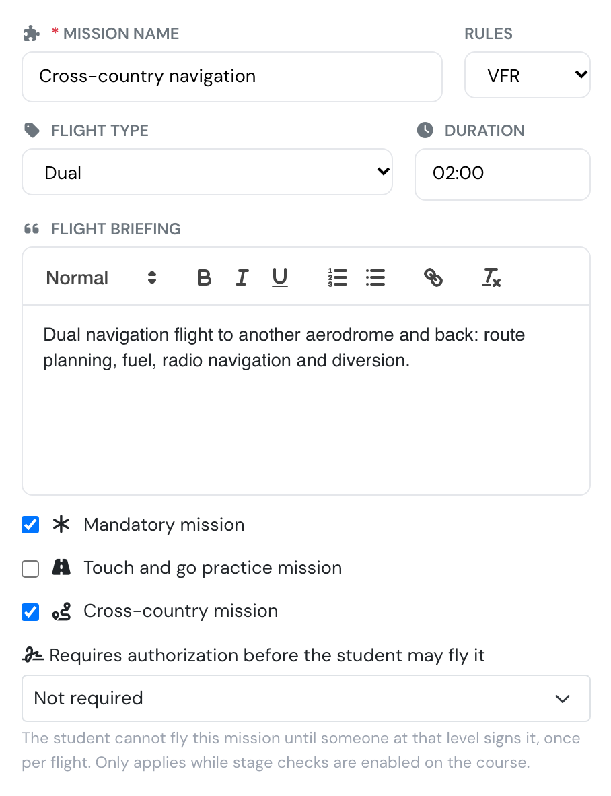
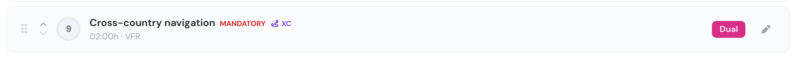
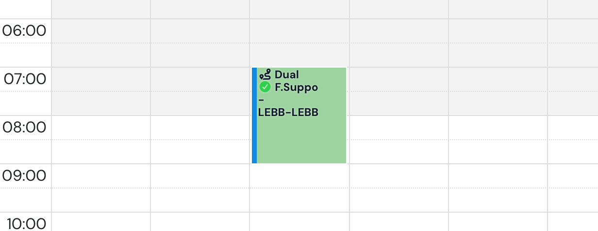
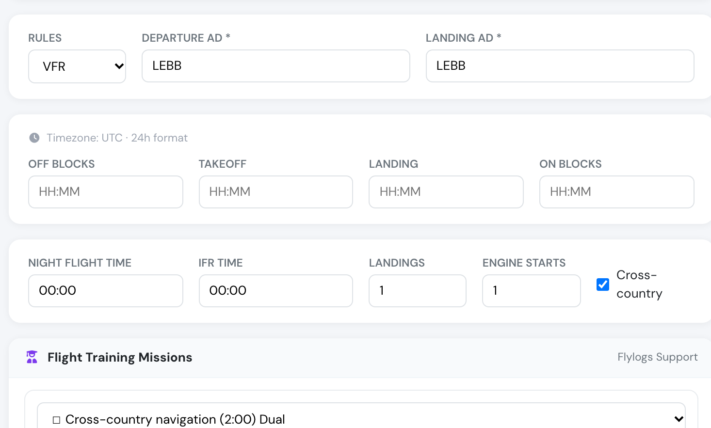
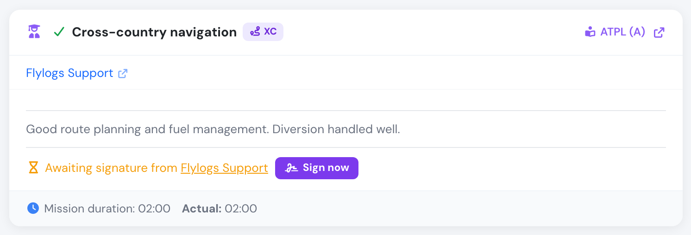
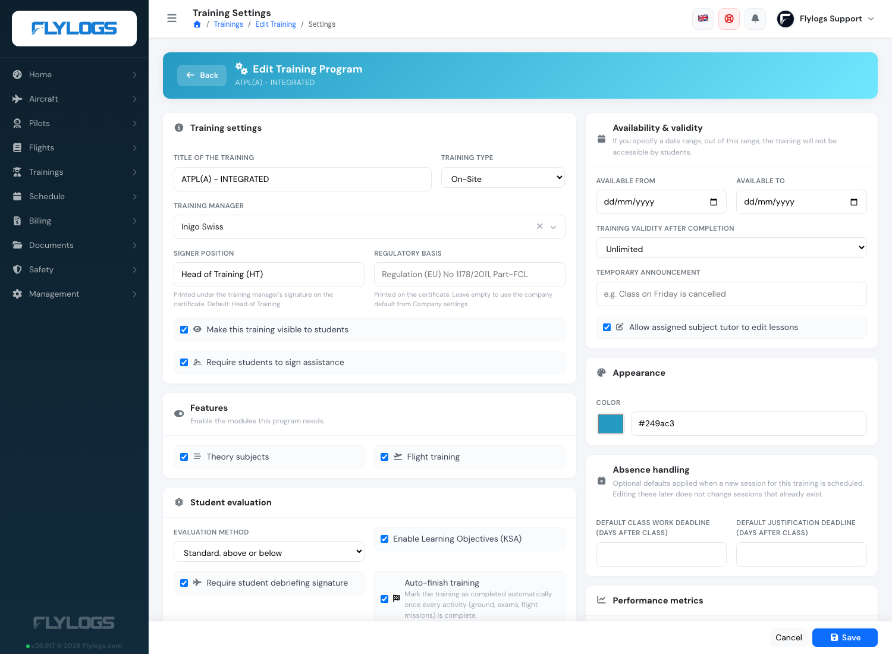

# Edit a training

Training management has been designed to be easy for anybody with little to none technical knowledge.

Main options in the training settings include the following:

* Name of training
* Type of training, (Onsite or distance learning)
* Activate/deactivate the training, and method of flight mission evaluation,
* Activate flight missions,&#x20;
* Training availability and validity dates for expiration,
* Student announcements,
* Training description and syllabus details,
* and subjects.

All this training settings can be modified at any time and will change the settings for all trainees signed up in the course.

<figure><figcaption>
Training edit window
</figcaption></figure>

### Flight Missions

Activating the Flight training checkbox, you will have the option to create a list of flight missions with exercises for the current training course. \
Also, when enabling Flight training this box shown below will appear.\
This additional box, allows you to select the exercise grading scale, require student signature of debriefings and it will also give you the option to activate the competence evaluation system.

<figure><figcaption></figcaption></figure>

#### Mission flags

Each mission can be marked as:

* **Mandatory mission** — the student must fly it to complete the course.
* **Touch and go practice mission** — circuits flown without a full stop between landings. Shown with a road icon and a **TG** badge.
* **Cross-country mission** — a navigation flight to another aerodrome. Shown with a route icon and an **XC** badge.

<figure><figcaption>
Tick "Cross-country mission" in the flight mission editor.
</figcaption></figure>

The **XC** badge appears in the course's mission list, in the mission details students and instructors open, in the booking details, on the booking in the schedule calendar (route icon, explained in the calendar legend), on the mission card of the flight, and in the booking reminder email ("Training: _mission name_ · Cross-country").

<figure><figcaption>
A cross-country mission in the course's mission list.
</figcaption></figure>

<figure><figcaption>
The route icon marks a booking for a cross-country mission in the schedule calendar.
</figcaption></figure>

**On the flight form.** When you add a cross-country mission to a flight, or change a mission to one, Flylogs ticks the flight's **Cross-country** box for you. It only ever ticks it, never unticks it. The box also stays ticked when the flight departs and lands at the same aerodrome (a round trip), which would otherwise untick it automatically. You can still untick it by hand. Opening an existing flight never changes its saved value: the box is only ticked when you add a mission or change one.

<figure><figcaption>
A round trip with a cross-country mission keeps the flight's Cross-country box ticked.
</figcaption></figure>

<figure><figcaption>
The mission card on the flight page.
</figcaption></figure>

### Requiring student attendance signatures

**Require students to sign assistance** asks every student recorded as present to countersign their own attendance for each class. The teacher's signature certifies who was in the room; the student's confirms they were there — the classroom equivalent of signing a flight debrief.

The option appears on onsite and remote courses. Distance courses show **Do not allow to skip lesson time** in its place.

<figure><figcaption>
"Require students to sign assistance" on the training settings page.
</figcaption></figure>

With it on, each student marked **Attended** or **Attended (post-class)** is notified once per class, signs from the class page with their password, and the signature date is kept on the register and printed on the class report PDF. Students can sign from four hours before the class onwards, whether or not the teacher has already signed and locked the register. Absent students are never asked.

**Close signatures after (days)** is optional and empty by default, meaning there is no deadline: a student can always complete the record. Set a number of days only if your organisation wants signatures to stop being accepted after a while — nothing else changes when that date passes, so leaving it open is usually the better choice.

**Enabling it is not retroactive.** The requirement applies to classes from the moment you switch it on. Classes taught before that are not subject to it and will never be reported as missing a student signature — switching this on cannot make your existing training history look unsigned.

Leaving it off changes nothing for students: no request is sent, no signature is expected, and the class report has no signature column.

See [Teacher tools](teacher-tools.md) for what this looks like on the class page.

### Showing all classes to enrolled students

By default a student only sees, in their trainings calendar, the classes they have been invited to (individually or through one of their pilot groups). Being enrolled in the training does not put them on every class.

Tick **Show all classes to enrolled students** when you want students to be able to attend any class of the training on their own initiative. With it on, every student with an **active** enrollment sees all the classes of this training, invited or not, and can open any of them. Students whose enrollment is completed, stopped, failed or expelled keep seeing only the classes they were invited to.

It only changes what students can see. A student who turns up to a class they were not invited to still has to be added to that class by the teacher so their attendance can be recorded. Managers are not affected — they already see every class.

The option is off by default and is only available on on-site trainings.

### Training availability and validity

**Training availability** sets a timeframe when the training course will be open to students enrolled in the course. You can define either the start date or the end date or both.

**Training validity** defines until when the training endorsement is valid (after training completion). It works like an expiration period for the training endorsement in the pilot profile page.

<figure><figcaption>
Training  availability and validity dates
</figcaption></figure>

Example of pilot valid and expired training endorsements:

<figure><figcaption>
Pilot trainings displaying the finished trainings.
</figcaption></figure>

### Certificate signer and regulatory basis

The **Training manager** you pick on the training settings page is the person who signs the course completion certificate: their stored signature (or a stamp with their name when no signature is on file) is printed at the bottom right. Two fields next to it shape what the certificate says:

* **Signer position** — free text printed under the signature, e.g. `Head of Training` or `Accountable Manager`. When empty, the certificate prints *Head of Training*. It replaces the signer's Flylogs role, which never appears on the certificate.
* **Regulatory basis** — printed under the course name, e.g. `Regulation (EU) No 1178/2011, Part-FCL`. When empty, the company default from **Company settings → General → Training organisation** is used. Set it per course when your account runs courses under different regulations.

Both fields only affect certificates issued from the moment you save. A certificate that has already been downloaded keeps the text it was issued with.


If a training has no training manager, Flylogs falls back to any Company Administrator or Operations Manager with a signature on file so the certificate always carries a signatory. Pick a manager explicitly for courses you issue as an approved organisation.


### Sharing a subject between courses

If the same subject is taught in several courses, use the **Subject Bank**: **Add from bank** on the course's *Subjects* tab copies a subject from another course and keeps it linked, so later changes can be reviewed and pushed to every course. See [Subject Bank (linked subjects)](subject-bank.md).

### Managing online exam questions

Online exams draw from a **shared question bank**. The same question can be reused across several exams — for example a subject-level test and the lesson exams that feed it. Because the question is shared, editing its text or answers updates it **everywhere it appears**.

**Deleting a question** removes it from the exam you are working on **only**. If the same question is still used by another exam or lesson, it stays there untouched. A question is fully retired from the course bank only once nothing else uses it — and even then it is hidden rather than erased, so it can be recovered if needed. Past student results keep showing the questions and answers exactly as they were taken.


An online exam is available to students only when its bank holds at least as many questions as the exam's **required question count**. If you delete questions below that number the exam shows as *unavailable* until you add more questions or lower the required count.


### Course revisions: minor and major changes

Courses change over time, and a change does not always apply to the students already training.



* A **minor change** — a typo, a clarified briefing, a reordered lesson — is made directly on the course, as always. It goes through course approval and applies to every student on the course.
* A **major change** — a new requirement, new missions, a new syllabus revision — starts a new **course revision**. Click "**Start new course revision**" in the **Course revisions** bar of the course page. Flylogs creates a draft copy of the course (subjects, lessons, exams, missions, stages, entry requirements and settings). Edit it freely: students keep training on the current course revision and new students keep enrolling in it while you work. Clicking twice, or two managers starting one at the same time, still creates a single draft.

When the draft is ready, click "**Publish course revision**". If its changes are waiting for course approval, approving them publishes the course revision. From then on:

* new students enrol in the new course revision by default — you can still choose an earlier one when enrolling (see [Enrolling new students](student-management.md#enrolling-new-students));
* the previous course revision leaves the course catalog and closes to applications;
* the course's open intakes and the applications still waiting on them move to the new course revision, so an approval enrols the student in the new one;
* **nobody is moved automatically.** Students on the previous course revision stay there until you decide.

#### Comparing course revisions

Click "**Compare course revisions**" in the Course revisions bar and pick any two. Flylogs lists what was added, removed or changed:

* ground subjects — added or removed, planned hours, and lessons and exams added or removed inside them;
* flight missions — added or removed, and for the others any change of position, flight type, planned time, flight rules, mandatory, touch-and-go or cross-country. A mission that changes position is not carried over when a student is moved between those two course revisions;
* stages, and course settings such as validity, grading or automatic completion.

Items are paired by name, so renaming a subject shows it as removed and added.

#### Moving students to the new course revision

Open the previous course revision (or follow the reminder on the new one) and click "**Move students**". Tick the students whose training is compatible with the new course revision; for each one you can also choose to credit hours flown on missions the new course revision does not have. What carries over follows the same rules as [moving a student to another course](student-management.md#moving-a-student-to-another-course). Students you leave unticked finish on the course revision they started.

In **Trainings → Edit trainings** each course is listed once, with its course revisions (current, draft, previous — with how many students each has) underneath. A draft you no longer want can be thrown away with "**Discard draft**". Everywhere else a course revision is shown as *Course name · course revision 2*.

**Who can do this:** only staff up to and including Trainings Manager (`user_group_id <= 135`) can start, publish, discard or approve a course revision, move students, or record previous experience. This includes approvals: the training manager named on a course no longer approves unless they are in one of those groups.
