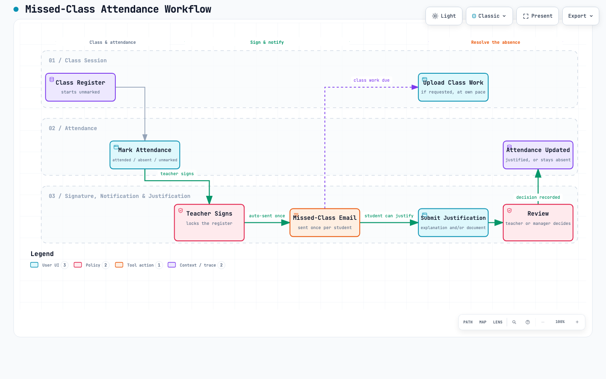
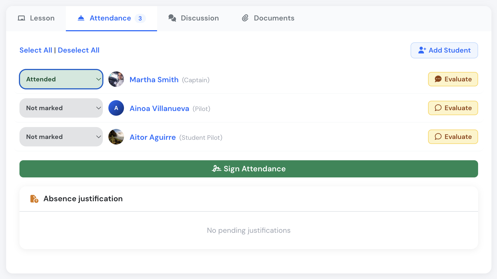
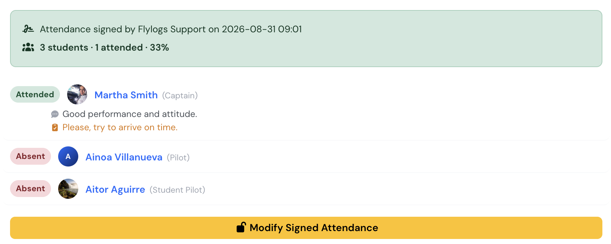
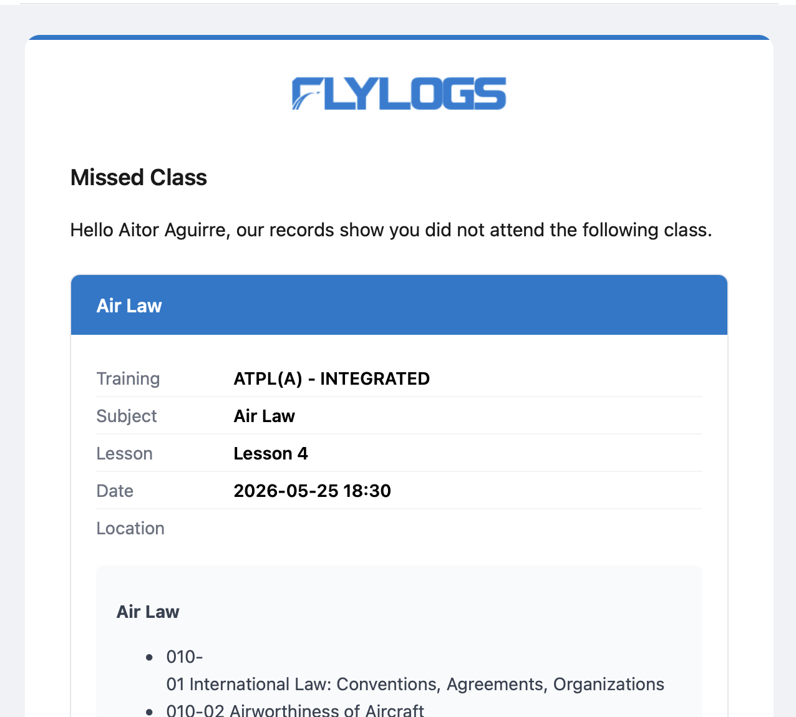
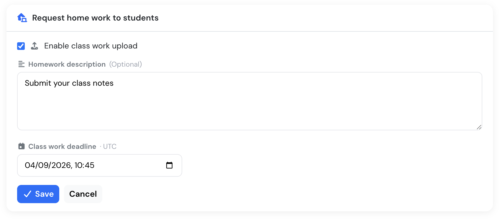
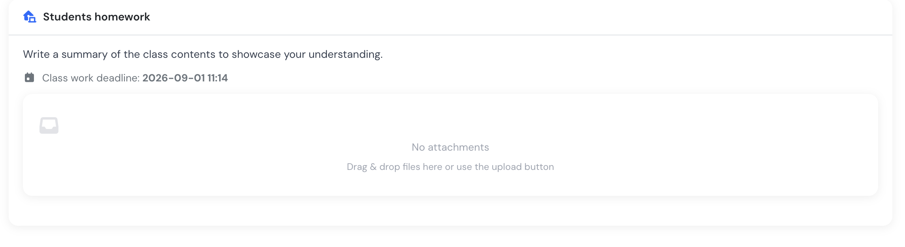

# Missed classes and class work

Onsite classes and exams track attendance as part of the training record, and follow up automatically when a student misses one. This page walks through the whole flow, from an unmarked register to a resolved, reported outcome. For where each of these actions lives on screen, see [Teacher tools](teacher-tools.md), [Student evaluation](student-evaluation.md) and [Student management](student-management.md).

<figure><figcaption>
The full flow: class session, attendance, signature, class work and absence justification.
</figcaption></figure>

### The four attendance statuses

Each student on a class register is set to one of:

* **Attended**
* **Attended (post-class)** — attended after the fact, see below.
* **Absent**
* **Absent (justified)** — an approved justification, see below.

Before the teacher signs the class, students can be left **unmarked** — nothing has been decided yet. Nothing is saved to the training record until the class is **signed**: signing is the moment the register becomes a record, and it turns every student still unmarked into **Absent**.

A signed register is locked. A training manager can reopen it with **Modify signed attendance**, make corrections, and sign again with **Update attendance** — every signature is kept as history, so nothing is overwritten. Both **Attended** and **Attended (post-class)** count as present; **Absent (justified)** does not.

<figure><figcaption>
The four attendance statuses on a class register.
</figcaption></figure>

<figure><figcaption>
A signed register: statuses are read-only, the totals are summarised, and only "Modify Signed Attendance" reopens it.
</figcaption></figure>
### The missed-class email

When the register is signed, Flylogs automatically emails every student marked **Absent**. The email names the class, its date and location, a summary of the content, and links straight to the class page. It also tells the student whether class work has been requested and how to justify the absence, with the relevant deadlines if set.

Each student receives this email once per class — even if the register is later reopened and signed again, a student already emailed isn't emailed a second time.

<figure><figcaption>
The missed-class email sent to an absent student.
</figcaption></figure>
### Uploading class work

A teacher can request class work (homework) from the class page's **Documents** tab — turned on there, not while scheduling the class. They set a deadline and write a description of what students need to do; students are notified and see a banner on the class page until they've dealt with it.

Once the register is signed, the request itself is frozen — it can't be turned on, changed or cancelled after that point. Students can still upload their work after signing, which is the point: class work is often finished after a missed class, not before it's caught up with. Each student only ever sees their own submissions; the teacher and any training manager see everyone's, to evaluate.

<figure><figcaption>
Requesting class work from the Documents tab.
</figcaption></figure>

<figure><figcaption>
What the student sees: the brief, the deadline, and their own upload area. Students never see another student's file.
</figcaption></figure>
### Justifying an absence

A student marked **Absent** can submit a justification from the class page's **Attendance** tab — an explanation, a document, or both.

<!-- SCREENSHOT TODO — add trainingsJustificationSubmit.png to .gitbook/assets/, then uncomment:

<figure><figcaption>
A student submitting an absence justification.
</figcaption></figure>

-->
### How a justification is decided

The class's teacher, or any training manager, reviews pending justifications from the same tab and either **approves** or **rejects** them, with an optional note. Approving sets the student to **Absent (justified)**. Each submission gets one decision — if the student wants to try again, they submit a new justification rather than reopening the old one.

<!-- SCREENSHOT TODO — add trainingsJustificationReview.png to .gitbook/assets/, then uncomment:

<figure><figcaption>
A teacher approving or rejecting a submitted justification.
</figcaption></figure>

-->

Class work files and justification documents can't be deleted or moved once uploaded, by anyone, including managers. They're the evidence behind an attendance decision, so the record stays intact.


### Attended after the fact

If a student makes up a missed class — for example by working through the content and any requested class work — a training manager can reopen the signed register and change that student's status to **Attended (post-class)** instead of leaving them **Absent** or **Absent (justified)**. It counts as attendance, but stays visible in reports as credit given after the fact rather than attendance on the day.

### Students invited but not enrolled

Someone can be invited to a class without being enrolled in the training. They can open the class page, but no attendance or evaluation can be recorded for them: the register shows them read-only with a **Not enrolled** label, and they're excluded from the attendance ratio, the missed-class email and the class work notification. Enrol them in the training to start recording their results.

### How it's reported

The student's training record, the training report and its PDF all split missed sessions into three outcomes: **justified**, **not justified**, and **credited after class**. See [Student management](student-management.md#attendance-breakdown) for where this appears.
