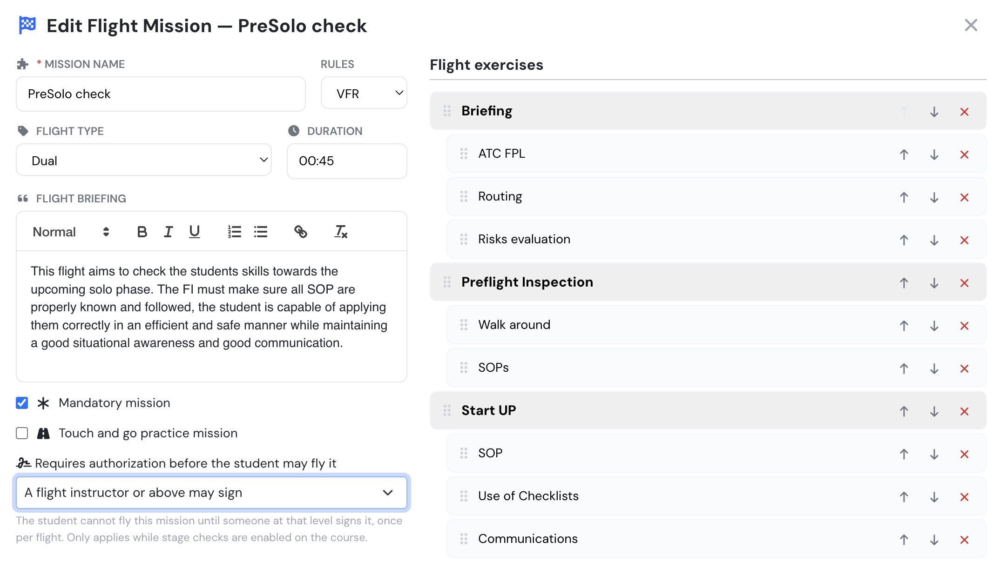
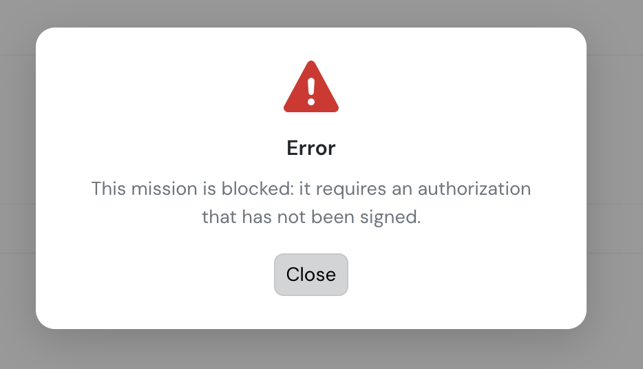
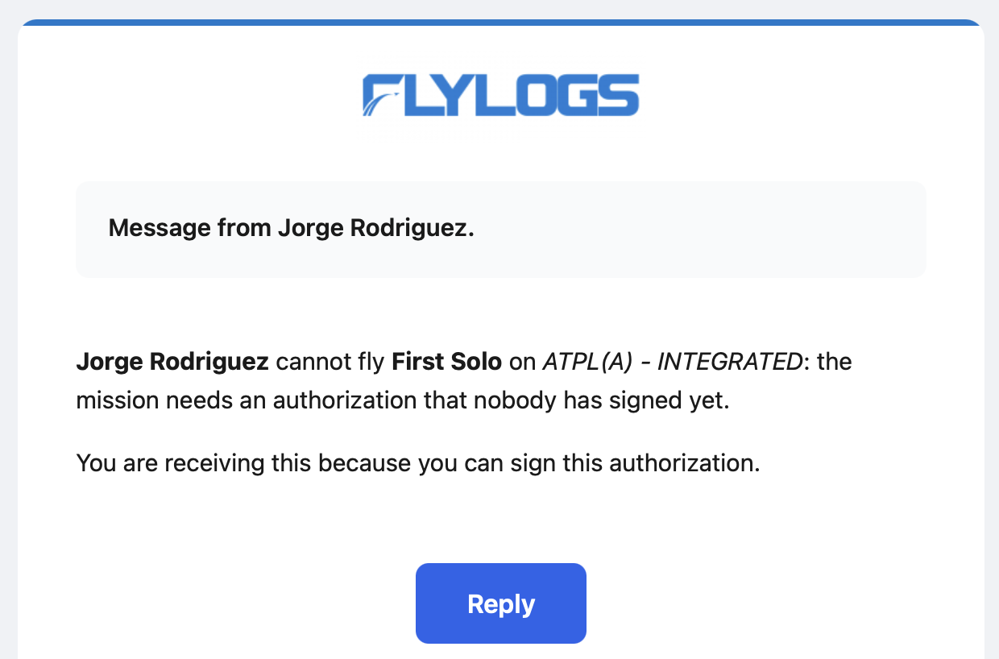

# Mission Authorizations

Under EASA FCL.020 a student pilot may not fly solo unless authorised by an instructor. Flylogs records that authorisation as a **signature against one flight**, not as a blanket permission.

It is not solo-only: any flight mission in a course can be marked as requiring an authorization — night, cross-country, or anything else your school wants signed out individually.

Mission authorizations are part of the stage-checks feature and are **off by default**. They apply only while [**Require stage checks**](stage-checks.md) is enabled on the course.

### Marking a mission as requiring authorization

Edit the mission and set **Requires authorization before the student may fly it**.

<figure><figcaption>
Choosing who may sign this mission out
</figcaption></figure>

The options describe who may sign:

| Setting | Who may sign |
| ------- | ------------ |
| Not required | Nobody needs to — the mission is flown normally |
| A flight instructor or above may sign | Instructors, chief pilots, managers, administrators |
| A chief pilot or above may sign | Chief pilots and above — excludes ordinary instructors |
| A trainings manager or above may sign | Trainings managers and above |
| A company manager may sign | Company management only |

The wider settings *include* everyone above them: choosing "a flight instructor or above" also lets your chief pilot and your managers sign. Pick the **lowest rank you are happy to have signing**, and everyone senior to them is covered.

A typical PPL course leaves routine dual missions as "not required", and sets the first solo to whichever rank your operations manual says must release a student.

### Signing a student out

Open the student and go to the **Flight missions** tab. Any mission awaiting a signature is listed with a **Sign authorization** button.

You are asked for optional limitations — free text, for example *"circuits only, wind below 15 kt"* — and then for your password, exactly like signing a debriefing.

What gets stored: who signed, when, from which address and browser, the limitations, and a hash of all of it that would reveal any later alteration of the record.

### What the student sees

Until the mission is signed, the flight cannot be dispatched or logged. Whoever tries gets a plain refusal:

<figure><figcaption>
Trying to log a mission that has not been signed
</figcaption></figure>

The block applies however the flight is created — flight record, schedule, or import — because it is enforced on the server, not in the screen you happen to be using.

### One authorization, one flight

The signature is used up by the flight that takes it. The next attempt at the same mission needs a new signature, so your records show one authorisation per flight rather than a standing permission.

Two consequences worth knowing:

* **Editing the flight that used it is fine.** Correcting times or remarks on that flight does not need a new signature.
* **If the flight is deleted or cancelled, the signature comes back.** The flight never happened, so the authorisation was never used.

An authorization that has not yet been used can be **withdrawn** with a reason. One that has already been used by a flight cannot — that is history. Withdrawing does not stop you signing a fresh one afterwards.

### Nobody has to chase it

When a student's flight is refused for want of a signature, an urgent notification goes out immediately — but only to people who can actually sign it. If a mission is restricted to managers, the instructor on the flight is not pestered about something they cannot do.

<figure><figcaption>
The notification, sent only to people who can sign this mission
</figcaption></figure>

If the block is still unresolved, the notification widens one step at a time:

1. The instructor on the flight
2. The student's instructor on that course
3. The course tutor
4. The student's supervisor
5. Anyone in the company who can sign it

Each step *adds* people; nobody is dropped. Steps that contain nobody able to sign are skipped rather than notified. The interval between steps is a company setting, four hours by default.

Issuing the signature, flying the mission, or cancelling the flight stops the escalation. Repeated attempts to log the same blocked flight do **not** send repeated notifications.

### Who can do what

Signing is decided by the **mission's** setting, not by a fixed role — that is the whole point of the level. Withdrawing a signature requires the same level as signing it. The student, their instructors and the course managers can all see the history of what was signed, by whom, and whether it was used or withdrawn.
