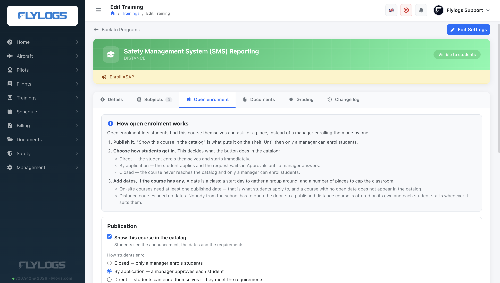
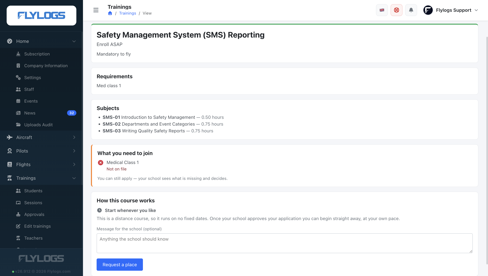
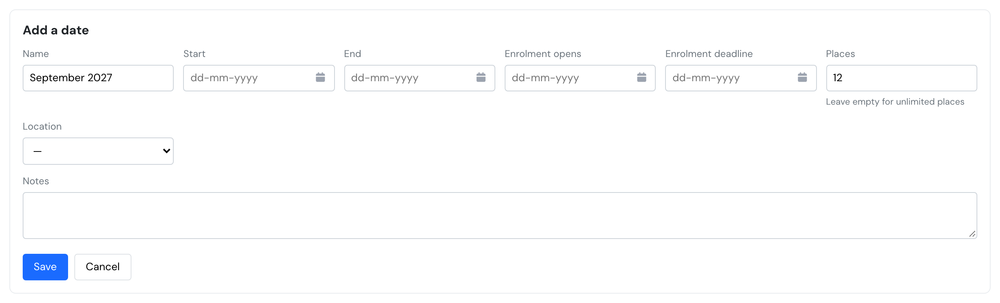
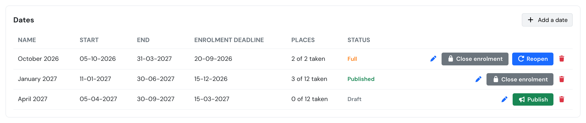
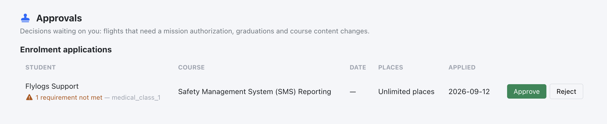

# Open trainings

Open trainings let your school **publish a course** so students enrol themselves, instead of a manager adding them one by one.

A published course shows its announcement, the requirements, and — for courses that run on fixed dates — the available dates and how many places are left. Students see it under **Available courses**, and on a widget on their home screen whenever your school has something on offer.

> Trainings are available on the **Premium** and **Unlimited** plans. On any other plan the catalog is not shown at all.



## Publishing a course

Open the course from **Trainings → Edit**, then the **Open enrolment** tab.

<figure><figcaption>
The Open enrolment tab. The panel at the top sums up the three steps; the course header shows <strong>Visible to students</strong> once it is published.
</figcaption></figure>

### Publication

* **Show this course in the catalog** — until this is on, nothing is visible to students, whatever dates exist. This is the only switch that decides visibility: a course that is also shared as a **template** for other schools is offered to your own students exactly like any other once this is ticked.
* **Short headline** — one line, shown on the course card.
* **Announcement** — the full description students read on the course page.
* **Requirements** — free text explaining what a student needs before applying. It is shown on the course page.

### How students enrol

Choose one of three modes, per course:

| Mode | What happens |
| ---- | ------------ |
| **Closed** | The course never appears in the catalog. Only a manager enrols students, exactly as before. |
| **By application** | The student applies. The application waits in **Approvals** until a manager approves or rejects it. The enrolment is created on approval. |
| **Direct** | The student is enrolled immediately, as long as places remain. No manager step. |

## Entry requirements

The **Requirements** box is free text: it explains, in your words, what a student needs. Below it, **Entry requirements** are the conditions Flylogs checks by itself. A course with none behaves exactly as before — anyone who can see it can apply.

Four kinds of rule:

| Rule | What is checked |
| ---- | --------------- |
| **Holds a certificate** | The student has a valid certificate of that exact type. |
| **Minimum flight hours** | Total, PIC, SIC, dual, instructor, night, IFR, cross-country or multi-engine. |
| **Has completed another course** | An enrolment on that course with status *Completed*. |
| **Minimum age** | Their age on the day they apply. |

### Certificates are matched exactly

A rule asking for **Medical Class 1** is met only by a certificate recorded as *Medical Class 1*. A Class 2 does not satisfy it — and neither does a certificate filed under the generic **Medical** type, even if somebody typed "Medical Class 1" into its name box.

This matters more than it sounds. Most medicals in Flylogs today are recorded under the generic type, so a Class 1 rule can fail students who genuinely hold one. Check how your school records medicals before relying on a certificate rule; the fix is to record them under the specific type, on the pilot's Documents tab.

(Flight dispatch is deliberately more forgiving, because a school that never recorded classes would otherwise ground its whole fleet. Entry requirements cannot be, or "Class 1 only" would mean nothing.)

### Which hours count

Hours come from the same totals as the pilot's own totals card: time flown as PICUS or as an instructor/examiner counts as PIC, instructor time also counts as FI, supervision counts as neither.

**Total hours** also include the career total on the student's profile, so somebody transferring in with 200 hours elsewhere is not treated as a beginner. Every other total — PIC, night, IFR — counts flights recorded in Flylogs only, because a declared career total says nothing about which seat they were in.

### What happens when a student does not qualify

They see the checklist on the course page before pressing anything: a green tick per rule met, and for each one unmet, what to do about it ("Not on file", "Yours has expired", "You have 40 h").

<figure><figcaption>
A student without a Medical Class 1 on file. The course takes applications, so they can still request a place.
</figcaption></figure>

* On a **Direct** course, they cannot enrol. Nobody from the school is in that path to check.
* On a **By application** course, they can still apply. The application arrives in **Approvals** marked with what was missing, and you decide — a medical booked for Friday is a perfectly normal reason to approve anyway.

The note on the application records what was true **when they applied**. Editing a rule later does not rewrite it.

## Dates — on-site courses only

A **date** is a class: a day to start a group on, and a number of places to cap the classroom. It is therefore something only an **on-site** course needs.

* **On-site courses** need at least one published date. That is what students apply to, and a course with no open date does not appear in the catalog at all.
* **Distance courses need no dates.** Nobody from the school has to open a classroom or hold a place, so a published distance course is offered on its own and each student starts it whenever it suits them — the same day they enrol, if the course is set to **Direct**. The **Open enrolment** tab hides the date editor for these courses and says so.

If you do add dates to a distance course, Flylogs takes you at your word: students then have to apply to one of those dates just like on an on-site course. Delete them and students go back to starting whenever they like.

A course that does run on dates can run several times a year — for example January, April and September. Each run is a **date** with its own places and its own deadline.

### Add a date

1. Open the course from **Trainings → Edit**, then the **Open enrolment** tab.
2. In the **Dates** card, click **Add a date**.
3. Fill in the date. In **Places**, enter the **total** number of places for this run, for example 12. You never enter the places left: Flylogs counts them for you as students enrol.
4. Click **Save**. The date is added to the list as a **Draft**.
5. Click the green **Publish** button on the date's row.

<figure><figcaption>
The Add a date form. Places is the total for this run; leave it empty for unlimited places.
</figcaption></figure>


**A new date is not visible until you publish it.** Saving creates it as a **Draft**, which students never see. Until you click **Publish** on the row, the date is not in the catalog and nobody can apply to it. An on-site course whose dates are all still drafts does not appear in the catalog at all, even when **Show this course in the catalog** is ticked.


<figure><figcaption>
The Dates list. The draft April date still needs its green <strong>Publish</strong> button pressed. The Places column shows how many places are taken out of the total.
</figcaption></figure>

### Places left

The **Places** column shows each date as **taken of total**, for example *3 of 12 taken*. The places left are the difference, 9 in that example, and that is the number students see in the catalog. A date with no limit shows **Unlimited places**.

The count is worked out every time the page loads, so it is always what enrolment will actually enforce. To offer more places, edit the date with the pencil and raise **Places**. Lowering it below the places already taken does not remove anyone.

Each date has:

* **Name** — how it appears to students (e.g. "January 2027").
* **Start** and **End** of the course.
* **Enrolment opens** and **Enrolment deadline**. The deadline day is the last day a student can apply, not the first closed one. Leave it empty for no deadline.
* **Places** — leave it **empty** for unlimited places. Zero means nobody can enrol, which is not the same thing.
* **Location**.

### Date statuses

* **Draft** — invisible to students. New dates start here.
* **Published** — in the catalog, taking applications.
* **Full** — every place is taken. The date stays visible and accepts waitlist entries only. Flylogs sets this automatically the moment the last place goes; you can also set it by hand to stop enrolment without cancelling.
* **Closed** — no longer taking anyone.
* **Cancelled** — the run is called off.

Each row has buttons for the status change that applies to it:

* **Publish** (green) on a **Draft** date.
* **Close enrolment** (grey) on a **Published** or **Full** date.
* **Reopen** (blue) on a **Closed** or **Full** date.

Raising the number of places on a **Full** date and pressing **Reopen** puts it back in the catalog.

### Deleting a date

A date with enrolled students **cannot be deleted** — Flylogs tells you how many there are. Cancel it instead, so the students and their history are kept.

## Places and the waitlist

A place is taken by an enrolled student, and also by an application you have already approved but whose enrolment has not been created yet. Students on the waitlist hold **no** place.

When a date is full, students can still join the **waitlist**. Promotion is manual: when a place frees up, approve the waitlisted application you choose from the Approvals page. Nothing is promoted automatically.

## Answering applications

Applications appear as a queue on the **Approvals** page, alongside course approvals and flight authorizations. Each row shows the student, the course, the date, how many places are taken and the student's message. An application to a distance course with no dates shows *Start whenever you like* in place of a date, and no place counter — there is no classroom to fill.

<figure><figcaption>
An application waiting on the Approvals page, flagged with the entry requirement the student did not meet.
</figcaption></figure>

* **Approve** creates the enrolment, exactly as if you had enrolled the student by hand.
* **Reject** asks for a reason, which the student sees on the course page.

If the date filled up between the application and your approval, Flylogs refuses the approval rather than overbooking, and tells you the date is full.

Waitlisted rows appear in the same queue, marked as such. Approving one is how you promote it.

## Who can do what

| Action | Who |
| ------ | --- |
| See the catalog and apply | Every user in the company |
| Publish a course, manage dates, set entry requirements | Managers (`user_group_id` 150 or lower) |
| Approve or reject applications | Managers (`user_group_id` 150 or lower) |

A course manager sees the applications for their own courses; users at group 135 or lower see every course's applications.

## What students see

* **Available courses** — a card per open course, with its next date and the places left, or *Start whenever you like* for a distance course with no dates. Filters by course type and starting month; the month filter only applies to courses that have dates, so it is hidden once the student filters to distance learning.
* **Course page** — announcement, subject list with hours, requirements, the entry-requirement checklist answered for them, and either the list of dates with a place counter and deadline each, or a short **How this course works** note for a distance course with no dates.
* The button changes with the situation: *Enrol* for direct courses, *Enrol and start* for a distance course a student can begin at once, *Request a place* when applications are used, and *Join the waitlist* when the date is full.
* Once they have applied, the page shows the state of their application and lets them withdraw it while it is still unanswered.
